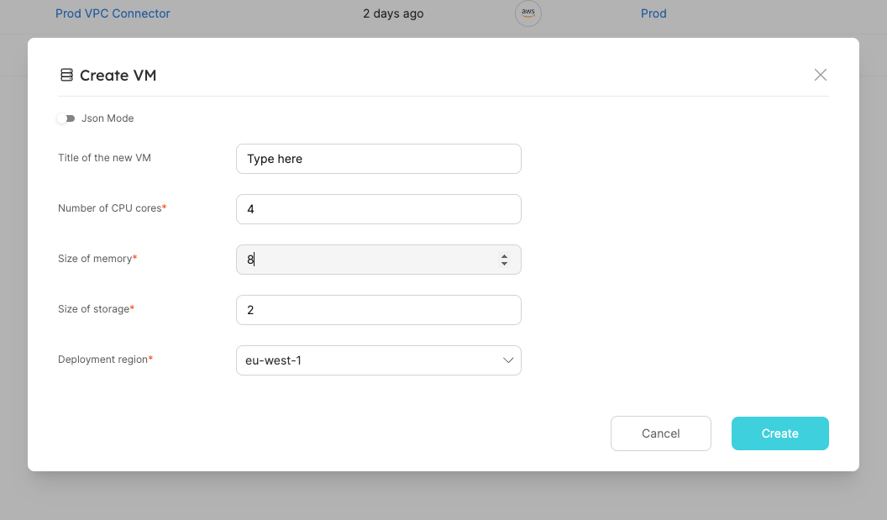

# Debugging Webhooks locally

In this guide, we will show you how to debug Webhook Self-Service Actions that are sent from Port locally.

This example contains the initial steps to set up a standard Self-Service Action use case, following it shows how to locally debug the payload sent by Port through the webhook [invocation method](/create-self-service-experiences/setup-backend/#json-structure).

## Prerequisites

- A Port API `CLIENT_ID` and `CLIENT_SECRET`;
- Python & PIP installed
- Nodejs

In this example, interaction with Port will be primarily conducted using the API, but can also be done using the web UI.

## Scenario

You want to provision new VMs using Port's `CREATE` Self-Service Actions.

In this example you will:

- Create a new `VM` Blueprint
- Add a `CREATE` action to the Blueprint
- Use a local web-server to debug the webhook requests that Port sends every time a developer asks for a new VM.

## Creating the VM blueprint

Let’s configure a `VM` Blueprint, its base structure is:

```json showLineNumbers
{
  "identifier": "vm",
  "title": "VM",
  "icon": "Server",
  "schema": {
    "properties": {
      "region": {
        "title": "Region",
        "type": "string",
        "description": "Region of the VM"
      },
      "cpu_cores": {
        "title": "CPU Cores",
        "type": "number",
        "description": "Number of allocated CPU cores"
      },
      "memory_size": {
        "title": "Memory Size ",
        "type": "number",
        "description": "Amount of allocated memory (GB)"
      },
      "storage_size": {
        "title": "Storage Size",
        "type": "number",
        "description": "Amount of allocated storage (GB)"
      },
      "free_storage": {
        "title": "Free Storage",
        "type": "number",
        "description": "Amount of free storage (GB)"
      },
      "deployed": {
        "title": "Deploy Status",
        "type": "string",
        "description": "The deployment status of this VM"
      }
    },
    "required": []
  },
  "calculationProperties": {}
}
```

Below you can see the `python` code to create this Blueprint (remember to insert your `CLIENT_ID` and `CLIENT_SECRET` in order to get an access token)

<details>
<summary>Click here to see the code</summary>

```python showLineNumbers
import requests

CLIENT_ID = 'YOUR_CLIENT_ID'
CLIENT_SECRET = 'YOUR_CLIENT_SECRET'

API_URL = 'https://api.getport.io/v1'

credentials = {'clientId': CLIENT_ID, 'clientSecret': CLIENT_SECRET}

token_response = requests.post(f'{API_URL}/auth/access_token', json=credentials)

access_token = token_response.json()['accessToken']

headers = {
    'Authorization': f'Bearer {access_token}'
}

blueprint = {
    "identifier": "vm",
    "title": "VM",
    "icon": "Server",
    "schema": {
        "properties": {
            "region": {
                "title": "Region",
                "type": "string",
                "description": "Region of the VM"
            },
            "cpu_cores": {
                "title": "CPU Cores",
                "type": "number",
                "description": "Number of allocated CPU cores"
            },
            "memory_size": {
                "title": "Memory Size ",
                "type": "number",
                "description": "Amount of allocated memory (GB)"
            },
            "storage_size": {
                "title": "Storage Size",
                "type": "number",
                "description": "Amount of allocated storage (GB)"
            },
            "free_storage": {
                "title": "Free Storage",
                "type": "number",
                "description": "Amount of free storage"
            },
            "deployed": {
                "title": "Deploy Status",
                "type": "string",
                "description": "The deployment status of this VM"
            }
        },
        "required": []
    },
    "calculationProperties": {},

}

response = requests.post(f'{API_URL}/blueprints', json=blueprint, headers=headers)

print(response.json())
```

</details>

## Creating the VM CREATE action

In order to debug your action payload locally, you need to forward it to your local machine, meaning the webhook target needs to be your `localhost`. In order to forward the requests directed at your webhook to the localhost, we will use [smee.io](https://smee.io/).

All you have to do is click on `Start new channel` and copy the provided `Webhook Proxy URL`, it should look similar to this: `https://smee.io/b1iO4C4ZGNYmiVL5`

Now let’s configure a Self-Service Action. You will add a `CREATE` action that will be triggered every time a developer creates a new VM entity, the Self-Service Action will trigger a small web-server running on your local machine.

:::tip
You will configure the web-server a bit later [in this guide](#creating-small-example-server-in-nodejs).
:::

Here is the action JSON:

```json showLineNumbers
{
  "identifier": "create_vm",
  "title": "Create VM",
  "icon": "Server",
  "description": "Create a new VM in cloud provider infrastructure",
  "trigger": "CREATE",
  "invocationMethod": { "type": "WEBHOOK", "url": "YOUR SMEE URL" },
  "userInputs": {
    "properties": {
      "title": {
        "type": "string",
        "title": "Title of the new VM"
      },
      "cpu": {
        "type": "number",
        "title": "Number of CPU cores"
      },
      "memory": {
        "type": "number",
        "title": "Size of memory"
      },
      "storage": {
        "type": "number",
        "title": "Size of storage"
      },
      "region": {
        "type": "string",
        "title": "Deployment region",
        "enum": ["eu-west-1", "eu-west-2", "us-west-1", "us-east-1"]
      }
    },
    "required": ["cpu", "memory", "storage", "region"]
  }
}
```

Below you can see the `python` code to create this action.

:::info Replacing placeholders

- Remember to insert your `CLIENT_ID` and `CLIENT_SECRET` in order to get an access token.
- Remember to insert the proxy URL you got from `smee` in order to redirect the webhook messages to your localhost.

:::

:::note Specifying the target blueprint
Note how the `vm` Blueprint identifier is used to add the action to the new Blueprint
:::

<details>
<summary>Click here to see code</summary>

```python showLineNumbers
import requests

CLIENT_ID = 'YOUR_CLIENT_ID'
CLIENT_SECRET = 'YOUR_CLIENT_SECRET'

API_URL = 'https://api.getport.io/v1'

credentials = {'clientId': CLIENT_ID, 'clientSecret': CLIENT_SECRET}

token_response = requests.post(f'{API_URL}/auth/access_token', json=credentials)

access_token = token_response.json()['accessToken']

headers = {
    'Authorization': f'Bearer {access_token}'
}

blueprint_identifier = 'vm'

action = {
    'identifier': 'create_vm',
    'title': 'Create VM',
    'icon': 'Server',
    'description': 'Create a new VM in cloud provider infrastructure',
    'trigger': 'CREATE',
    "invocationMethod": { 'type': 'WEBHOOK', 'url': 'YOUR SMEE URL' },
    'userInputs': {
        'properties': {
            'title': {
                'type': 'string',
                'title': 'Title of the new VM'
            },
            'cpu': {
                'type': 'number',
                'title': 'Number of CPU cores'
            },
            'memory': {
                'type': 'number',
                'title': 'Size of memory'
            },
            'storage': {
                'type': 'number',
                'title': 'Size of storage'
            },
            'region': {
                'type': 'string',
                'title': 'Deployment region',
                'enum': ['eu-west-1', 'eu-west-2', 'us-west-1', 'us-east-1']
            }
        },
        'required': [
            'cpu', 'memory', 'storage', 'region'
        ]
    }
}

response = requests.post(f'{API_URL}/blueprints/{blueprint_identifier}/actions', json=action, headers=headers)

print(response.json())
```

</details>

## Forwarding events to localhost

Now install the Smee client to forward the events to your `localhost`, you will use `pysmee` to achieve that:

```bash
pip install pysmee
```

Now use it to forward the event, for example:

```bash
pysmee forward https://smee.io/b1iO4C4ZGNYmiVL5 http://localhost:3000/webhooks
```

You should see a log line output like this:

```bash
[2022-09-15 13:59:39,462 MainThread] INFO: Forwarding https://smee.io/b1iO4C4ZGNYmiVL5 to http://localhost:3000/webhooks
```

## Creating a small example server in Nodejs

Now because you are forwarding events to your localhost, all you need to do is create a small server that will listen to `POST` requests that are being sent to the /webhooks route.

:::tip
This example shows how to setup a small listener server using [Nodejs](https://nodejs.org/en/) and [Express](https://expressjs.com/) but you can use any language and framework you prefer.
:::

Create a folder and run the following in it

```bash
npm init -y
npm install express
```

Inside this folder create an `index.js` file and paste the following:

```js
const { createHmac } = require("crypto");
const express = require("express");
const app = express();
const port = 3000;

app.post("/webhooks", (request, response) => {
  // This part is used to verify that the webhook message was sent by Port
  const signed = createHmac("sha256", "<CLIENT_SECRET>")
    .update(
      `${request.headers["x-port-timestamp"]}.${JSON.stringify(request.body)}`
    )
    .digest("base64");

  if (signed !== request.headers["x-port-signature"].split(",")[1]) {
    throw new Error("Invalid singature");
  }

  // You can put any custom logic here
  console.log("Success!");

  response.send("Hello World!");
});

app.listen(port, () => {
  console.log(`Example app listening on port ${port}`);
});
```

Now run the server:

```bash
node index.js
```

## Triggering the action

Login to port and go to the VM page and trigger the action via the **Create VM** action button:


Fill the wanted details and click on `Create`



And that's it, the `Success!` output shows that your local server really did receive your webhook payload:


:::tip
Now that webhook requests are forwarded to your local machine, you can use your IDE to place breakpoints, examine the structure of the webhook request and iterate on your custom handler logic.
:::
