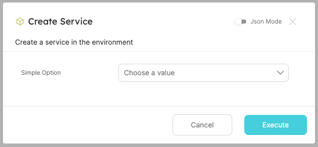
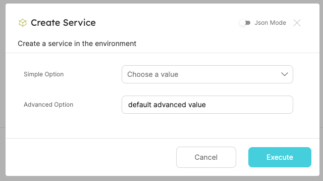
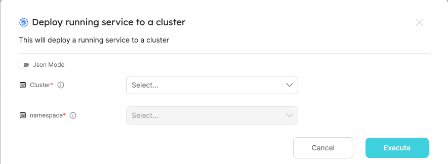

import Tabs from '@theme/Tabs';
import TabItem from '@theme/TabItem';

# Advanced Form Configurations

Advanced user form settings allow you to create more customizable experiences for users who perform self-service actions. This is done by creating an adaptive user form that changes according to data about the entity, the user, and the user form inputs.

### Common Use Cases

- Filter the available options in a dropdown input.
- Create a dependency between inputs to allow the user to select a value based on the value of another input.
- Define dynamic default values based on the logged-in user properties(such as teams, email, role) or the entity that the action is being executed on (for day-2 or delete actions only).

#### building such actions can be done by leveraging 4 keys in the action's schema:

<Tabs
defaultValue="DependsOn"
values={[
{ label: 'dependsOn', value: 'DependsOn', },
{ label: 'dataset', value: 'Dataset', },
{ label: 'jqQuery', value: 'jqQuery', },
{ label: 'displayCondition', value: 'displayCondition', },
]}>
<TabItem value="DependsOn">

The `dependsOn` property is used to create a dependency between inputs. If input X depends on input Y, input X will be disabled until input Y is filled.  
In the example below, the `SDK` input depends on the `Language` input:

```json showLineNumbers
{
  "properties": {
    "language": {
      "type": "string",
      "enum": ["javascript", "python"]
    },
    "SDK": {
      "type": "string",
      "dependsOn": ["language"]
    }
  }
}
```

</TabItem>
<TabItem value="Dataset">

The `dataset` property is used to filter the displayed options in an "entity" input. It is comprised of two properties:

- `Combinator` - the logical operation to apply between the rules of the dataset. [Read more](/search-and-query/#combinator).
- `Rules` - an array of [rules](/search-and-query/#rules), only entities that pass them will be displayed in the form.
  Note that the `value` key in the dataset can be a constant (string, number, etc) or a "jqQuery" object.

```json showLineNumbers
{
  "namespace": {
    "type": "string",
    "format": "entity",
    "blueprint": "namespace",
    "dataset": {
      "combinator": "and",
      "rules": [
        {
          "property": "$team",
          "operator": "containsAny",
          "value": "value here. this can also be a 'jqQuery' object"
        }
      ]
    }
  }
}
```

</TabItem>
<TabItem value="jqQuery">

The `jqQuery` property is used to extract data from the entity, the logged-in user, or the current action's form inputs. It can also be used to perform data manipulations.  
In this example, the `jqQuery` checks the value of another property (`language`) and determines the possible values of the `SDK` property accordingly:

```json showLineNumbers
{
  "properties": {
    "language": {
      "type": "string",
      "enum": ["javascript", "python"]
    },
    "SDK": {
      "type": "string",
      "enum": {
        "jqQuery": "if .form.language == \"javascript\" then [\"Node 16\", \"Node 18\"] else [\"Python 3.8\"] end"
      }
    }
  }
}
```

### The properties you can access using the "jqQuery" object

<Tabs
defaultValue="form"
values={[
{label: 'form', value: 'form'},
{label: 'entity', value: 'entity'},
{label: 'user', value: 'user'},
]}>

<TabItem value="form">

The values of the inputs in the current action form.

Usage:

```json
{
  "jqQuery": ".form.input1"
}
```

The available `form` object(each input is a key in the action's [`userInputs`](/create-self-service-experiences/setup-ui-for-action/user-inputs/) object):

```json
{
  "input1": "...",
  "input2": "...",
  "input3": "..."
}
```

</TabItem>
<TabItem value="entity">

The properties of the `entity` on which the action is performed. Entity data is only available in "day-2" and "delete" actions.

Usage:

```json
{
  "jqQuery": ".entity.properties.property1"
}
```

The available `entity` object:

```json
{
  "identifier": "...",
  "title": "...",
  "blueprint": "...",
  "team": ["..."],
  "properties": {
    "property1": "...",
    "property2": "...",
    "property3": "..."
  },
  "relations": {
    "relation1": "...",
    "relation2": "...",
    "relationMany": ["...", "..."]
  },
  "createdAt": "...",
  "createdBy": "...",
  "updatedAt": "...",
  "updatedBy": "...",
  "scorecards": {
    "ResourceQuota": {
      "rules": [
        {
          "identifier": "...",
          "status": "...",
          "level": "..."
        },
        {
          "identifier": "...",
          "status": "...",
          "level": "..."
        }
      ],
      "level": "..."
    },
    "Ownership": {
      "rules": [
        {
          "identifier": "...",
          "status": "...",
          "level": "..."
        },
        {
          "identifier": "...",
          "status": "...",
          "level": "..."
        }
      ],
      "level": "..."
    }
  }
}
```

</TabItem>
<TabItem value="user">

The properties of the user that executed the action.

Usage:

```json
{
  "jqQuery": ".user.email"
}
```

The available logged-in user object:

```json
{
  "picture": "...",
  "userId": "...",
  "email": "...",
  "name": "...",
  "mainRole": "...",
  "roles": [
    {
      "name": "..."
    }
  ],
  "teams": [
    {
      "name": "...",
      "provider": "..."
    },
    {
      "name": "...",
      "provider": "..."
    }
  ]
}
```

</TabItem>
</Tabs>

Keys that are supported with jqQuery expressions:

| Key     | Description                       |
| ------- | --------------------------------- |
| enum    | any enum of a property            |
| value   | the value inside a "dataset" rule |
| default | the default value of any property |

</TabItem>

<TabItem value="displayCondition">

The `displayCondition` property is used to dynamically hide/show inputs in the form.
The `displayCondition` value could be set to either a boolean (`true` value is always shown, `false` value is always hidden), or to a `jqQuery` which evaluates to a boolean.

In this example, the `displayCondition` checks if the exeuting user has the `"admin"` role, and if they don't have this role than the advanced option will be hidden for them. The default value will still be filled in and sent to the backend:

```json showLineNumbers
{
  "properties": {
    "simpleOption": {
      "type": "string",
      "enum": ["option1", "option2"]
    },
    "advancedOption": {
      "type": "string",
      "default": "default advanced value",
      "displayCondition": {
        "jqQuery": ".user.roles | any(.name == \"admin\")"
      }
    }
  }
}
```

</TabItem>

</Tabs>

---

## Usage examples

### Creating a dependency between two form inputs

This example contains a dependency between the `language` input and the `SDK` input. The `SDK` input's available options are defined according to the selected language (see the `jqQuery` key).

<Tabs
defaultValue="api"
values={[
{label: 'API', value: 'api'},
{label: 'Terraform', value: 'terraform'},
]}>

<TabItem value="api">

```json showLineNumbers
{
  "properties": {
    "language": {
      "type": "string",
      "enum": ["javascript", "python"]
    },
    "SDK": {
      "type": "string",
      "enum": {
        "jqQuery": "if .form.language == \"javascript\" then [\"Node 16\", \"Node 18\"] else [\"Python 3.8\"] end"
      },
      "dependsOn": ["language"]
    }
  }
}
```

</TabItem>

<TabItem value="terraform">

```hcl showLineNumbers
resource "port_action" myAction {
  # ...action configuration
  {
    user_properties = {
      string_props = {
        language = {
          enum = ["javascript", "python"]
        }
        SDK = {
          enum_jq_query = "if .form.language == \"javascript\" then [\"Node 16\", \"Node 18\"] else [\"Python 3.8\"] end"
          depends_on: ["language"]
        }
      }
    }
  }
}
```

</TabItem>
</Tabs>


### Hiding property based on the executing user's roles

In this example, the `displayCondition` checks if the exeuting user has the `"admin"` role, and if they don't have this role than the advanced option will be hidden for them. The default value will still be filled in and sent to the backend:

<Tabs
defaultValue="api"
values={[
{label: 'API', value: 'api'},
{label: 'Terraform', value: 'terraform'},
]}>

<TabItem value="api">

```json showLineNumbers
{
  "properties": {
    "simpleOption": {
      "type": "string",
      "enum": ["option1", "option2"]
    },
    "advancedOption": {
      "type": "string",
      "default": "default advanced value",
      "displayCondition": {
        "jqQuery": ".user.roles | any(.name == \"admin\")"
      }
    }
  }
}
```

</TabItem>

<TabItem value="terraform">

```hcl showLineNumbers
resource "port_action" myAction {
  # ...action configuration
  {
    user_properties = {
      string_props = {
        language = {
          enum = ["javascript", "python"]
        }
        SDK = {
          enum_jq_query = "if .form.language == \"javascript\" then [\"Node 16\", \"Node 18\"] else [\"Python 3.8\"] end"
          depends_on: ["language"]
        }
      }
    }
  }
}
```

</TabItem>
</Tabs>

This is how the run form would show up for non-admin users:


And this is how the form would show up for admin users:


### Filter the dropdown's available options based on a property

This example contains a display-condition that will only display the advanced property for users with the `devops` role:

<Tabs
defaultValue="api"
values={[
{label: 'API', value: 'api'},
{label: 'Terraform', value: 'terraform'},
]}>

<TabItem value="api">

```json showLineNumbers
{
  "env": {
    "type": "string",
    "format": "entity",
    "blueprint": "environment",
    "dataset": {
      "combinator": "and",
      "rules": [
        {
          "property": "type",
          "operator": "!=",
          "value": "production"
        }
      ]
    }
  }
}
```

</TabItem>

<TabItem value="terraform">

```hcl showLineNumbers
resource "port_action" myAction {
  # ...action configuration
  {
    user_properties = {
      string_props = {
        env = {
          format : "entity",
          blueprint : "environment"
          dataset = {
            combinator = "and"
            rules = [
              {
                property = "type"
                operator = "!="
                value = {
                  jq_query = "'production'"
                }
              }
            ]
          }
        }
      }
    }
  }
}
```

</TabItem>
</Tabs>


:point_up: only the environments whose type is not `production` will appear in the dropdown. :point_up:

### Filter the dropdown's available options based on a previous input

This example contains a filter that will only display the namespaces that are [related to](/search-and-query/#operators-1) the cluster that was selected in the `Cluster` input:

<Tabs
defaultValue="api"
values={[
{label: 'API', value: 'api'},
{label: 'Terraform', value: 'terraform'},
]}>

<TabItem value="api">

```json showLineNumbers
{
  "Cluster": {
    "type": "string",
    "format": "entity",
    "blueprint": "Cluster",
    "title": "Cluster",
    "description": "The cluster to create the namespace in"
  },
  "namespace": {
    "type": "string",
    "format": "entity",
    "blueprint": "namespace",
    "dependsOn": ["Cluster"],
    "dataset": {
      "combinator": "and",
      "rules": [
        {
          "blueprint": "Cluster",
          "operator": "relatedTo",
          "value": {
            "jqQuery": ".form.Cluster.identifier"
          }
        }
      ]
    },
    "title": "namespace",
    "description": "The namespace to create the cluster in"
  }
}
```

</TabItem>

<TabItem value="terraform">

```hcl showLineNumbers
resource "port_action" myAction {
  # ...action configuration
  {
    user_properties = {
      string_props = {
        cluster = {
          format      = "entity",
          blueprint   = "Cluster",
          title       = "Cluster",
          description = "The cluster to create the namespace in"
        }
        namespace = {
          title : "namespace",
          description : "The namespace to create the cluster in"
          format     = "entity",
          blueprint  = "namespace",
          depends_on = ["Cluster"],
          dataset = {
            combinator = "and"
            rules = [
              {
                blueprint = "Cluster"
                operator  = "relatedTo"
                value = {
                  jq_query = ".form.Cluster.identifier"
                }
              }
            ]
          }
        }
      }
    }
  }
}
```

</TabItem>
</Tabs>



:point_up: The user will be required to choose a cluster, then the `namespace` input list will be populated with namespace entities related to the chosen cluster. :point_up:

### Filter the dropdown's available options based on properties of the user that executes the action

This example contains a filter that will only display the namespaces that belong to the user's teams (note the value key in the rules object):

<Tabs
defaultValue="api"
values={[
{label: 'API', value: 'api'},
{label: 'Terraform', value: 'terraform'},
]}>

<TabItem value="api">

```json showLineNumbers
{
  "namespace": {
    "type": "string",
    "format": "entity",
    "blueprint": "namespace",
    "dataset": {
      "combinator": "and",
      "rules": [
        {
          "property": "$team",
          "operator": "containsAny",
          "value": {
            "jqQuery": "[.user.teams[].name]"
          }
        }
      ]
    }
  }
}
```

</TabItem>

<TabItem value="terraform">

```hcl showLineNumbers
resource "port_action" myAction {
  # ...action configuration
  {
    user_properties = {
      string_props = {
        namespace = {
          format : "entity",
          blueprint : "namespace"
          dataset = {
            combinator = "and"
            rules = [
              {
                property = "$team",
                operator = "containsAny",
                value = {
                  jq_query = "[.user.teams[].name]"
                }
              }
            ]
          }
        }
      }
    }
  }
}
```

</TabItem>
</Tabs>


:point_up: These are the only namespaces that are associated with the logged-in user's teams. :point_up:

### Filter the dropdown's available options based on the properties of the entity on which the action is performed

This example contains a filter that will only display the namespaces that have similar tags to those of the entity on which the action is performed:

<Tabs
defaultValue="api"
values={[
{label: 'API', value: 'api'},
{label: 'Terraform', value: 'terraform'},
]}>

<TabItem value="api">

```json showLineNumbers
{
  "namespace": {
    "type": "string",
    "format": "entity",
    "blueprint": "namespace",
    "dataset": {
      "combinator": "and",
      "rules": [
        {
          "property": "tags",
          "operator": "containsAny",
          "value": {
            "jqQuery": "[.entity.properties.tags[]]"
          }
        }
      ]
    }
  }
}
```

</TabItem>

<TabItem value="terraform">

```hcl showLineNumbers
resource "port_action" myAction {
  # ...action configuration
  {
    user_properties = {
      string_props = {
        namespace = {
          format     = "entity",
          blueprint  = "namespace",
          dataset = {
            combinator = "and"
            rules = [
              {
                property = "tags"
                operator = "containsAny"
                value = {
                  jq_query = "[.entity.properties.tags[]]"
                }
              }
            ]
          }
        }
      }
    }
  }
}
```

</TabItem>
</Tabs>

### Setting a default value with the jqQuery

This example contains an array input with a default value that will be equal to the tags of the entity on which the action is performed:

<Tabs
defaultValue="api"
values={[
{label: 'API', value: 'api'},
{label: 'Terraform', value: 'terraform'},
]}>

<TabItem value="api">

```json showLineNumbers
{
  "some_input": {
    "type": "array",
    "default": {
      "jqQuery": ".entity.properties.tags"
    }
  }
}
```

</TabItem>

<TabItem value="terraform">

```hcl showLineNumbers
resource "port_action" myAction {
  # ...action configuration
  {
    user_properties = {
      array_props = {
        some_input = {
          default_jq_query = ".entity.properties.tags"
        }
      }
    }
  }
}
```

</TabItem>
</Tabs>


:point_up: The namespace tags are already inserted into the form. :point_up:

## Complete Example

In this example, we will create an action that lets the user select a cluster and a namespace in that cluster. The user will also be able to select a service that is already running in the cluster. The action will then deploy the selected service to the selected namespace in the cluster. The user will only be able to select a service that is linked to his team.

#### the existing model in Port:


#### the action's configuration:

<Tabs
defaultValue="api"
values={[
{label: 'API', value: 'api'},
{label: 'Terraform', value: 'terraform'},
]}>

<TabItem value="api">

```json showLineNumbers
{
  "identifier": "createRunningService",
  "title": "Deploy running service to a cluster",
  "icon": "Cluster",
  "userInputs": {
    "properties": {
      "Cluster": {
        "type": "string",
        "format": "entity",
        "blueprint": "Cluster",
        "title": "Cluster",
        "description": "The cluster to create the namespace in"
      },
      "namespace": {
        "type": "string",
        "format": "entity",
        "blueprint": "namespace",
        "dependsOn": ["Cluster"],
        "dataset": {
          "combinator": "and",
          "rules": [
            {
              "blueprint": "Cluster",
              "operator": "relatedTo",
              "value": {
                "jqQuery": ".form.Cluster.identifier"
              }
            }
          ]
        },
        "title": "namespace",
        "description": "The namespace to create the cluster in"
      },
      "service": {
        "type": "string",
        "format": "entity",
        "blueprint": "Service",
        "dataset": {
          "combinator": "and",
          "rules": [
            {
              "blueprint": "$team",
              "operator": "containsAny",
              "value": {
                "jqQuery": "[.user.teams[].name]"
              }
            }
          ]
        },
        "title": "Service"
      }
    },
    "required": ["Cluster", "namespace", "service"]
  },
  "invocationMethod": {
    "type": "WEBHOOK",
    "url": "https://example.com"
  },
  "trigger": "CREATE",
  "description": "This will deploy a running service to a cluster"
}
```

</TabItem>

<TabItem value="terraform">

```hcl showLineNumbers
resource "port_action" "createRunningService" {
  title       = "Create Running Service"
  blueprint   = "abc"
  identifier  = "createRunningService"
  trigger     = "CREATE"
  description = "This will deploy a running service to a cluster"
  webhook_method = {
    url = "https://example.com"
  }
  user_properties = {
    string_props = {
      cluster = {
        format      = "entity",
        blueprint   = "Cluster",
        title       = "Cluster"
        description = "The cluster to create the namespace in"
        required    = true
      }
      namespace = {
        title       = "Namespace"
        format      = "entity",
        blueprint   = "namespace",
        description = "The namespace to create the cluster in"
        required    = true
        depends_on  = ["cluster"]
        dataset = {
          combinator = "and"
          rules = [
            {
              blueprint = "Cluster"
              operator  = "relatedTo"
              value = {
                jq_query = ".form.Cluster.identifier"
              }
            }
          ]
        }
      }
      service = {
        title     = "Service"
        blueprint = "Service",
        required  = true
        dataset = {
          combinator = "and"
          rules = [
            {
              blueprint = "$team"
              operator  = "containsAny"
              value = {
                jq_query = "[.user.teams[].name]"
              }
            }
          ]
        }
      }
    }
  }
}
```

</TabItem>
</Tabs>

#### The action in the developer portal:


:point_up: The user will be required to choose a cluster, and then the namespace input list will be populated with namespace entities related to the chosen cluster. The user will only be able to deploy services associated with his team.  
Note the `$` before `team`, this indicates that this is a [metadata property](/build-your-software-catalog/define-your-data-model/setup-blueprint/properties/meta-properties).
