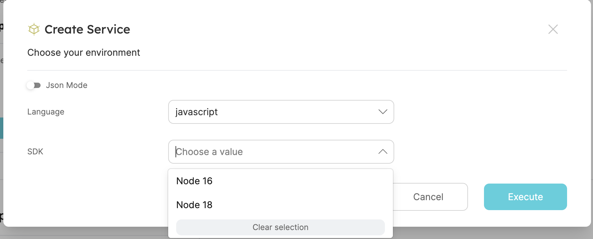
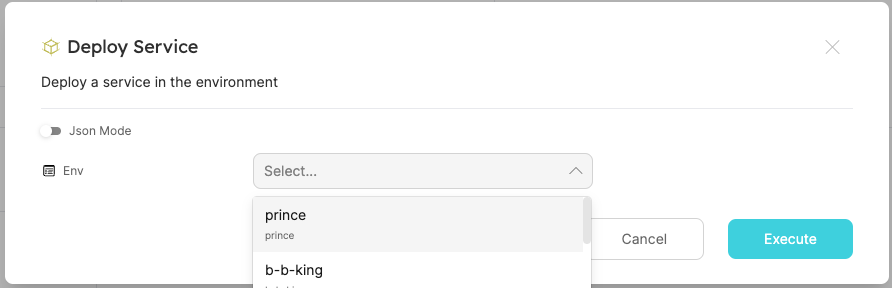
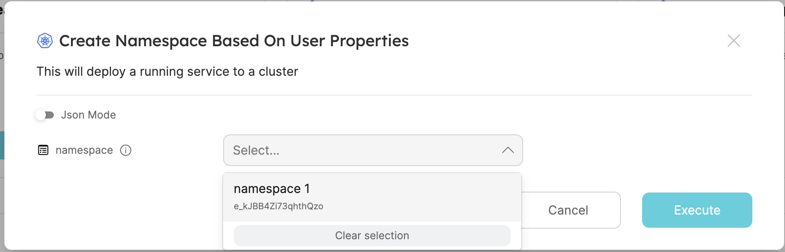
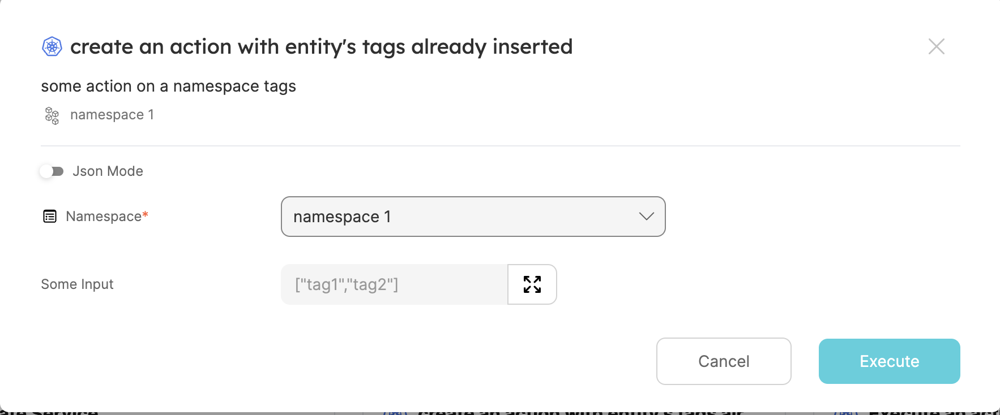
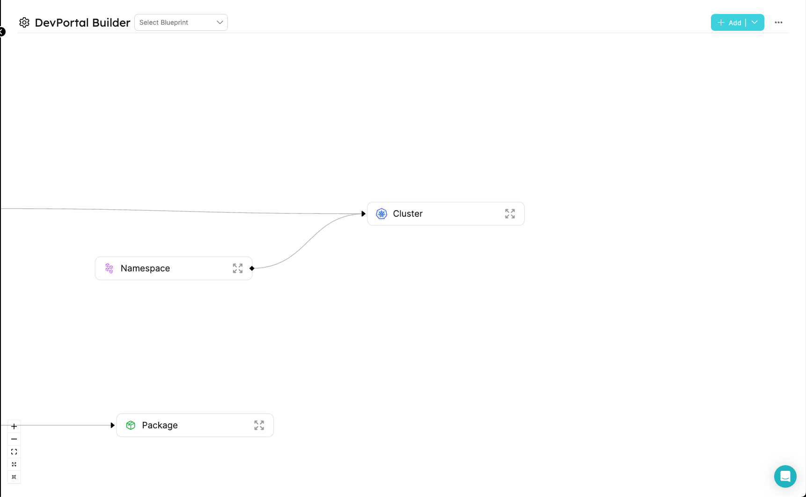
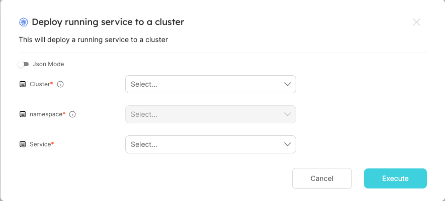

import Tabs from '@theme/Tabs';
import TabItem from '@theme/TabItem';

# Advanced Form Configurations

Advanced user form settings allow you to create more customizable experiences for users who perform self-service actions. This is done by creating an adaptive user form that changes according to data about the entity, the user, and the user form inputs.

### Common Use Cases

- Filter the available options in a dropdown input.
- Create a dependency between inputs to allow the user to select a value based on the value of another input.
- Define dynamic default values based on the logged-in user properties(such as teams, email, role etc`) or the entity that the action is being executed on (for day-2 or delete actions only).

#### building such actions can be done by leveraging 3 keys in the action's schema:

<Tabs
defaultValue="jqQuery"
values={[
{ label: 'dependsOn', value: 'DependsOn', },
{ label: 'dataset', value: 'Dataset', },
{ label: 'jqQuery', value: 'jqQuery', },
]}>
<TabItem value="DependsOn">
The dependsOn property is used to create a dependency between inputs. Input dependency means that if input X depends on input Y, input X will be disabled until input Y is filled.
In the example below, the "SDK" input is depends on the "Language" input

```json
{
  "language": {
    "type": "string",
    "enum": ["javascript", "python"]
  },
  "SDK": {
    "type": "string",
    "dependsOn": ["language"]
  }
}
```

</TabItem>
<TabItem value="Dataset">
The dataset property is used to filter the available options in an "entity" format input.
The "value" key in the dataset can be a constant (String, number, etc) or a "jqQuery" object. Read more on how to use the "dataset" <a href="/search-and-query/#combinator">here</a>

```json
{
  "namespace": {
    "type": "string",
    "format": "entity",
    "blueprint": "namespace",
    "dataset": {
      "combinator": "and",
      "rules": [
        {
          "property": "$team",
          "operator": "containsAny",
          "value": "value here. this can also be a 'jqQuery' object"
        }
      ]
    }
  }
}
```

</TabItem>
<TabItem value="jqQuery">
The jqQuery property is used to create a query that can be used to extract data from the entity, the logged-in user, or the current action's form inputs. The query can also be used to perform data manipulations.

```json
{
  "language": {
    "type": "string",
    "enum": ["javascript", "python"],
  }
},
{
  "SDK": {
    "type": "string",
    "enum": {
      "jqQuery": "if .form.language == \"javascript\" then [\"Node 16\", \"Node 18\"] else [\"Python 3.8\"] end"
    },
  }
}
```

### All the properties you can access using the "jqQuery" object

<Tabs
defaultValue="form"
values={[
{label: 'form', value: 'form'},
{label: 'entity', value: 'entity'},
{label: 'user', value: 'user'},
]}>
<TabItem value="form">
The value of the input that was inserted by the user in the action form.

Usage:

```json
{
  "jqQuery": ".form.input1"
}
```

The available form object(each input is a key in the action's `userInputs` object):

```json
{
  "input1": "...",
  "input2": "...",
  "input3": "..."
}
```

  </TabItem>
  <TabItem value="entity">
  The properties of the entity on which the action is performed. Entity data is only available in "day-2" and "delete" actions.

Usage:

```json
{
  "jqQuery": ".entity.properties.property1"
}
```

The available entity object:

```json
{
  "identifier": "...",
  "title": "...",
  "blueprint": "...",
  "team": ["..."],
  "properties": {
    "property1": "...",
    "property2": "...",
    "property3": "..."
  },
  "relations": {
    "relation1": "...",
    "relation2": "...",
    "relationMany": ["...", "..."]
  },
  "createdAt": "...",
  "createdBy": "...",
  "updatedAt": "...",
  "updatedBy": "...",
  "scorecards": {
    "ResourceQuota": {
      "rules": [
        {
          "identifier": "...",
          "status": "...",
          "level": "..."
        },
        {
          "identifier": "...",
          "status": "...",
          "level": "..."
        }
      ],
      "level": "..."
    },
    "Ownership": {
      "rules": [
        {
          "identifier": "...",
          "status": "...",
          "level": "..."
        },
        {
          "identifier": "...",
          "status": "...",
          "level": "..."
        }
      ],
      "level": "..."
    }
  }
}
```

  </TabItem>
  <TabItem value="user">
  The properties of the user that executed the action.

Usage:

```json
{
  "jqQuery": ".user.email"
}
```

The available logged-in user object:

```json
{
  "picture": "...",
  "userId": "...",
  "email": "...",
  "name": "...",
  "mainRole": "...",
  "roles": [
    {
      "name": "..."
    }
  ],
  "teams": [
    {
      "name": "...",
      "provider": "..."
    },
    {
      "name": "...",
      "provider": "..."
    }
  ]
}
```

  </TabItem>
</Tabs>
Keys that are supported with jqQuery expressions:

| Key     | Description                       |
| ------- | --------------------------------- |
| enum    | any enum of a property            |
| value   | the value inside a "dataset" rule |
| default | the default value of any property |

</TabItem>
</Tabs>

## Usage examples

### Creating a dependency between two form inputs

This example contains a dependency between the "language" input and the "SDK" input. The "SDK" input's available options are defined according to the selected language (see the jqQuery key).

```json
{
  "language": {
    "type": "string",
    "enum": ["javascript", "python"],
  }
},
{
  "SDK": {
    "type": "string",
    "enum": {
      "jqQuery": "if .form.language == \"javascript\" then [\"Node 16\", \"Node 18\"] else [\"Python 3.8\"] end"
    },
    "dependsOn": ["language"]
  }
}
```



### Filter the dropdown's available options based on a property

This example contains a filter that will only display environment entities whose type is not `production`:

```json
{
  "env": {
    "type": "string",
    "format": "entity",
    "blueprint": "env",
    "dataset": {
      "combinator": "and",
      "rules": [
        {
          "property": "role",
          "operator": "!=",
          "value": "production"
        }
      ]
    }
  }
}
```



:point_up: only the environments which are not with the role "production" will appear in the dropdown. :point_up:

### Filter the dropdown's available options based on properties of the user that execute the action

This example contains a filter that will only display the namespaces that belong to the user's teams (notice the value key in the rules object).

```json
{
  "namespace": {
    "type": "string",
    "format": "entity",
    "blueprint": "namespace",
    "dataset": {
      "combinator": "and",
      "rules": [
        {
          "property": "$team",
          "operator": "containsAny",
          "value": {
            "jqQuery": "[.user.teams[].name]"
          }
        }
      ]
    }
  }
}
```



:point_up: these are only the namespaces that are associated with the logged-in user's teams. :point_up:

### Filter the dropdown's available options based on the properties of the entity on which the action is performed (for day-2 or delete actions only)

This example contains a filter that will only display the namespaces that have similar tags to the tags of the entity on which the action is performed.

```json
{
  "namespace": {
    "type": "string",
    "format": "entity",
    "blueprint": "namespace",
    "dataset": {
      "combinator": "and",
      "rules": [
        {
          "property": "tags",
          "operator": "containsAny",
          "value": {
            "jqQuery": "[.entity.properties.tags[]]"
          }
        }
      ]
    }
  }
}
```

### Setting a default value with the jqQuery

This example contains an array input with a default value that will be equal to the tags of the entity on which the action is performed

```json
{
  "some_input": {
    "type": "array",
    "default" {
      "jqQuery": ".entity.properties.tags"
    }
  }
}
```



:point_up: The namespace tags are already inserted to the form. :point_up:

<!-- this is commented out for now -->
<!-- ## Complete Example
In this example, we will create an action that lets the user select a cluster and a namespace in that cluster. The user will also be able to select a service that is already running in the cluster. The action will then deploy the selected service to the selected namespace in the cluster. The user will only be able to select a service that is linked to his team.
#### the existing model in Port:

#### the action's configuration:
```json
{
  "identifier": "createRunningService",
  "title": "Deploy running service to a cluster",
  "icon": "Cluster",
  "userInputs": {
    "properties": {
      "Cluster": {
        "type": "string",
        "format": "entity",
        "blueprint": "Cluster",
        "title": "Cluster",
        "description": "The cluster to create the namespace in"
      },
      "namespace": {
        "type": "string",
        "format": "entity",
        "blueprint": "namespace",
        "dependsOn": ["Cluster"],
        "dataset": {
          "combinator": "and",
          "rules": [
            {
              "blueprint": "Cluster",
              "operator": "relatedTo",
              "value": {
                "jqQuery": ".form.Cluster.identifier"
              }
            }
          ]
        },
        "title": "namespace",
        "description": "The namespace to create the cluster in"
      },
      "service": {
        "type": "string",
        "format": "entity",
        "blueprint": "Service",
        "dataset": {
          "combinator": "and",
          "rules": [
            {
              "blueprint": "$team",
              "operator": "containsAny",
              "value": {
                "jqQuery": "[.user.teams[].name]"
              }
            }
          ]
        },
        "title": "Service"
      }
    },
    "required": ["Cluster", "namespace", "service"]
  },
  "invocationMethod": {
    "type": "WEBHOOK",
    "url": "https://example.com"
  },
  "trigger": "CREATE",
  "description": "This will deploy a running service to a cluster"
}
```
#### The action in the developer portal:

:point_up: The user will be required to choose a cluster, then a namespace from the selected cluster. And will be able to deploy only services associated with his team -->
