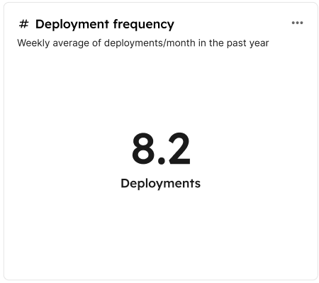
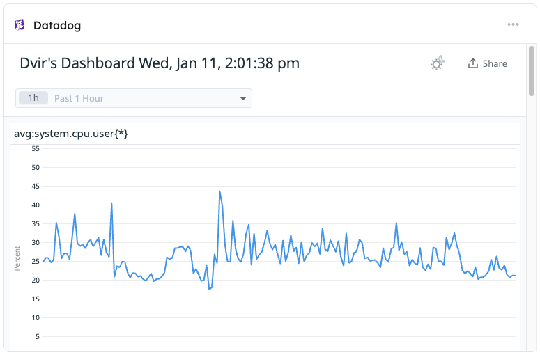

# Dashboard widgets

Port supports various visualizations in the form of widgets, allowing you to display data from your software catalog using graphic elements, making it easier to make sense of large datasets.

Dashboards are available in the following locations:

1. The [Home page](https://app.getport.io/organization/home) of your Port app - the home page itself is a dashboard, allowing you to add and customize any of the widgets described on this page.
2. Every [entity page](/customize-pages-dashboards-and-plugins/page/entity-page#dashboard-widgets) can have a `dashboard` tab with its own widgets.
3. The [software catalog](https://app.getport.io/services) allows you to create customizable [dashboard pages](/customize-pages-dashboards-and-plugins/page/dashboard-page).

## Widget types

### Pie chart

You can create a pie chart illustrating data from entities in your software catalog divided by categories and entity properties inside a specific entity page [**specific entity page**](../page/entity-page.md).


#### Visualization properties

| Field                   | Type     | Description                                                                                                                  | Default | Required |
| ----------------------- | -------- | ---------------------------------------------------------------------------------------------------------------------------- | ------- | -------- |
| `Title`                 | `String` | Pie chart title                                                                                                              | `null`  | `true`   |
| `Icon`                  | `String` | Pie chart Icon                                                                                                               | `null`  | `false`  |
| `Description`           | `String` | Pie chart description                                                                                                        | `null`  | `false`  |
| `Blueprint`             | `String` | The chosen blueprint from which related entities data is visualized                                                          | `null`  | `true`   |
| `Breakdown by property` | `String` | Group your chart by a specific property                                                                                      | `null`  | `true`   |
| `Filters`               | `Array`  | Filters to include or exclude specific data based on Port's [Search Rules](../../search-and-query/search-and-query.md#rules) | []      | `false`  |

### Number chart

You can create a number chart visualization from related entities in the [**specific entity page**](../page/entity-page.md). You can either count the entities or perform an aggregation function on a number property. You can also filter entities so the aggregation number chart will only apply to a limited set of entities with Port's [Search Rules](/search-and-query/search-and-query.md#rules)



#### Number chart properties

| Field             | Type     | Description                                                                                                                                                                                                                                 | Default    | Required |
| ----------------- | -------- | ------------------------------------------------------------------------------------------------------------------------------------------------------------------------------------------------------------------------------------------- | ---------- | -------- |
| `Title`           | `String` | Number Chart title                                                                                                                                                                                                                          | `null`     | `true`   |
| `Icon`            | `String` | Number Chart Icon                                                                                                                                                                                                                           | `null`     | `false`  |
| `Description`     | `String` | Number Chart description                                                                                                                                                                                                                    | `null`     | `false`  |
| `Blueprint`       | `String` | The chosen blueprint from which related entities data is visualized from                                                                                                                                                                    | `null`     | `true`   |
| `Calculate By`    | `String` | Aggregate by either counting the entities or perform a function on a property. Possible values: `entities`, `property`                                                                                                                      | `entities` | `true`   |
| `Property`        | `String` | The number chart value will be the selected property's aggregated value (according to the chosen function). The `property` key is only available when `Calculate By` is equal to `property`                                                 | `null`     | `true`   |
| `Function`        | `String` | In case `Calculate By` is equal to `property` the options are: sum, min, max, average and median. <br/> In case `Calculate By` is equal to `entities` the options are: count and average.                                                   | `null`     | `true`   |
| `Average of`      | `String` | In case `Calculate By` is equal to `entities` the options are: hour, day ,week and month. <br/> In case `Calculate By` is equal to `property` the options are: hour, day, week, month and total (divide the sum by the number of entities). | `null`     | `true`   |
| `Measure time by` | `String` | Used to specify an alternative property to use as the time property for the average calculation instead of the default field which is `createdAt`.                                                                                          | `null`     | `false`  |
| `Filters`         | `Array`  | Filters to include or exclude specific data based on Port's [search rules](../../search-and-query/search-and-query.md#rules)                                                                                                                | []         | `false`  |
| `unit`            | `String` | The unit of the number chart. Possible Values: `%`, `$`, `£`, `€`, `none`, `custom`                                                                                                                                                         | `null`     | `true`   |
| `unitCustom`      | `String` | Text to display below the number value. The `unitCustom` key is only available when `unit` equals to `custom`                                                                                                                               | `null`     | `true`   |
| `unitAlignment`   | `String` | `left`, `right`, `bottom`.                                                                                                                                                                                                                  | `null`     | `true`   |

:::note
When performing calculations of average time intervals, such as by hour, day, week, or month, it is important to note that any partial interval is considered as a full interval. This approach ensures consistency across different time units.

For example, if the dataset includes information spanning across 2 hours and 20 minutes, but the selected average timeframe is `hour`, then the summed value will be divided by 3 hours.
:::

### Markdown

This widget allows you to display any markdown content you wish in formatted form:


#### Markdown widget properties

| Field      | Type     | Description           | Default | Required |
| ---------- | -------- | --------------------- | ------- | -------- |
| `Title`    | `String` | Markdown widget title | `null`  | `true`   |
| `Icon`     | `String` | Markdown widget Icon  | `null`  | `false`  |
| `markdown` | `String` | Markdown content      | `null`  | `false`  |

### Iframe visualization

You can create an iframe widget to display an embedded url in the dashboard. The iframe widget is useful to display external dashboards or other external content. It also appends to the iframe URL query params the entity identifier and the blueprint identifier so the embedded page can use it for various purposes.

The entity identifier will be concatenated under the `entity` query param and the blueprint identifier will be concatenated under the `blueprint` query param. For example: `https://some-iframe-url.com?entity=entity_identifier&blueprint=blueprint_identifier`.



#### Widget properties

| Field               | Type           | Description                                                                                                                                            | Default | Required |
| ------------------- | -------------- | ------------------------------------------------------------------------------------------------------------------------------------------------------ | ------- | -------- |
| `Title`             | `String`       | Iframe widget title                                                                                                                                    | `null`  | `true`   |
| `Icon`              | `String`       | Iframe widget Icon                                                                                                                                     | `null`  | `false`  |
| `Description`       | `String`       | Iframe widget description                                                                                                                              | `null`  | `false`  |
| `URL`               | `String`       | Iframe widget url                                                                                                                                      | `null`  | `false`  |
| `URL type`          | `String`       | `public` or `protect`                                                                                                                                  | `null`  | `false`  |
| `Authorization Url` | `URL String`   | If the `URL type` is `protected` this will be required. Read more about it [here](/build-your-software-catalog/customize-integrations/configure-data-model/setup-blueprint/properties/embedded-url/authentication/#authentication-code-flow--pkce) | `null`  | `false`  |
| `clientId`          | `String`       | If the `URL type` is `protected` this will be required. Read more about it [here](/build-your-software-catalog/customize-integrations/configure-data-model/setup-blueprint/properties/embedded-url/authentication/#authentication-code-flow--pkce) | `null`  | `false`  |
| `Scopes`            | `String Array` | If the `URL type` is `protected` this will be required. Read more about it [here](/build-your-software-catalog/customize-integrations/configure-data-model/setup-blueprint/properties/embedded-url/authentication/#authentication-code-flow--pkce) | `null`  | `false`  |
| `Token URL`         | `URL String`   | If the `URL type` is `protected` this will be required. Read more about it [here](/build-your-software-catalog/customize-integrations/configure-data-model/setup-blueprint/properties/embedded-url/authentication/#authentication-code-flow--pkce) | `null`  | `false`  |

### Table

This widget allows you to create tables displaying all entities based on a selected blueprint.  
Tables can be [searched, filtered and customized](/customize-pages-dashboards-and-plugins/page/catalog-page#customization) as you wish, using the corresponding buttons in the widget.


#### Customization

Just like catalog pages, tables support the following customization options:

- [Initial filters](/customize-pages-dashboards-and-plugins/page/catalog-page/#initial-filters)
- [Excluded properties](/customize-pages-dashboards-and-plugins/page/catalog-page/#excluded-properties)

### Action card

This widget allows you to execute [self-service actions](/create-self-service-experiences) directly from any dashboard (including your homepage).

A single action card can contain one or multiple actions:

**Single action**  
To execute the action, click on the button in the bottom left corner of the widget:


<br/><br/>

**Multiple actions**  
When choosing multiple actions, you can choose your own title for the widget.  
To execute an action, click on the ⚡ button next to it:


### Action runs

This widget allows you to create a table displaying all past runs of a [self-service action](/create-self-service-experiences) in your portal.  
The table will automatically display data about each run, including status, input parameters, the executing user, and more. 


## Chart filters

[Pie charts](#pie-chart), [number charts](#number-chart) and [tables](#table) support filters, which allow you to include or exclude specific data from them. The filters are based on Port's [Search Rules](../../search-and-query/search-and-query.md#rules), and are set when creating the widget:


### Filter example: only deployment entities from the last week

Let's assume we have a [blueprint](/build-your-software-catalog/customize-integrations/configure-data-model/setup-blueprint/setup-blueprint.md) that is called `Service` which is related to another blueprint called `Deployment`, and we want to create visualizations on top of the last week's deployments of this service.

To achieve this desired state, we can go into one of the `Service`'s profile pages and create a new visualization. After selecting the `Deployment` blueprint in the dropdown, we can add the following filter to the `Filters` array:

```json showLineNumbers
[
  {
    "property": "$createdAt",
    "operator": "between",
    "value": {
      "preset": "lastWeek"
    }
  }
]
```

### Dynamic filters

You can use [dynamic properties](/search-and-query/#dynamic-properties) of the logged-in user when filtering a widget.
