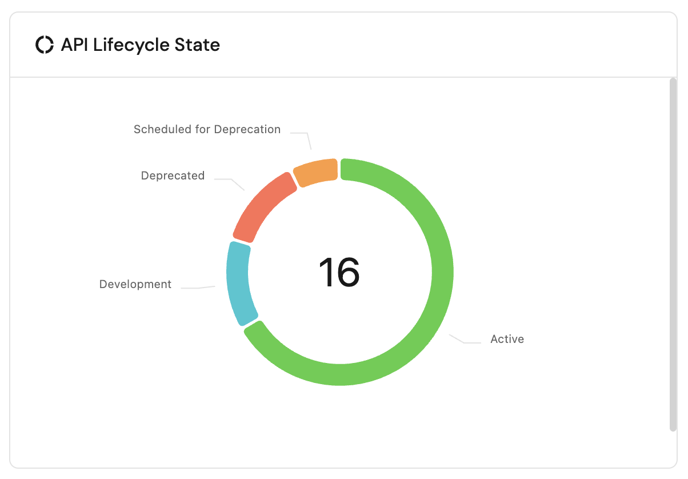

# Dashboards

Port supports multiple visualizations, allowing you to display data from your software catalog in a visual and graphic manner, making it easier to create custom dashboard and make sense of large datasets.

Continue reading to learn more about our visualization types:

## Creating visualizations

- On the top right of the page click on `Add Visualization` button;
- Select the desired visualization:


- Fill out the form and click save.


## Editing visualizations

- On the top right of the pie chart widget click on the three dots icon;
- Select your desired action (edit/delete).


## Visualization types

### Pie chart

You can create a pie chart illustrating data from entities in your software catalog divided by categories and entity properties inside a specific entity page [**specific entity page**](../page/entity-page.md).



#### Visualization properties

| Field                   | Type     | Description                                                                                                                  | Default | Required |
| ----------------------- | -------- | ---------------------------------------------------------------------------------------------------------------------------- | ------- | -------- |
| `Title`                 | `String` | Pie chart title                                                                                                              | `null`  | `true`   |
| `Icon`                  | `String` | Pie chart Icon                                                                                                               | `null`  | `false`  |
| `Description`           | `String` | Pie chart description                                                                                                        | `null`  | `false`  |
| `Blueprint`             | `String` | The chosen blueprint from which related entities data is visualized                                                          | `null`  | `true`   |
| `Breakdown by property` | `String` | Group your chart by a specific property                                                                                      | `null`  | `true`   |
| `Filters`               | `Array`  | Filters to include or exclude specific data based on Port's [Search Rules](../../search-and-query/search-and-query.md#rules) | []      | `false`  |

### Metric chart

You can create a metric visualization from related entities in the [**specific entity page**](../page/entity-page.md). You can either count the entities or perform an aggregation function on a number property. You can also filter entities so the aggregation metric will only apply to a limited set of entities with Port's [Search Rules](../../search-and-query/search-and-query.md#rules)


#### Metric properties

| Field             | Type     | Description                                                                                                                                                                                                                                 | Default    | Required |
| ----------------- | -------- | ------------------------------------------------------------------------------------------------------------------------------------------------------------------------------------------------------------------------------------------- | ---------- | -------- |
| `Title`           | `String` | Metric title                                                                                                                                                                                                                                | `null`     | `true`   |
| `Icon`            | `String` | Metric Icon                                                                                                                                                                                                                                 | `null`     | `false`  |
| `Description`     | `String` | Metric description                                                                                                                                                                                                                          | `null`     | `false`  |
| `Blueprint`       | `String` | The chosen blueprint from which related entities data is visualized from                                                                                                                                                                    | `null`     | `true`   |
| `Calculate By`    | `String` | Aggregate by either counting the entities or perform a function on a property. Possible values: `entities`, `property`                                                                                                                      | `entities` | `true`   |
| `Property`        | `String` | The metric value will be the selected property's aggregated value (according to the chosen function). The `property` key is only available when `Calculate By` is equal to `property`                                                       | `null`     | `true`   |
| `Function`        | `String` | In case `Calculate By` is equal to `property` the options are: sum, min, max, average and median. <br/> In case `Calculate By` is equal to `entities` the options are: count and average.                                                   | `null`     | `true`   |
| `Average of`      | `String` | In case `Calculate By` is equal to `entities` the options are: hour, day ,week and month. <br/> In case `Calculate By` is equal to `property` the options are: hour, day, week, month and total (divide the sum by the number of entities). | `null`     | `true`   |
| `Measure time by` | `String` | sed to specify an alternative property to use as the time property for the average calculation instead of the default field which is `createdAt`.                                                                                           | `null`     | `false`  |
| `Filters`         | `Array`  | Filters to include or exclude specific data based on Port's [search rules](../../search-and-query/search-and-query.md#rules)                                                                                                                | []         | `false`  |
| `unit`            | `String` | The unit of the metric. Possible Values: `%`, `$`, `£`, `€`, `none`, `custom`                                                                                                                                                               | `null`     | `true`   |
| `unitCustom`      | `String` | Text to display below the metric value. The `unitCustom` key is only available when `unit` equals to `custom`                                                                                                                               | `null`     | `true`   |
| `unitAlignment`   | `String` | `left`, `right`, `bottom`.                                                                                                                                                                                                                  | `null`     | `true`   |

:::note
When performing calculations of average time intervals, such as by hour, day, week, or month, it is important to note that any partial interval is considered as a full interval. This approach ensures consistency across different time units.

For example, if the dataset includes information spanning across 2 hours and 20 minutes, but the selected average timeframe is `hour`, then the summed value will be divided by 3 hours.
:::

## Chart filters

The chart filters allow to include or exclude specific data from the visualization. The filters are based on Port's [Search Rules](../../search-and-query/search-and-query.md#rules)

### Filter example: only deployment entities from the last week

Let's assume we have a [blueprint](../../build-your-software-catalog/define-your-data-model/setup-blueprint/setup-blueprint.md) that is called `Service` which is related to another blueprint called `Deployment`, and we want to create visualizations on top of the last week's deployments of this service.

To achieve this desired state, we can go into one of the `Service`'s profile pages and create a new visualization. After selecting the `Deployment` blueprint in the dropdown, we can add the following filter to the `Filters` array:

```json showLineNumbers
[
  {
    "property": "$createdAt",
    "operator": "between",
    "value": {
      "preset": "lastWeek"
    }
  }
]
```
