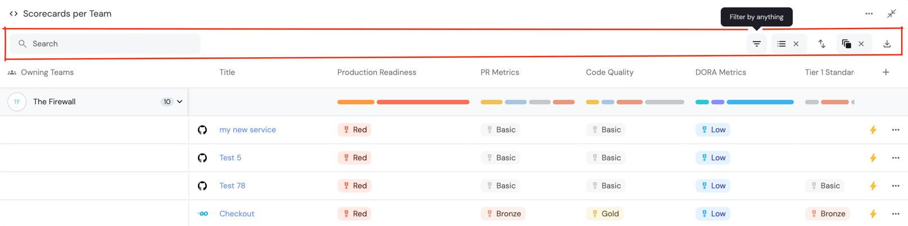
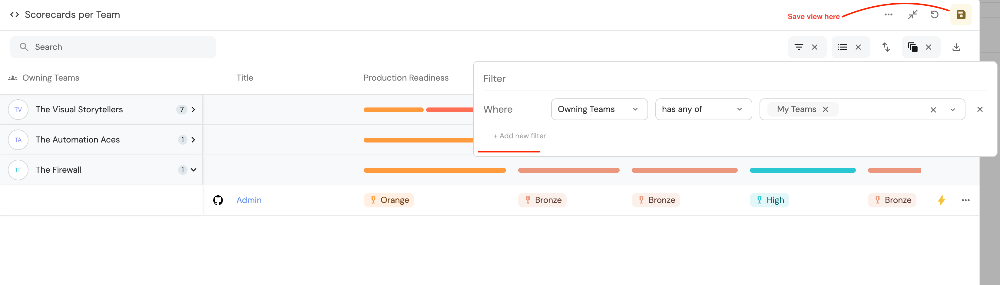
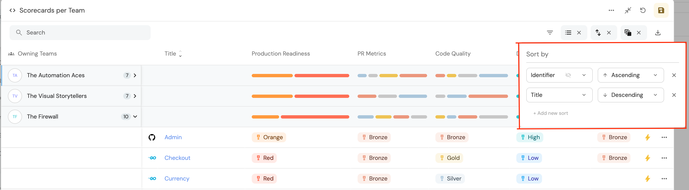
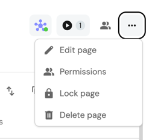
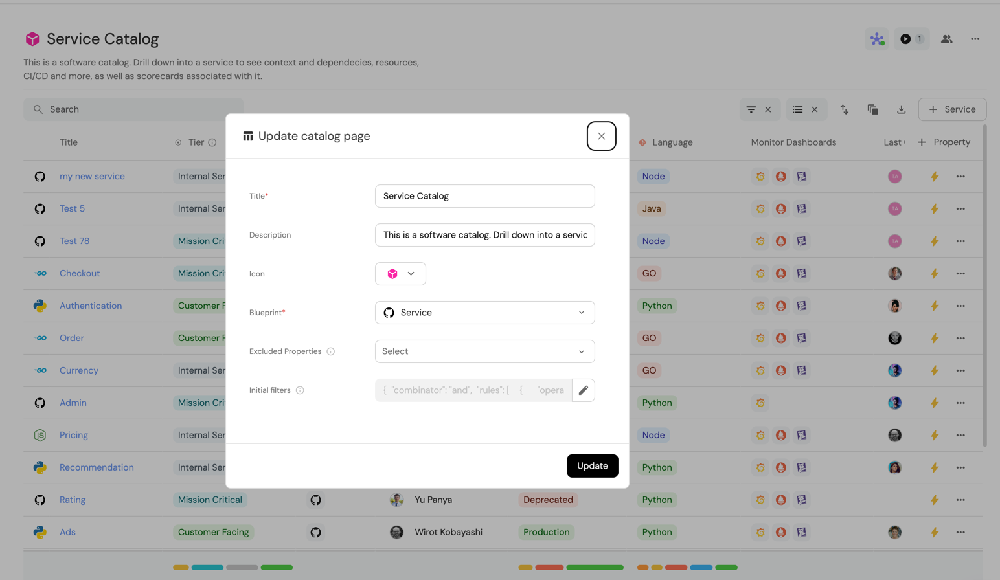

# Catalog page

A catalog page displays a table of all existing [entities](/build-your-software-catalog/sync-data-to-catalog/#creating-entities) created from a [blueprint](/build-your-software-catalog/define-your-data-model/setup-blueprint/#what-is-a-blueprint).  
In this example we can see all of the cluster entities we created from the `K8s Cluster` blueprint:


## Page creation

When a blueprint is created, a catalog page is automatically generated in the Software Catalog.  
You can also manually create additional catalog pages for any existing blueprint, and customize them as you wish. Read on to see the available customization options.

### Initial filters

In some cases, an entities table may be very large, resulting in long loading times. To prevent this, you can define filters that resolve when Port queries the data (rather than after querying).  
To define such a filter, use the `Initial filters` field when creating a page:


<br/><br/>

You can define any [supported rule](/search-and-query/#rules) in JSON format. Here is an example filter that fetches all `Deployments` that were created in the past month:

```json showLineNumbers
[
  {
    "property": "$updatedAt",
    "operator": "between",
    "value": { "preset": "lastMonth" }
  }
]
```

## Customization

The entities table can be customized, which will define the users' view of the Port platform.

:::tip

We highly recommend using these customizations to provide a clean and accurate view of the platform for your developers.

:::

All table customizations are available on the top bar of the table:



### Filter

You can filter the table by using the following menu:


You can define any filtering operator with a suitable value.

You can filter one or more values while setting the relation between each field with a `And/Or`.

#### My Teams Filter

By using the `My Teams` filter you will only see entities that belong to one of your teams. This means you will only see entities from teams that you are a member of.

This filter works on:

- `string` properties with the format `team`.
- The [meta property](../../build-your-software-catalog/define-your-data-model/setup-blueprint/properties/meta-properties) `Team`.



### Sort

You can sort the table by using the following menu:



You can sort by one or more fields of any kind.

:::tip
To sort a specific column, click on the column title.
:::

### Hide

You can hide table columns by using the following menu:


You can decide whether each field is viewable to users or not.

:::tip
We highly recommend hiding irrelevant data from users, to provide them with a clean work environment, relieving them from any distractions.
:::

### Group By

You can group by entities by using the following menu:


You can group results according to any field in the table.

:::tip
Group by is recommended when you want to create custom views for users, such as "microservices by owners".

Just create your `group by` setting, add additional viewing settings if needed, and [save a new page](#saving-new-pages) from the custom view.
:::

### Search

Port provides a free-text search option on tables. To search a table, click here:


-> [Explore how to control page visibility and permissions](./page-permissions.md)

## Page operations

Each page type has a set of operations that can be performed from the UI.  
The table below summarizes the available operations for every type:

| Page type                      | Save a view | Save view as<br /> a new page | Edit page | Delete page | Lock page |
| ------------------------------ | :---------: | :---------------------------: | :-------: | :---------: | :-------: |
| Blueprint page (Default Page)  |     ✅      |              ✅               |    ❌     |     ❌      |    ✅     |
| Custom page (manually created) |     ✅      |              ✅               |    ✅     |     ✅      |    ✅     |

:::info Default page
The default page is automatically generated when a new Blueprint is created. This page is directly tied to its Blueprint and cannot be edited or deleted.

In order to edit or delete the default Blueprint page, you need to edit or delete the Blueprint itself.

It's possible to filter, sort, group by, and use the table widget controls to change the layout of the default page.
:::

### Save a view

Every change made on a specific page, such as filtering or sorting, enables the `Save this view` button.  
Clicking on it will save the new view for all users.


:::note
The ability to save a view for all users is available only for the [Admin role](../../sso-rbac/rbac/rbac.md#roles)
:::

### Save a new page

Each time a change is made on a page, and the `Save this view` becomes enabled, you can press the small arrow on its right side to open a dropdown menu:

<center>


</center>

After clicking the `Save as a new page` button, a window will pop up:


#### Choose page icon

When saving a new page or editing an existing one, a set of icons is available to you:

<center>


</center>

### Edit, lock or delete a page

You can edit, lock or delete a page by clicking the `...` button in the top right corner:

<center>



</center>

#### Editing pages

Editing a page allows you to change its name and/or icon:



#### Locking pages

Locking a catalog page disables the option to hide columns or apply filters to modify the displayed data.

Locking pages gives you a way to specifically curate pages to your developers' needs. This ensures that they can't modify the views or see data that isn't relevant to them.

To learn how to lock pages, refer to [page permissions](./page-permissions.md#lock-pages).

#### Deleting pages

A manually-created catalog page can be deleted by clicking the `Delete page` button.
