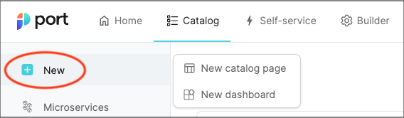

# Dashboard page

Dashboards are collections of widgets that allow you to display entity data using graphic elements:

Similar to [catalog pages](/customize-pages-dashboards-and-plugins/page/catalog-page), dashboards reside in the panel on the left-hand side of the software catalog.  
Dashboards are a great way to display aggregated data and track the information that is relevant and/or interesting to you and your developers.

## Creating a dashboard page

You can create as many dashboards as you'd like. To create a dashboard, click on `New` and select `New dashboard`:

## Adding new widgets

A dashboard can include any of the [supported widgets](/customize-pages-dashboards-and-plugins/dashboards/#visualization-types).

To add a new widget, click `Add` and choose your desired visualization type:

