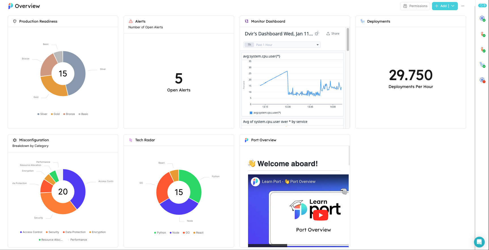
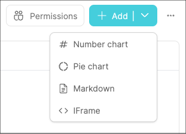

import Tabs from "@theme/Tabs"
import TabItem from "@theme/TabItem"
import PortTooltip from "/src/components/tooltip/tooltip.jsx"

# Dashboard page

Dashboards are collections of widgets that allow you to display entity data using graphic elements:



Similar to [catalog pages](/customize-pages-dashboards-and-plugins/page/catalog-page), dashboards reside in the panel on the left-hand side of the software catalog.  
Dashboards are a great way to display aggregated data and track the information that is relevant and/or interesting to you and your developers.

## Creating a dashboard page

You can create as many dashboards as you'd like.

<Tabs groupId="create-dashboard-page" queryString values={[
{label: "From the UI", value: "ui"},
{label: "From Pulumi", value: "pulumi"}
]}>

<TabItem value="ui">

To create a dashboard, click on `New` and select `New dashboard`:


</TabItem>

<TabItem value="api">

</TabItem>

<TabItem value="pulumi">

:::info Port Pulumi
See all the supported variables in the Port Pulumi [documentation](https://www.pulumi.com/registry/packages/port/api-docs/page/#create)
:::

**Introduction**

This guide walks you through creating custom pages using our [Pulumi provider](https://www.pulumi.com/registry/packages/port/). We'll cover:

- Widget Building Blocks: Creating the helper functions for generating different widget types.
- Dashboard Design: Composing widgets into layouts for your dashboard.
- Customization: Adapting the examples to your specific needs.

**Prerequisites**

1. Basic Port Concepts: Familiarity with <PortTooltip id="blueprint">blueprints</PortTooltip>, <PortTooltip id="entity">entities</PortTooltip>, and <PortTooltip id="dataset">datasets</PortTooltip> in your Port system is helpful.
2. You will also need your [Port credentials](https://docs.port.io/build-your-software-catalog/custom-integration/api/#find-your-port-credentials).
3. This guide also assumes that you have installed Pulumi, and [the Port provider's SDK](https://www.pulumi.com/registry/packages/port/installation-configuration/) in your chosen language.

<Tabs groupId="pulumi-create-dashboard" queryString values={[
{label: "Python", value: "python"},
{label: "Typescript", value: "typescript"}
]}>

<TabItem value="python">

1. Let us create some helper functions. These will help to create the different kinds of widgets.

<details>
<summary>Widget Helper Functions</summary>

```python showLineNumbers
import json
from port_pulumi import Page

# Widget Helper Functions
def generate_widget_id(title, widget_type):
    """
    Generates a unique widget ID based on the title and widget type.

    Args:
        title (str): The title of the widget.
        widget_type (str): The type of the widget (e.g., "markdown", "table-entities-explorer").

    Returns:
        str: The generated widget ID, e.g., "microservicesGuideMarkdown".
    """
    # Convert title to camelCase
    title_words = title.split()
    camel_case_title = title_words[0].lower() + "".join(
        word.capitalize() for word in title_words[1:]
    )

    # Combine camelCase title and widget type
    base_id = f"{camel_case_title}{widget_type.capitalize()}"

    # Ensure the length does not exceed the limit
    max_length = len("QlUwO3VRBMQ3HjdH")
    return base_id[:max_length]

# Load markdown from a file helper function
def read_markdown_file(file_path):
    with open(file_path, "r", encoding="utf-8") as file:
        markdown_content = file.read()
        return markdown_content


def create_markdown_widget(title, description, markdown_content):
    """
    Creates a markdown widget configuration.

    Args:
        title (str): The title of the widget.
        subtitle (str): The subtitle of the markdown content.
        description (str): A description for the widget.

    Returns:
        tuple: A tuple containing:
            * widget_config (dict): The widget configuration dictionary.
            * widget_id (str): The generated widget ID.
    """
    widget_id = generate_widget_id(title, "markdown")
    widget_config = {
        "title": title,
        "icon": "BlankPage",
        "markdown": markdown_content,
        "type": "markdown",
        "description": description,
        "id": widget_id,
    }
    return widget_config, widget_id


def create_iframe_widget(title, url, url_type="public", description=""):
    widget_id = generate_widget_id(title, "iframe-widget")
    widget_config = {
        "title": title,
        "description": description,
        "icon": "Code",
        "urlType": url_type,
        "url": url,
        "type": "iframe-widget",
        "id": widget_id,
    }
    return widget_config, widget_id

```

</details>

<br />

2. Now we can define the widgets in our dashboard and the layout of the page.

<details>
<summary>Dashboard Configuration</summary>

```python showLineNumbers
# ... (Rest of the Code: Helper Functions)

file_path = "microservices.md"  # Replace with the path to your Markdown file
markdown_content = read_markdown_file(file_path)

# Widget Creation (with IDs); we use the IDs to define the layout of the dashboard
markdown_config, markdown_id = create_markdown_widget(
    title="Service Guide",
    description="Services are typically organized around business capabilities. Each service is often owned by a single, small team.",
    markdown_content=markdown_content,
)

quote_config, quote_id = create_iframe_widget(
    title="Quote of the Day",
    url="https://kwize.com/quote-of-the-day/embed/&txt=0"
)

# Dashboard Layout Definition
dashboard_layout = {
    "id": "myDashboardWidget",  # This is optional, as Port can auto-generate IDs
    "type": "dashboard-widget",
    "layout": [
        {
            "columns": [
                {"id": markdown_id, "size": 6},
                {"id": quote_id, "size": 6},
            ],
            "height": 400,
        }
    ],
}

widgets_config = {
    **dashboard_layout,  # Embed the layout structure
    "widgets": [
        markdown_config,
        quote_config
    ],
}

print(widgets_config)
```

</details>
<br />

3. Now we can define the page and run `pulumi up` to create the page in Port.
<details>
<summary>Page Definition</summary>

```python showLineNumbers
import json
from port_pulumi import Page

// ... (Rest of the Code)

# Page Creation
microservice_dashboard_page = Page(
    "microservice-overview-page-resource",
    identifier="microservice_overview_page",
    title="Microservices Dashboard",
    icon="Microservice",
    type="dashboard",
    widgets=[json.dumps(widgets_config)],
)
```

</details>

<br />

4. Let us now add helper functions to create <PortTooltip id="dataset">dataset</PortTooltip> dependent widgets.

:::tip
If you have not already, we recommend [installing](/build-your-software-catalog/sync-data-to-catalog/git/github/#setup) the GitHub app in order to get some data into your Port account. Subsequently, you can use the blueprints from this [guide](/build-your-software-catalog/sync-data-to-catalog/git/github/examples/#mapping-repositories-file-contents-and-pull-requests) and follow along for tangible results.
:::

<details>
<summary>More Widget Functions</summary>

```python showLineNumbers
# ... (Other helper functions)

def use_dataset(blueprint_id):
    """
    Creates a dataset configuration that filters entities based on the provided blueprint ID.

    Args:
        blueprint_id (str): The ID of the blueprint to filter for.

    Returns:
        dict: The dataset configuration dictionary.
    """
    return {  # Directly return the dataset
        "combinator": "and",
        "rules": [{"operator": "=", "value": blueprint_id, "property": "$blueprint"}],
    }


def create_table_explorer_widget(title, dataset, excludedFields=["properties.readme"]):
    widget_id = generate_widget_id(title, "table-entities-explorer")
    widget_config = {
        "displayMode": "widget",
        "title": title,
        "type": "table-entities-explorer",
        "dataset": dataset,
        "id": widget_id,
        "excludedFields": excludedFields,
    }
    return widget_config, widget_id


def create_entities_pie_chart_widget(title, dataset, property):
    widget_id = generate_widget_id(title, "entities-pie-chart")
    widget_config = {
        "title": title,
        "icon": "PieChart",
        "type": "entities-pie-chart",
        "dataset": dataset,
        "property": property,
        "id": widget_id,
    }
    return widget_config, widget_id


def create_entities_number_chart_widget(
    title,
    blueprint_id,
    dataset=[],
    func="average",
    measure_time_by="$createdAt",
    averageOf="day",
    description="",
):
    """
    Creates an entities number chart widget configuration.

    Args:
      title (str):  The title of the widget.
      dataset:  The dataset for the widget.
      func (str, optional): The aggregation function to use. Options: "average", "count", "sum". Defaults to "average".
      measure_time_by (str, optional): The property to use for time-based aggregations. Defaults to "$createdAt".
      averageOf (str, optional): The time period for averaging. Options: "day", "week", "month". Defaults to "day".
      description (str, optional): A description for the widget.

    Returns:
      tuple: A tuple containing the widget configuration dictionary and its ID.
    """

    widget_id = generate_widget_id(title, "entities-number-chart")
    widget_config = {
        "blueprint": blueprint_id,
        "calculationBy": "entities",
        "title": title,
        "description": description,
        "type": "entities-number-chart",
        "icon": "Calculator",
        "dataset": dataset,
        "func": func,
        "measureTimeBy": measure_time_by,
        "averageOf": averageOf,
        "unit": "custom",
        "unitCustom": "per day",
        "id": widget_id,
    }
    return widget_config, widget_id
```

</details>
<br />

5. Let us now create dataset dependent widgets.

<details>

<summary>Dataset Widgets</summary>

```python showLineNumbers
# ... Sample Data & Widget Creation ...

# ... (Creation of markdownConfig e.t.c)

# Dataset configuration: `service` is the name of the blueprint in Port
services_dataset = use_dataset("service")

table_config, table_id = create_table_explorer_widget(
    title="Services",
    dataset=services_dataset,
    excludedFields=["properties.readme"],
)

pie_chart_config, pie_chart_id = create_entities_pie_chart_widget(
    title="Languages", dataset=services_dataset, property="property#language"
)

pr_chart_config, pr_chart_id = create_entities_number_chart_widget(
    title="Avg Pull Requests",
    blueprint_id="githubPullRequest",
    description="Hpw many PRs do we open daily",
)

# Dashboard Layout Definition
dashboard_layout = {
    "id": "myDashboardWidget",  # This is optional, as Port can auto-generate IDs
    "type": "dashboard-widget",
    "layout": [
        # previous configuration: markdown and quote widgets,
        {
            "height": 400,
            "columns": [
                {"id": pie_chart_id, "size": 6},
                {"id": pr_chart_id, "size": 6},
            ],
        },
        {"height": 400, "columns": [{"id": table_id, "size": 12}]},
    ],
}

widgets_config = {
    **dashboard_layout,  # Embed the layout structure
    "widgets": [
        markdown_config,
        quote_config,
        # highlight-start
        pie_chart_config,
        pr_chart_config,
        table_config
        # highlight-end
    ],
}

print(widgets_config)
```

</details>
<br />

6. Now you can run the `pulumi up` command again to update the page.

</TabItem>

<TabItem value="typescript">

```typescript
import * as pulumi from "@pulumi/pulumi";
import * as port from "@port-labs/port";
import * as fs from "fs"; // Assuming we use Node's 'fs' module for file reading

// ------------------ Widget Helper Functions ------------------

interface WidgetConfig {
  // Sample interface, adjust as needed
  id: string;
  title: string;
  type: string;
  icon?: string; // Optional properties
  description?: string;
  markdown?: string;
  blueprint?: string;
  displayMode?: string;
  dataset?: any;
  excludedFields?: string[];
  property?: string;
  calculationBy?: string;
  urlType?: string;
  // ... other widget properties
}

function generateWidgetId(title: string, widgetType: string): string {
  const titleWords = title.split(" ");
  const camelCaseTitle =
    titleWords[0].toLowerCase() +
    titleWords
      .slice(1)
      .map((word) => word)
      .join("");
  const baseId = `${camelCaseTitle}${widgetType}`;

  // Ensure the length does not exceed the limit
  const maxLength = 20; // Replace with the correct limit if needed
  return baseId.substring(0, maxLength);
}

function createMarkdownWidget(
  title: string,
  description: string,
  markdownContent: string
): [WidgetConfig, string] {
  const widgetId = generateWidgetId(title, "markdown");
  const widgetConfig: WidgetConfig = {
    title,
    icon: "BlankPage",
    markdown: markdownContent,
    type: "markdown",
    description,
    id: widgetId,
  };
  return [widgetConfig, widgetId];
}

function createTableExplorerWidget(
  title: string,
  dataset: any,
  excludedFields: string[] = ["properties.readme"]
): [WidgetConfig, string] {
  const widgetId = generateWidgetId(title, "table-entities-explorer");
  const widgetConfig: WidgetConfig = {
    displayMode: "widget", // Assuming  this property exists
    title,
    type: "table-entities-explorer",
    dataset,
    id: widgetId,
    excludedFields,
  };
  return [widgetConfig, widgetId];
}

function createEntitiesPieChartWidget(
  title: string,
  dataset: any,
  property: string
): [WidgetConfig, string] {
  const widgetId = generateWidgetId(title, "entities-pie-chart");
  const widgetConfig = {
    title,
    icon: "PieChart",
    type: "entities-pie-chart",
    dataset,
    property,
    id: widgetId,
  };
  return [widgetConfig, widgetId];
}

function createIframeWidget(
  title: string,
  url: string,
  urlType: string = "public",
  description: string = ""
): [WidgetConfig, string] {
  const widgetId = generateWidgetId(title, "iframe-widget");
  const widgetConfig = {
    title,
    description,
    icon: "Code",
    urlType,
    url,
    type: "iframe-widget",
    id: widgetId,
  };
  return [widgetConfig, widgetId];
}

function createEntitiesNumberChartWidget(
  title: string,
  blueprintId: string,
  dataset: any = [],
  func: "average" | "count" | "sum" = "average",
  measureTimeBy: string = "$createdAt",
  averageOf: "day" | "week" | "month" = "day",
  description: string = ""
): [WidgetConfig, string] {
  const widgetId = generateWidgetId(title, "entities-number-chart");
  const widgetConfig = {
    blueprint: blueprintId,
    calculationBy: "entities",
    title,
    description,
    type: "entities-number-chart",
    icon: "Calculator",
    dataset,
    func,
    measureTimeBy,
    averageOf,
    unit: "custom",
    unitCustom: "per day",
    id: widgetId,
  };
  return [widgetConfig, widgetId];
}

// ------------------ Other Helper Functions ------------------

function readMarkdownFile(filePath: string): string {
  return fs.readFileSync(filePath, "utf-8");
}

function useDataset(blueprintId: string): any {
  // Type may vary depending on your provider
  return {
    combinator: "and",
    rules: [{ operator: "=", value: blueprintId, property: "$blueprint" }],
  };
}

// ------------------ Sample Data & Widget Creation ------------------

const servicesDataset = useDataset("service");
const githubPrDataset = useDataset("githubPullRequest");

const filePath = "microservices.md";
const markdownContent = readMarkdownFile(filePath);

const [markdownConfig, markdownId] = createMarkdownWidget(
  "Service Guide",
  "Services are typically organized around business capabilities...",
  markdownContent
);

// Table Explorer Widget
const [tableConfig, tableId] = createTableExplorerWidget(
  "Services",
  servicesDataset,
  ["properties.readme", "properties.slack"]
);

// Entities Pie Chart Widget
const [pieChartConfig, pieChartId] = createEntitiesPieChartWidget(
  "Languages",
  servicesDataset,
  "property#language"
);

// Iframe Widget
const [quoteConfig, quoteId] = createIframeWidget(
  "Quote of the Day",
  "https://kwize.com/quote-of-the-day/embed/&txt=0"
);

// Entities Number Chart Widget
const [prChartConfig, prChartId] = createEntitiesNumberChartWidget(
  "Avg Pull Requests",
  "githubPullRequest",
  githubPrDataset,
  "average",
  "$createdAt",
  "day",
  "How many PRs do we open daily?"
);

// ------------------ Dashboard Layout ------------------

const dashboardLayout = {
  id: "myDashboardWidget", // Optional
  type: "dashboard-widget",
  layout: [
    {
      // Row 1
      columns: [
        { id: markdownId, size: 6 }, // Markdown Widget (half width)
        { id: pieChartId, size: 6 }, // Pie Chart Widget (half width)
      ],
      height: 400,
    },
    {
      // Row 2
      columns: [
        { id: quoteId, size: 12 }, // Quote Widget (half width)
        { id: prChartId, size: 6 }, // PR Chart Widget (half width)
      ],
      height: 400,
    },
    {
      // Row 3
      columns: [
        { id: tableId, size: 12 }, // Table Widget (full width)
      ],
      height: 400,
    },
  ],
};

const widgetsConfig = {
  ...dashboardLayout,
  widgets: [
    markdownConfig,
    pieChartConfig,
    quoteConfig,
    prChartConfig,
    tableConfig,
  ],
};

// ------------------ Page Creation ------------------

export const microserviceDashboardPage = new port.Page(
  "microservice-overview-page-resource",
  {
    identifier: "microservice_overview_page",
    title: "Microservices Dashboard",
    icon: "Microservice",
    type: "dashboard",
    widgets: [JSON.stringify(widgetsConfig)],
  }
);
```

</TabItem>

</Tabs>

</TabItem>

</Tabs>


### Description

You can provide additional context to your developers by using the `Description` field when creating a dashboard page.  
This field supports adding links in markdown format: `[link text](https://www.address.com)`.


<br/><br/>

The description will be displayed at the top of the page, under the page title:


## Adding new widgets

A dashboard can include any of the [supported widgets](/customize-pages-dashboards-and-plugins/dashboards/#visualization-types).

To add a new widget, click `Add` and choose your desired visualization type:



## Reordering and resizing widgets

Widgets can be expanded and/or moved within a dashboard page.

To move a widget, drag it from the top-left corner to your desired position:


<br/><br/>

To resize a widget, hover over one of its sides until the blue bar appears, then drag it to expand/shrink:


