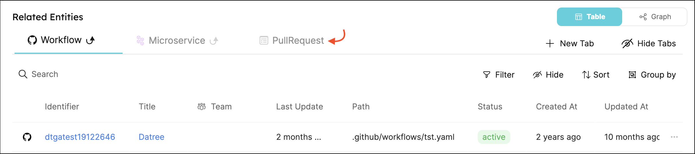
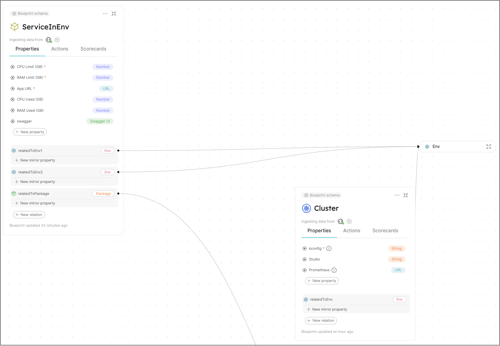
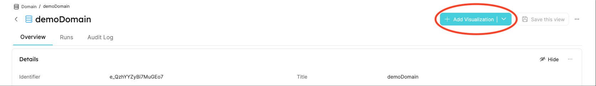
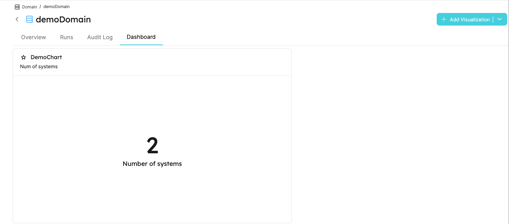

# Entity page

Each [entity](../../build-your-software-catalog/sync-data-to-catalog/sync-data-to-catalog.md#entity-json-structure) has a dedicated page that contains 3 tabs (by default):

- [`Overview`](#overview)
- [`Runs`](#runs)
- [`Audit log`](#audit-log)

## Overview

The Overview tab is comprised of two widgets:

### Details

Here you will find the entity's properties and their values, its scorecards and their values, and other metadata.

### Related entities

By default, all directly-related entities in the same direction will automatically appear in this widget. This is true for both forward-related and backward-related entities. Indirectly-related entities will not appear.

For example:

`Workflow Run` has a forward-relation to `Workflow`, which has a forward-relation to `Microservice`. `Microservice` has a **backward**-relation to `Pull Request`. Since we changed direction midway, this relation is **indirect**:

As you can see, when looking at the entity page of a certain `Workflow Run`, `Workflow` and `Microservice` automatically appear, but `Pull Request` does not, since its relation is in the other direction:

#### New related entity tab

You can add additional entities to the `Related entities` table by clicking on the `+ New Tab` button. In the dialog, the `Related blueprint` dropdown will display all entities that are related in any way to the current entity. In our `Workflow run` example above, we can use this button to add a `Pull request` tab to our widget.

In some cases, the related blueprint may be reachable by more than one relation, like this:

Say we want to add a `Cluster` tab to `ServiceInEnv`'s related entities. In such a case, the `related property` dropdown will display the possible relations for us to choose from:

#### Hide tabs

The `Hide tabs` button on the right allows you to control which tabs are visible in this widget.

## Runs

If the entity's blueprint has any [actions](/create-self-service-experiences/) configured, the `Runs` tab will display their history log, results, log streams, and more.

## Audit log

This tab displays all actions (including CRUD) that caused any change to the entity's configuration. For each change, useful metadata will be shown such as the initiator, diff before and after the change, relevant blueprint, and more.

## Dashboard widgets

[Visualization widgets](/customize-pages-dashboards-and-plugins/dashboards/) can be added to an entity page to display data using graphic elements.

You can add widgets to an entity page by using the `Add visualization` menu:

Let's create a simple number chart that displays the number of `System` entities related to this `Domain`:

After the first widget is created, a new tab called `dashboard` will be created in the entity page displaying the new widget:

Each additional visualization will be added as a widget to the `dashboard` tab.

## Additional tabs

Some of the [available property types](/build-your-software-catalog/define-your-data-model/setup-blueprint/properties/#supported-properties) are visual by nature. When defining one of these properties in a blueprint, an additional tab will be automatically created in each entity page related to this blueprint, displaying the property's content in the relevant visual format.

The following property types are supported:

- [Markdown](/build-your-software-catalog/define-your-data-model/setup-blueprint/properties/markdown)
- [Embedded URL](/build-your-software-catalog/define-your-data-model/setup-blueprint/properties/embedded-url)
- [Swagger UI](/build-your-software-catalog/define-your-data-model/setup-blueprint/properties/swagger)

## Entity page operations

Each page type has a set of operations that can be performed from the UI.  
The table below summarizes the available operations for an entity page:

| Page type   | Save a view | Save view as  a new page | Edit page | Delete page | Lock page |
| ----------- | :---------: | :---------------------------: | :-------: | :---------: | :-------: |
| Entity page |     ✅      |              ❌               |    ❌     |     ❌      |    ✅     |

For more information about each operation, see [page operations](/customize-pages-dashboards-and-plugins/page/catalog-page#page-operations).
