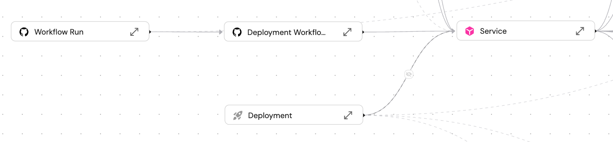

# Entity page

Each [entity](../../build-your-software-catalog/sync-data-to-catalog/sync-data-to-catalog.md#entity-json-structure) has a specific page that contains 3 tabs (by default):

- [`Overview`](#overview)
- [`Runs`](#runs)
- [`Audit log`](#audit-log)

## Overview

The Overview tab is comprised of two widgets:

### Details

### Related entities

By default, all directly-related entities in the same direction will automatically appear in the widget. This is true for both forward-related and backward-related entities. Indirectly-related entities will not appear.

For example:

`Workflow Run` has a forward-relation to `Workflow`, which has a forward-relation to `Microservice`. `Microservice` has a **backward**-relation to `Pull Request`:

As you can see, when looking at the entity page of a certain `Workflow Run`, `Workflow` and `Microservice` automatically appear, but `Pull Request` does not, since its relation is in the other direction:

#### New related entity tab

You can add additional entities to the `Related entities` table by clicking on the `+ New Tab` button. In the dialog, the `Target blueprint` dropdown will display all entities that are related in any way to the current entity.  
If there are multiple paths to reach the target blueprint, you will see the following message in the dialog:

In this case, you will need to choose a relation or property that will determine the path to the target.

## Runs

If the entity's blueprint has any [actions](/create-self-service-experiences/) configured, the `Runs` tab will display their history log, results, log streams, and more.

## Audit log

This tab displays all actions (including CRUD) that caused any change to the entity's configuration. For each change, useful metadata will be shown such as the initiator, diff before and after the change, relevant blueprint, and more.
