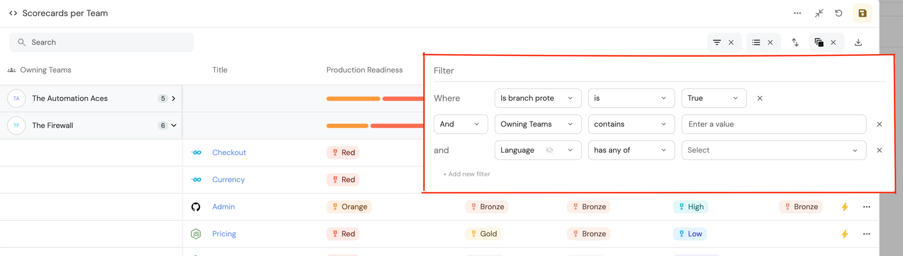

# Page

## What is a page?

A page displays Entity data in different forms, such as a table, data summary, etc.

### The basic concepts of a page

- When a Blueprint is created, a page is automatically generated. You can find it in the navigation bar, and it contains a single table widget;
- Pages are dynamic - you can create multiple pages that display diverse data, according to the filters you set in advance;
- Entity pages automatically appear for each new Entity you create.

### Pages architecture

#### Page widgets

Widgets enhance your developer portal by providing diverse visuals, based on the data ingested into Port.

A page can hold a single widget or multiple widgets, for example:

- Full table view widget;
- Markdown widget with the README of a service;
- etc.

To learn more, refer to the [Widgets](../widgets/widgets.md) section.

#### Page tabs

A tab is a sub-page within a page.

Pages can be separated into several tabs, each of which is a page that holds one or more widgets.

Default tabs:

- Overview;
- Runs;
- Audit Log.

## Blueprint page

This page displays a table widget that details all the Blueprints specific Entities.

## Page operations

Each page type has a set of operations that can be performed from the UI.  
The table below summarizes the available operations for every type:

| Page type                                           | Save a view | Save view as  a new page | Edit page | Delete page |
| --------------------------------------------------- | :---------: | :---------------------------: | :-------: | :---------: |
| Blueprint page (Default Page)                       |     ✅      |              ✅               |    ❌     |     ❌      |
| [Entity page](./entity-page.md)                     |     ✅      |              ❌               |    ❌     |     ❌      |
| [Users page](../../sso-rbac/rbac/rbac.md#users-tab) |     ✅      |              ❌               |    ❌     |     ❌      |
| Audit log page                                      |     ✅      |              ❌               |    ❌     |     ❌      |
| Custom page (generated from save as new page)       |     ✅      |              ✅               |    ✅     |     ✅      |

:::info Default page
The default page is automatically generated when a new Blueprint is created. That page is directly tied to its Blueprint and it cannot be edited or deleted.

In order to edit or delete the default Blueprint page, you need to edit or delete the Blueprint itself.

It's possible to filter, sort, group by, and use the table widget controls to change the layout of the default Blueprint page directly from the default page.
:::

All **page** operations are available on the right top bar, as shown here: (in line with the table above)

### Save a view

Every change made on a specific page, such as filtering or sorting, enables the `Save this view` button.  
Clicking on it will save the new view for all users.

:::note
The ability to save a view for all users is available only for the [Admin role](../../sso-rbac/rbac/rbac.md#roles)
:::

### Save a new page

Each time a change is made on a page, and the `Save this view` becomes enabled, you can press the small arrow on its right side to open the dropdown menu:

After clicking the `Save as a new page` button, a window will pop up:

:::note
When saving a new page or editing an existing one, a set of icons is available to you:

:::

### Edit, lock or delete a page

#### Editing pages

By clicking the `...` button on the top right corner, you can edit the page name and its icon.

Editing a page:

#### Locking pages

Locking a blueprints' page disables the option to hide columns or apply filters to modify the data shown in the page.

Locking pages gives you a way to specifically curate pages to your developers' needs and make sure they can't modify the views, this prevents them from seeing data that isn't relevant to them.

To learn how to lock pages, refer to the [tutorial](./tutorial.md#lock-pages)

#### Deleting pages

An Entity page is deleted automatically when the connected Entity is deleted.

## Table operations

Table operations are used to define the user’s view of the Port platform.

:::tip
We highly recommend using the table operations to provide a clean and accurate view of the platform for your developers.

:::

All **table** operations are available on the top bar of the table:

### Filter

You can filter a table by using the following menu:

To filter, you can define any filtering operator with a suitable value.

You can filter one or more values while setting the relation between each field filter with a: `And/Or`.

### Sort

You can sort the table on the following menu:

You can sort by one or more fields of any kind.

:::tip
To sort a specific column, click on the column title.
:::

### Hide

You can hide table columns on the following menu:

You can decide whether each field is viewable to users or not.

:::tip
We highly recommend hiding irrelevant data from users, to provide them with a clean work environment, relieving them from any irrelevant distractions.
:::

### Group By

You can group by Entities on the following menu:

You can group results according to any field in the table.

:::tip
Group by is recommended when you want to create custom views for users, such as "microservices by owners".

Just create your `group by` setting, add additional viewing settings if needed, and [save a new page](#saving-new-pages) from the custom view.
:::

### Search

We provide a free text search option on tables. To search on a table, click the left side of the top bar:

[Explore how to control page visibility with basic examples](./tutorial.md)

[Dive into advanced operations on Pages with our API ➡️ ](../../api-reference/api-reference.mdx)
