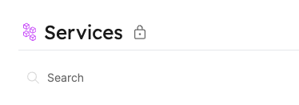

import Tabs from "@theme/Tabs"
import TabItem from "@theme/TabItem"

# Page Tutorial

## Page permissions

Pages have 4 regular CRUD permissions:

- Create, Read, Update and Delete.
- Currently only read permission can be modified.

## Get page permissions

- Any user can get the permissions of a specific page.

### From the API

:::note

- Remember that an access token is needed to make API requests, refer back to [Getting an API token](../../build-your-software-catalog/sync-data-to-catalog/api/api.md#get-api-token) if you need to generate a new one.
- Currently in order to see the page identifiers you can request all pages by making a  
  GET request to `https://api.getport.io/v1/pages`

:::

Make an **HTTP GET** request to the URL: `https://api.getport.io/v1/pages/{page_identifier}/permissions`.

The response will contain the roles and users that are allowed to read (view) the requested page:

```json showLineNumbers
{
  "read": {
    "roles": ["Admin", "Member"],
    "users": ["exampleUser1@example.com", "exampleUser2@example.com"],
    "teams": ["Team 1", "Team 2"]
  }
}
```

This response body indicates that those roles, users and teams have permissions to read the page.
In addition, every role, user and team which does not appear in this request body does not have permission to view the page.

:::note
Only page permissions of software catalog pages can be requested. For example, the permissions for the DevPortal Builder page and the audit log page cannot be changed.
:::

## Update page permissions

- Only users with the admin role can update the permissions of a specific page;
- Only page permissions of software catalog pages can be modified.

### From the API

To update page permissions, you will need to specify the roles, teams or users that should have permissions for the page.

To perform an update, make an **HTTP PATCH** request to the following URL: `https://api.getport.io/v1/pages/{page_identifier}/permissions`.

Here is an example request body:

```json showLineNumbers
{
  "read": {
    "roles": ["Admin", "Member"]
  }
}
```

:::tip

The `PATCH` API will perform updates only to keys that are specified in the request body. Be sure to include only the relevant keys in the request body (users, roles or teams)

If you do not specify a specific key (for example `users` in the request, user permissions to the specific page will remain unchanged).

When making changes to permissions, any role, user or team that does not appear in the corresponding key in the request body will lose permissions to the page (this is how you remove permissions to a page).

:::

### Examples

Let's present a set of page permissions and then explore how different `PATCH` request bodies change the effective permissions of the page.

Given the following permissions for a page:

```json showLineNumbers
{
  "read": {
    "roles": ["Admin", "Member"],
    "users": [],
    "teams": []
  }
}
```

#### Add permissions to role

Making an **HTTP PATCH** request with the following body will give the `Services-Moderator` role permissions to view the page (without removing the permissions of any existing role):

```json showLineNumbers
{
  "read": {
    "roles": ["Admin", "Member", "Services-Moderator"]
  }
}
```

#### Remove permissions from role

Making an **HTTP PATCH** request with the following body will remove the `Member` roles' permissions to view the page:

```json showLineNumbers
{
  "read": {
    "roles": ["Admin"]
  }
}
```

#### Add permissions to user

Making an **HTTP PATCH** request with the following body will give the specified users permissions to view the page (without changing the permissions of existing `roles`):

```json showLineNumbers
{
  "read": {
    "users": ["exampleUser1@example.com", "exampleUser2@example.com"]
  }
}
```

#### Add permissions to team

Making an **HTTP PATCH** request with the following body will give the specified teams permissions to view the page (without changing the permissions of existing `roles`):

```json showLineNumbers
{
  "read": {
    "teams": ["Team 1", "Team 2"]
  }
}
```

:::info
It is possible to update multiple permission keys (`roles`, `teams` and/or `users`) in a single `PATCH` request, just keep in mind that any `role`, `team` or `user` that is not specified and previously had permissions to the page, will lose those permissions.
:::

## Lock pages

Locking the page affects widgets that have Filter and/or Hide functionality.

See the section below for the different methods to lock a page:

<Tabs values={[
{label: "API", value: "api"},
{label: "UI", value: "ui"}
]}>

<TabItem value="api">

To lock a page, make an **HTTP PATCH** request to the following URL: `https://api.getport.io/v1/pages/{page_identifier}`

with the following body:

```json showLineNumbers
{
  "locked": true
}
```

</TabItem>

<TabItem value="ui">

Users that have permissions to update a page (Usually users with the admin role) can lock the page's widgets.

1. Save the page in the desired view by clicking the `save page` button;
2. Open the page menu and click on `lock page`.

</TabItem>

</Tabs>

:::note
A locked page will have the `Lock` icon next to the page's title.

<center>



</center>

:::
