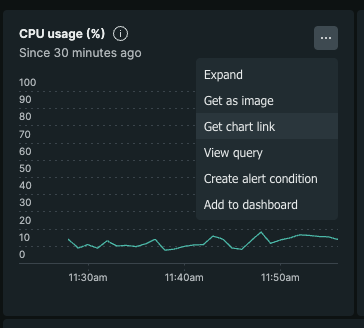
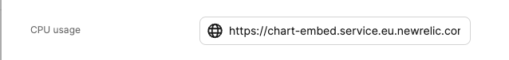
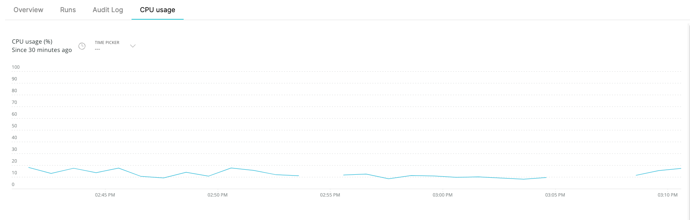

import Tabs from "@theme/Tabs"
import TabItem from "@theme/TabItem"

# Embedded URL

You can use the embedded-url `spec` property to embed any publicly available webpage into an additional tab in the [specific entity page](../../page/entity-page.md).

By using the `embedded_url` spec in a [Blueprint property](../../../build-your-software-catalog/define-your-data-model/setup-blueprint/properties/properties.md#structure), Port will display the url as a new tab matching the provided URL in the blueprint's entity.

:::note
Make sure the URL you want to embed in Port is publicly available (i.e. not inside a private VPC or only accessible using a VPN)
:::

## Prerequisites

In order to add an embedded view tab into your specific entity page, all you need is a publicly available URL with the data you want to embed.

## Embedded URL property definition in Blueprint schema

### Definition

<Tabs groupId="definition" defaultValue="api" values={[
{label: "API", value: "api"},
{label: "Terraform", value: "terraform"},
]}>

<TabItem value="api">

```json showLineNumbers
{
  "myEmbeddedUrl": {
    "title": "My Embedded URL",
    // highlight-start
    "type": "string",
    "format": "url",
    "spec": "embedded-url",
    // highlight-end
    "description": "embedded-url Prop"
  }
}
```

</TabItem>

<TabItem value="terraform">

```hcl showLineNumbers
resource "port_blueprint" "myBlueprint" {
  # ...blueprint properties
  # highlight-start
  properties {
    identifier = "myEmbeddedUrl"
    title      = "My Embedded URL"
    required   = false
    type       = "string"
    format     = "url"
    spec       = "embedded-url"
  }
  # highlight-end
}
```

</TabItem>

</Tabs>

## Examples

### Datadog dashboard

In this example we are embedding a [Datadog](https://docs.datadoghq.com/dashboards/sharing/) dashboard in order to get application metrics directly inside Port.

Add the `embedded-URL` property to a Blueprint:

<details>
<summary>Blueprint property definition</summary>

```json showLineNumbers
{
  "datadog": {
    "title": "Datadog",
    "type": "string",
    "format": "url",
    "spec": "embedded-url"
  }
}
```

</details>

Create or edit an Entity of the Blueprint you added the `Datadog` property to, and specify the URL to the Datadog dashboard:


Now go to the specific entity page of your Entity and the Datadog dashboard will be visible in a dedicated tab:


### New Relic Chart

In this example we are embedding a CPU usage [New Relic Chart](https://one.eu.newrelic.com/) to get infrastructure metrics directly inside Port.

Add the `embedded-URL` property to a Blueprint:

<details>
<summary>Blueprint property definition</summary>

```json showLineNumbers
{
  "cpuUsage": {
    "type": "string",
    "title": "CPU usage",
    "spec": "embedded-url",
    "format": "url"
  }
}
```

</details>
Go to new relic and extract the chart URL of a specific chart



Create or edit an Entity of the Blueprint you added the `cpuUsage` property to, and specify the URL to the CPU Usage chart:



Now go to the specific entity page of your Entity and the CPU Usage chart will be visible in a dedicated tab:


