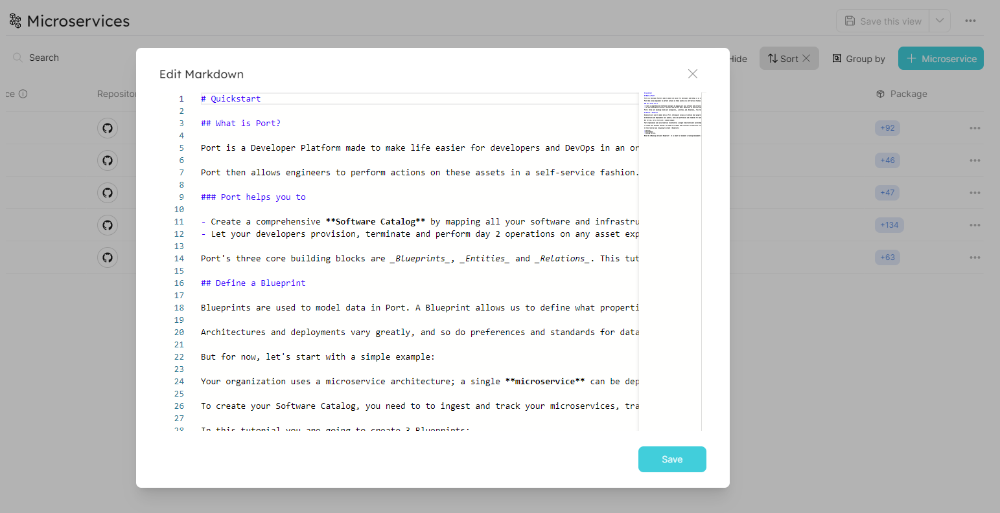
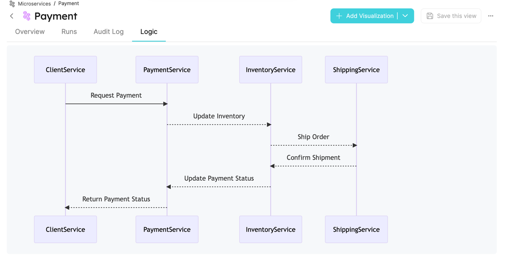

# Markdown

With Port, you can import and display [Markdown](https://en.wikipedia.org/wiki/Markdown) files as tabs.

By using the combination of `"type": "string` and `"format": "markdown"` in a [Blueprint property](../../build-your-software-catalog/define-your-data-model/setup-blueprint/properties/properties.md#structure), Port will format and display the markdown text in the [Specific entity page](../page/entity-page.md).

## Definition in Blueprint

```json showLineNumbers
{
  "title": "Markdown Property",
  "type": "string",
  "format": "markdown",
  "description": "A Markdown property"
}
```

## Example

Here is how the Markdown tab in the specific entity page appears when markdown text is provided:




### Mermaid

The markdown widget also supports [Mermaid](https://mermaid-js.github.io/mermaid/#/), a diagramming and charting tool that uses text and code to generate diagrams and charts.

You can refer to the [Mermaid Examples](https://mermaid.js.org/syntax/examples.html) for more examples and information on how to use it.


