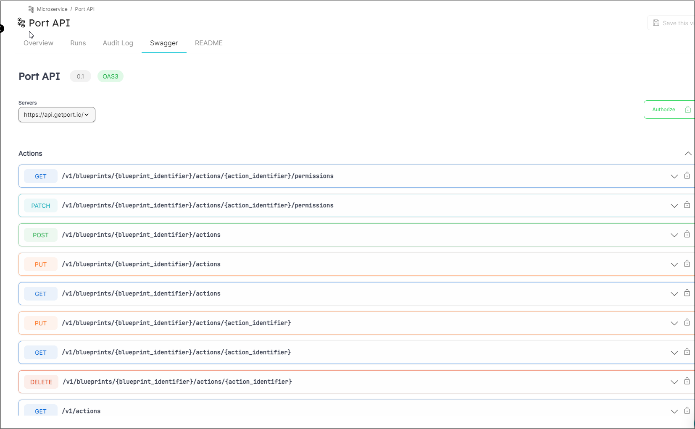

import Tabs from "@theme/Tabs"
import TabItem from "@theme/TabItem"

# OpenAPI

With Port, you can import and display [OpenAPI](https://www.openapis.org/) specification files as [Swagger UI](https://swagger.io/) tabs.

By using a special Open API Blueprint property, Port will display the Swagger UI matching the spec file provided in the [specific entity page](../page/entity-page.md). In addition, it will also provide advanced functionality such as performing HTTP calls to the spec target directly from Port.

## Definition

<Tabs groupId="definition" defaultValue="url" values={[
{label: "URL", value: "url"},
{label: "Object", value: "object"}
]}>

<TabItem value="url">

When using the URL format, Port will query the provided URL for the OpenAPI spec and expects a JSON OpenAPI spec

:::note

When using URL for the `open-api` display please make sure that your server allows cross-origin (CORS) requests from `app.getport.io`.

To serve the OpenAPI spec from an AWS S3 bucket, please add a CORS policy to the bucket that allows requests from `app.getport.io`, check out the [AWS documentation](https://docs.aws.amazon.com/AmazonS3/latest/userguide/enabling-cors-examples.html?icmpid=docs_amazons3_console) for more information.
:::

<Tabs groupId="lang" defaultValue="api" values={[
{label: "API", value: "api"},
{label: "Terraform", value: "terraform"}
]}>

<TabItem value="api">

```json showLineNumbers
{
  "myOpenApi": {
    "title": "My Open API",
    // highlight-start
    "type": "string",
    "format": "url",
    "spec": "open-api",
    // highlight-end
    "description": "Open-API Prop"
  }
}
```

</TabItem>

<TabItem value="terraform">

```hcl showLineNumbers
resource "port_blueprint" "myBlueprint" {
  # ...blueprint properties
  # highlight-start
  properties {
    identifier = "myOpenApi"
    title      = "My Open Api"
    required   = false
    type       = "string"
    format     = "url"
    spec       = "open-api"
  }
  # highlight-end
}
```

</TabItem>

</Tabs>

</TabItem>

<TabItem value="object">

When using the object type, you will have to provide the full JSON OpenAPI spec as an object to the entity

<Tabs groupId="lang" defaultValue="api" values={[
{label: "API", value: "api"},
{label: "Terraform", value: "terraform"}
]}>

<TabItem value="api">

```json showLineNumbers
{
  "myOpenApi": {
    "title": "My Open API",
    // highlight-start
    "type": "object",
    "spec": "open-api",
    // highlight-end
    "description": "Open-API Prop"
  }
}
```

</TabItem>

<TabItem value="terraform">

```hcl showLineNumbers
resource "port_blueprint" "myBlueprint" {
  # ...blueprint properties
  # highlight-start
  properties {
    identifier = "myOpenApi"
    title      = "My Open Api"
    required   = false
    type       = "object"
    spec       = "open-api"
  }
  # highlight-end
}
```

</TabItem>

</Tabs>

</TabItem>

</Tabs>

## Example

Here is how the Swagger tab in the specific entity page appears when an OpenAPI spec is provided:


