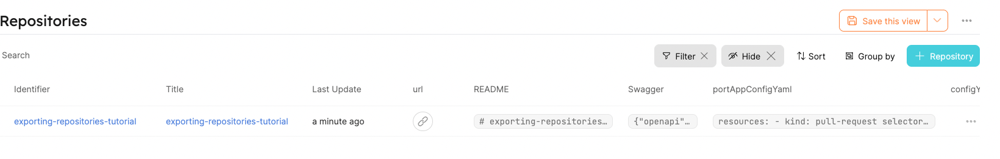
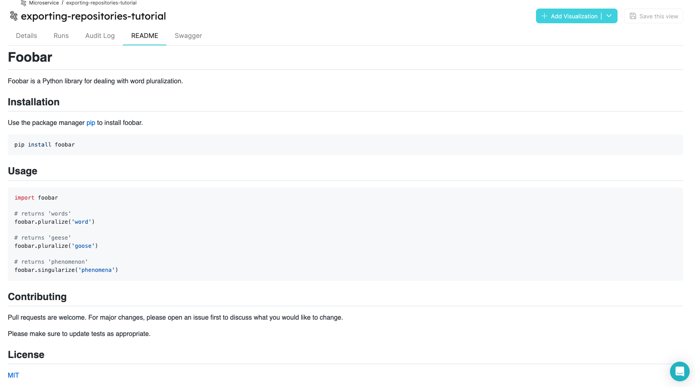
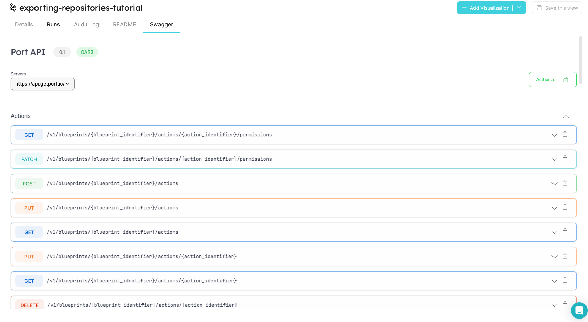

:::note Prerequisites

- [Please install our Bitbucket app](./installation).

:::

# Exporting repositories

By the end of this tutorial, we will have a `microservice` Blueprint that contains an auto-synced `REAMDE.md` file and `repository URL` from Bitbucket to Port properties.

1. Create a `microservice` Blueprint and `port-app-config.yml` configuration file.

To export your Bitbucket `repositories` to Port, you can use the following Port Blueprints definitions, and `port-app-config.yml`:

:::note

If you don't have a `README.md` file within the selected example repository for this tutorial, then delete the `readme` property from the Blueprint below.

:::

<details>
<summary> Microservice Blueprint </summary>

```json showLineNumbers
{
  "identifier": "microservice",
  "title": "Microservice",
  "icon": "Microservice",
  "schema": {
    "properties": {
      "readme": {
        "title": "README",
        "type": "string",
        "format": "markdown"
      },
      "swagger": {
        "title": "Swagger",
        "type": "object",
        "spec": "open-api"
      },
      "url": {
        "title": "URL",
        "format": "url",
        "type": "string"
      }
    },
    "required": []
  },
  "mirrorProperties": {},
  "calculationProperties": {},
  "relations": {}
}
```

</details>

In order to apply the `port-app-config.yml` in the whole organization, place it in the repository's root folder.

<details>

<summary> Port port-app-config.yml </summary>

```yaml showLineNumbers
resources:
  - kind: repository
    selector:
      query: "true"
    port:
      entity:
        mappings:
          identifier: ".name"
          title: ".name"
          blueprint: '"repository"'
          properties:
            portAppConfigYaml: file://port-app-config.yml
      blueprint:
        mappings:
          identifier: '"repository"'
          schema:
            properties:
              portAppConfigYaml:
                type: '"string"'
                format: '"yaml"'
                default: file://port-app-config.yml
```

</details>

:::info

- We leverage [JQ JSON processor](https://stedolan.github.io/jq/manual/) to map and transform Bitbucket objects to Port Entities.
- Click [Here](https://developer.atlassian.com/cloud/bitbucket/rest/api-group-repositories/#api-repositories-workspace-repo-slug-get) for the Bitbucket repository object structure.

:::

2. Push `port-app-config.yml` to your default branch.

That's it! after the push is complete, the exporter will start ingesting the entities on the next commit to the repository.



Check out the `README.md` in markdown format inside the [Specific Entity Page](../../software-catalog/entity/entity.md#entity-page)



You can also have a Swagger component within the [Specific Entity Page](../../software-catalog/entity/entity.md#entity-page). To achieve that all you have to do is to add a `jq` mapping of an `open-api.json` file to the `port-app-config.yml` created above.

<details>

<summary> Port port-app-config.yml with swagger </summary>

```yaml showLineNumbers
resources:
  - kind: repository
    selector:
      query: "true"
    port:
      entity:
        mappings:
          identifier: ".name"
          title: ".name"
          blueprint: '"repository"'
          properties:
            portAppConfigYaml: file://port-app-config.yml
      blueprint:
        mappings:
          identifier: '"repository"'
          schema:
            properties:
              portAppConfigYaml:
                type: '"string"'
                format: '"yaml"'
                default: file://port-app-config.yml
```

</details>


