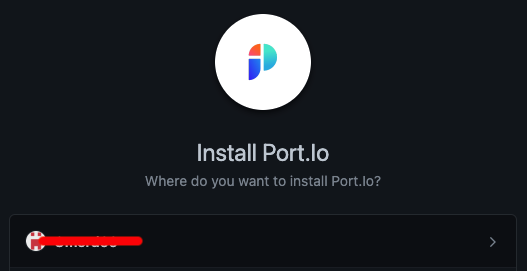

# Installation

## Installing Port's Bitbucket application

:::note Prerequisites

- A registered organization in Port;
- Your Port user role is set to `Admin`.

:::

### Installation

TODO: change this to the real url and real images

1. Go to the [Bitbucket App page](https://github.com/apps/getport-io).

2. Click `Install`.

   

3. Choose the repositories you want the app to be installed for.

   

4. You'll be redirected to Port, please **log in**.

5. Once logged in, you will see the success indication in the top of the screen:

   
