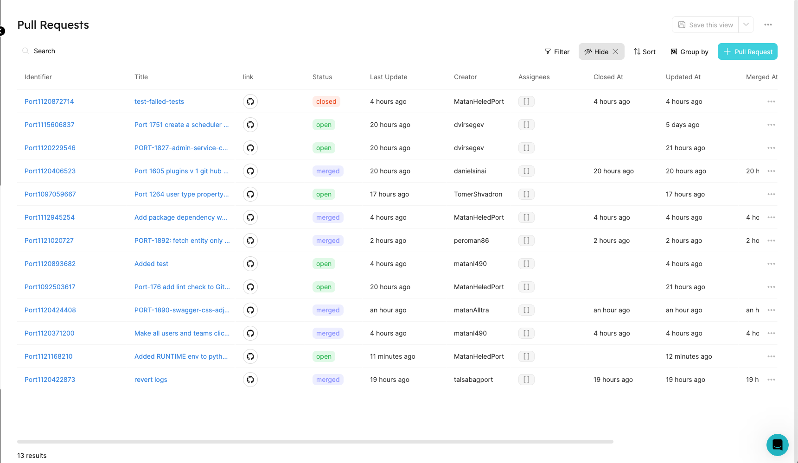
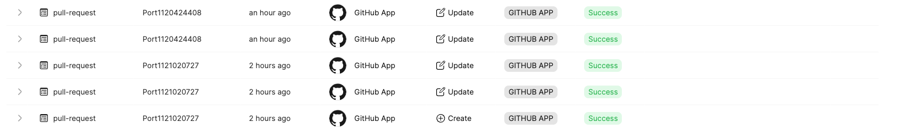

:::note Prerequisites

[Please install our GitHub app](../installation).
:::

# Quickstart

In this tutorial, we will export pull requests from GitHub and create matching Port Entities!

1. Create a `pull-request` Blueprint and `port-app-config.yml` Blueprint.

To export your GitHub `Pull Requests` to Port, you can use the following Port Blueprints definitions, and `port-app-config.yml`:

<details>
<summary> Pull Request Blueprint </summary>

```json showLineNumbers
{
  "identifier": "pull-request",
  "title": "Pull Request",
  "schema": {
    "properties": {
      "creator": {
        "title": "Creator",
        "type": "string"
      },
      "assignees": {
        "title": "Assignees",
        "type": "array"
      },
      "reviewers": {
        "title": "Reviewers",
        "type": "array"
      },
      "status": {
        "title": "Status",
        "type": "string",
        "enum": ["merged", "open", "closed"],
        "enumColors": {
          "merged": "purple",
          "open": "green",
          "closed": "red"
        }
      },
      "closedAt": {
        "title": "Closed At",
        "type": "string",
        "format": "date-time"
      },
      "updatedAt": {
        "title": "Updated At",
        "type": "string",
        "format": "date-time"
      },
      "mergedAt": {
        "title": "Merged At",
        "type": "string",
        "format": "date-time"
      },
      "description": {
        "title": "Description",
        "type": "string",
        "format": "markdown"
      },
      "link": {
        "format": "url",
        "type": "string"
      }
    },
    "required": []
  },
  "mirrorProperties": {},
  "formulaProperties": {},
  "relations": {}
}
```

</details>

You have to place the `port-app-config.yml` inside the `.github` folder or within the `.github-private` repository in the root directory to apply it for the whole organization.
For more info refer to [Advanced Configuration](../advanced-configuration)

<details>

<summary> Port port-app-config.yml </summary>

```yaml showLineNumbers
resources:
  - kind: pull-request
    selector:
      query: "true"
    port:
      entity:
        mappings:
          identifier: ".head.repo.name + (.id|tostring)"
          title: ".title"
          blueprint: '"pull-request"'
          properties:
            creator: ".user.login"
            assignees: ".assignees[].login"
            reviewers: ".requested_reviewers[].login"
            status: ".status" # merged, closed, opened
            closedAt: ".closed_at"
            updatedAt: ".updated_at"
            mergedAt: ".merged_at"
            description: ".body"
            prNumber: ".id"
            link: ".html_url"
```

</details>

:::info

- Currently, we support only `pull-request` as GitHub objects (referenced by the `kind` key) but more are coming soon!
- We leverage [JQ JSON processor](https://stedolan.github.io/jq/manual/) to map and transform GitHub objects to Port Entities.
- Click [Here](https://docs.github.com/en/rest/pulls/pulls#get-a-pull-request) for the GitHub pull request object structure.

You might have noticed that the `status` field is not provided by GitHub's API, that's because it is a custom property we added to simplify things.
:::

2. push `port-app-config.yml` to your default branch.

Done! after the push is complete, the exporter will begin creating all the `open` pull requests in the repository or organization, and update on every change to existing or creation of new `pull-requests`.

Now you can view and query all of your Pull Requests as Port Entities!



You can also see the description in markdown format inside the [Specific Entity Page] , and look for the respective audit logs with an indication of the GitHub Exporter as the source:


