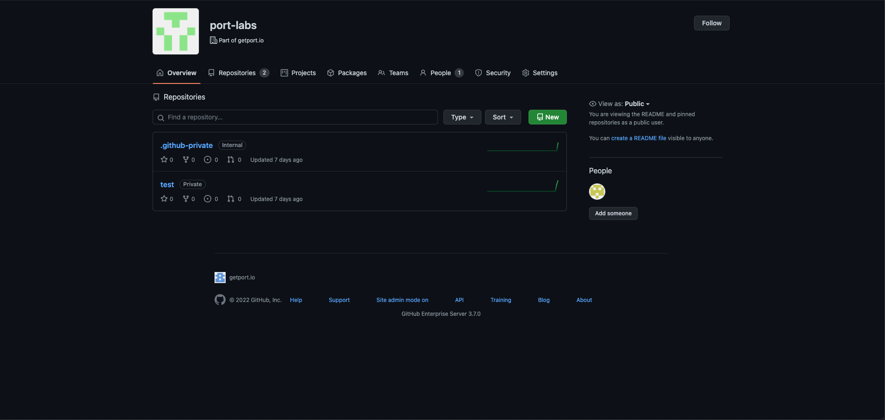
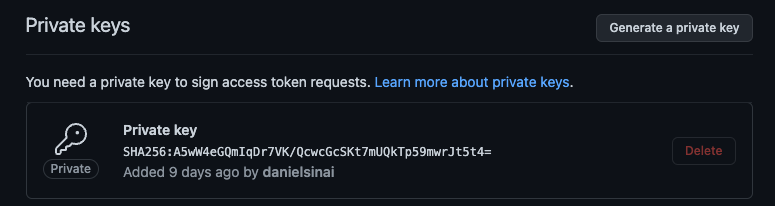
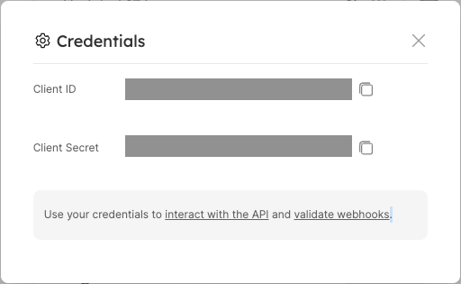

# Self Hosted Installation

:::note Prerequisites

- A registered organization in Port;
- Your Port user role is set to `Admin`.
  :::

In organizations that have a self-hosted GitHub installation there is no access to our official public app, therefore there are some extra steps you need to take for installation:

1. Register Port's GitHub App in your GitHub organization;
2. Deploy Port's GitHub App Docker Image inside your VPC;
3. Install Port's GitHub App in your GitHub organization and on select repositories.

## Registering Port's GitHub App

1. First, navigate to your organization inside your self-hosted GitHub and click on Settings



2. Inside the settings view, click on Developer Settings -> and then select GitHub Apps


3. Click on "New GitHub App"


4. Now insert all of the following properties:

- GitHub App name: port.io
- Homepage URL: https://getport.io
- Webhook URL: HTTP Server URL, if you don't yet know the value of this step, leave it blank until you deploy the GitHub backend
- Webhook secret: Webhook secret (Any string you would like)
- Repository Permissions:
  - Checks: Read and Write (for validating Port.yml)
  - Metadata: Readonly
  - Pull Request: Readonly
- Repository Events:
  - Pull Request
  - Push

Then select "Create GitHub App"

5. Now go to the settings of the created GitHub App and Generate a private key



And save the downloaded file

## Deployment

:::note Prerequisites

- You will need your Port `CLIENT_ID` and `CLIENT_SECRET`. To find your Port API credentials go to [Port](https://app.getport.io), click on `Credentials` at the bottom left corner and you will be able to view and copy your `CLIENT_ID` and `CLIENT_SECRET`:

<center>



</center>
:::

## Docker

To use our GitHub app you will need to deploy our official GitHub app docker image on your VPC.

It can be deployed on any platform that allows deploying images as containers such as: K8S, ECS, AWS App Runner, etc.

You can pull the Docker image by running:

```
docker pull ghcr.io/port-labs/port-self-hosted-github-app:0.1.0
```

And now run it via

```
docker run -e APP_ID=<APP_ID from register step> -e WEBHOOK_SECRET=<WEBHOOK_SECRET from previous step> -e GHE_HOST=<GITHUB BASE HOST, ie github.compay.com> -e PORT=<Any PORT> -e PORT_URL=https://api.getport.io -e PORT_CLIENT_ID=<Port's CLIENT_ID> -e PORT_CLIENT_SECRET=<Port's CLIENT_SECRET> -e PRIVATE_KEY=<BASE 64 PRIVATEKEY> ghcr.io/port-labs/port-self-hosted-github-app
```

| Env variable         | Description                                                                                                                    |
| -------------------- | ------------------------------------------------------------------------------------------------------------------------------ | --- |
| `APP_ID`             | Application ID, it should show up in the edit GitHub App page in the upper section                                             |
| `WEBHOOK_SECRET`     | The same string that have been used to register the application in the previous step                                           |
| `GHE_HOST`           | Your organization self-hosted GitHub hostname                                                                                  |
| `PORT`               | The port that the will listen to                                                                                               |
| `PORT_URL`           | Port's API Base URL                                                                                                            |
| `PORT_CLIENT_ID`     | Port client id for interacting with the API                                                                                    |
| `PORT_CLIENT_SECRET` | Port client secret for interacting with the API                                                                                |
| `PRIVATE_KEY`        | A base64 encoded private key, can be You can get the private key base64 value by running `base64 -i private-key-file-path.pem` |     |

## Installing Port's GitHub application

After you have the App registered in your organization and the docker is up and running, you can install the app and select the repositories to integrate it with

1. First, navigate to your organization inside your self-hosted GitHub and click on Settings


2. Inside the settings view, click on Developer Settings -> and then select GitHub Apps


3. Click `edit` on the GitHub app created at the step before


4. Go to Install App -> and select the install button on your wanted organization

5. Choose the repositories you want the app to be installed for.


## Next Steps

Now that you have the GitHub app installed, you can refer to our examples for some practical use cases:

- [Exporting pull requests as entities to Port](./exporter/quickstart.md)
- [Exporting entities via port.yml definition file](./gitops/quickstart.md)
