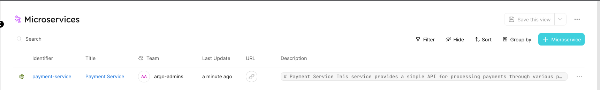
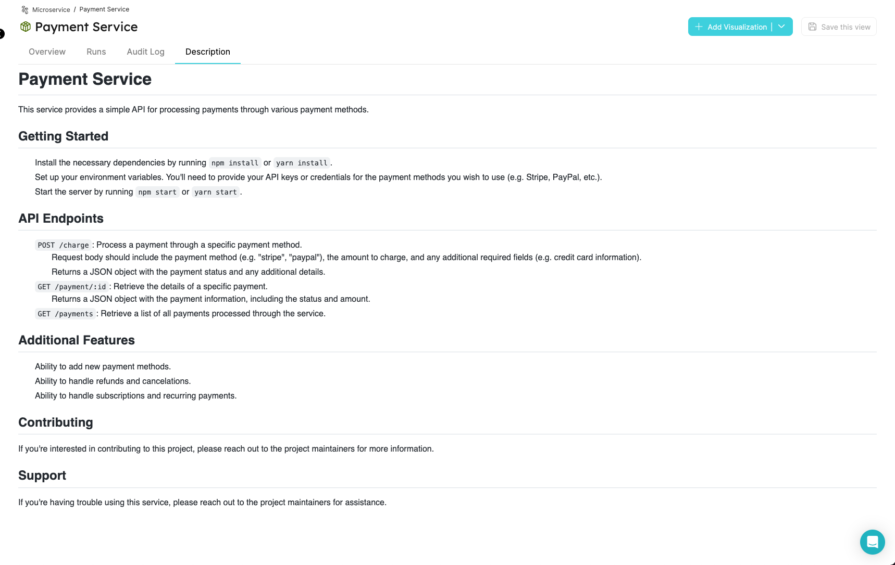

:::note Prerequisites

- [Please install our GitHub app](./installation).

:::

# Exporting all repositories

By the end of this tutorial, we will have a `microservice` Blueprint that contains the properties `repository URL` and `Description` which are automatically synced from GitHub to Port property.

1. Create a `microservice` Blueprint and `port-app-config.yml` configuration file.

To export your GitHub `repositories` to Port, you can use the following Port Blueprints definitions, and `port-app-config.yml`:

<details>
<summary> Microservice Blueprint </summary>

```json showLineNumbers
{
  "identifier": "microservice",
  "title": "Microservice",
  "icon": "Microservice",
  "schema": {
    "properties": {
      "description": {
        "title": "Description",
        "type": "string",
        "format": "markdown"
      },
      "url": {
        "title": "URL",
        "format": "url",
        "type": "string"
      }
    },
    "required": []
  },
  "mirrorProperties": {},
  "calculationProperties": {},
  "relations": {}
}
```

</details>

In order to apply the `port-app-config.yml` in the whole organization, place it in the `.github` folder or in the `.github-private` repository in the root directory.

<details>

<summary> Port port-app-config.yml </summary>

```yaml showLineNumbers
resources:
  - kind: repository
    selector:
      query: "true" # a JQ expression that it's output (boolean) determinating wheter to report the current resource or not
    port:
      entity:
        mappings:
          identifier: ".name" # The Entity identifier will be the repository name. After the creation of the Entity the exporter will send `PATCH` requests to update this repository within Port.
          title: ".name"
          blueprint: '"microservice"'
          properties:
            url: ".html_url" # fetching from GitHub metadata the repository url and injecting it as a url proeprty
            description: ".description" # fetching from GitHub metadata the repository url and injecting it as a url proeprty
```

</details>

:::info

- We leverage [JQ JSON processor](https://stedolan.github.io/jq/manual/) to map and transform GitHub objects to Port Entities.
- Click [Here](https://docs.github.com/en/rest/repos/repos#get-a-repository) for the GitHub repository object structure.

:::

2. Push `port-app-config.yml` to your default branch.

That's it! after the push is complete, the exporter will start ingesting the Entities on the next commit to the repository.



Check out the `Description` of the repository in markdown format inside the [Specific Entity Page](../../software-catalog/entity/entity.md#entity-page).


