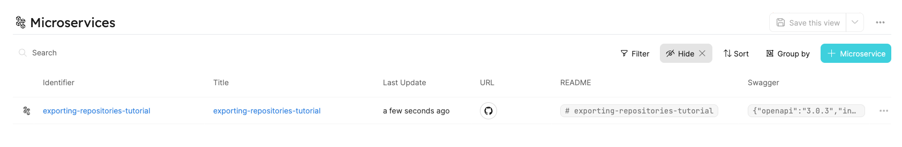

:::note Prerequisites

- [Please install our GitHub app](./installation).
- GitHub repository.

:::

# Exporting repositories

By the end of the tutorial, we will have a `microservice` blueprint that contains `REAMDE.md`, `open-api.json` files and a `repository URL` that are auto synced from GitHub to Port.

1. Create a `microservice` Blueprint and `port-app-config.yml` configuration file.

To export your GitHub `repositories` to Port, you can use the following Port Blueprints definitions, and `port-app-config.yml`:

:::note

If you don't have `README.md` or `open-api.json` file within the selected example repository for this tutorial skip from specifying them in the Blueprint and configuration file below.

:::

<details>
<summary> Microservice Blueprint </summary>

```json showLineNumbers
{
  "identifier": "microservice",
  "title": "Microservice",
  "icon": "Microservice",
  "schema": {
    "properties": {
      "readme": {
        "title": "README",
        "type": "string",
        "format": "markdown"
      },
      "swagger": {
        "title": "Swagger",
        "type": "object",
        "spec": "open-api"
      },
      "url": {
        "title": "URL",
        "format": "url",
        "type": "string"
      }
    },
    "required": []
  },
  "mirrorProperties": {},
  "formulaProperties": {},
  "calculationProperties": {},
  "relations": {}
}
```

</details>

You have to place the `port-app-config.yml` inside the `.github` folder or within the `.github-private` repository in the root directory to apply it for the whole organization.

<details>

<summary> Port port-app-config.yml </summary>

```yaml showLineNumbers
resources:
  - kind: repository
    selector:
      query: "true"
    port:
      entity:
        mappings:
          identifier: ".name"
          title: ".name"
          blueprint: '"microservice"'
          properties:
            swagger: file://open-api.json # fetching the open-api file that is within the root folder of the repository and injecting it as a swagger property
            readme: file://README.md # fetching the README.md file that is within the root folder of the repository and injecting it as a markdown property
            url: ".html_url" # fetching from GitHub metadata the repository url and injecting it as a url proeprty
```

</details>

:::info

- We leverage [JQ JSON processor](https://stedolan.github.io/jq/manual/) to map and transform GitHub objects to Port Entities.
- Click [Here](https://docs.github.com/en/rest/repos/repos#get-a-repository) for the GitHub repository object structure.

:::

2. push `port-app-config.yml` to your default branch.

Done! after the push is complete, right on the next commit to the repository the exporter will start ingesting the entities.



You can also see the `README.md` in markdown format inside the [Specific Entity Page](../../platform-overview/port-components/page.md#entity-page)


And the `open-api.json` file as Swagger component [Specific Entity Page](../../platform-overview/port-components/page.md#entity-page)


