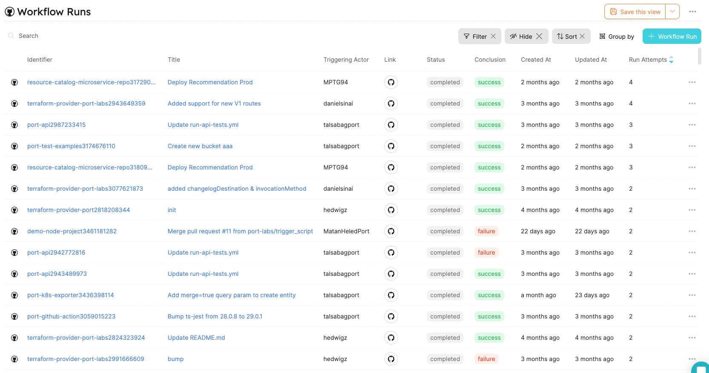

:::note Prerequisites

[Please install our GitHub app](./installation).
:::

In this tutorial, we will export workflows runs from GitHub and create matching Port Entities!

1. Create a `workflow-run` Blueprint and `port-app-config.yml` configuration file.

To export your GitHub `Workflows Runs` to Port, you can use the following Port Blueprints definitions, and `port-app-config.yml`:

<details>
<summary> Workflow Run Blueprint </summary>

```json showLineNumbers
{
  "identifier": "workflow-run",
  "title": "Workflow Run",
  "icon": "Github",
  "schema": {
    "properties": {
      "name": {
        "title": "Name",
        "type": "string"
      },
      "triggeringActor": {
        "title": "Triggering Actor",
        "type": "string"
      },
      "status": {
        "title": "Status",
        "type": "string",
        "enum": [
          "completed",
          "action_required",
          "cancelled",
          "startup_failure",
          "failure",
          "neutral",
          "skipped",
          "stale",
          "success",
          "timed_out",
          "in_progress",
          "queued",
          "requested",
          "waiting"
        ],
        "enumColors": {
          "queued": "yellow",
          "in_progress": "yellow",
          "success": "green",
          "failure": "red"
        }
      },
      "conclusion": {
        "title": "Conclusion",
        "type": "string",
        "enum": [
          "completed",
          "action_required",
          "cancelled",
          "startup_failure",
          "failure",
          "neutral",
          "skipped",
          "stale",
          "success",
          "timed_out",
          "in_progress",
          "queued",
          "requested",
          "waiting"
        ],
        "enumColors": {
          "queued": "yellow",
          "in_progress": "yellow",
          "success": "green",
          "failure": "red"
        }
      },
      "createdAt": {
        "title": "Created At",
        "type": "string",
        "format": "date-time"
      },
      "runStartedAt": {
        "title": "Run Started At",
        "type": "string",
        "format": "date-time"
      },
      "updatedAt": {
        "title": "Updated At",
        "type": "string",
        "format": "date-time"
      },
      "runNumber": {
        "title": "Run Number",
        "type": "number"
      },
      "runAttempt": {
        "title": "Run Attempts",
        "type": "number"
      },
      "link": {
        "title": "Link",
        "type": "string",
        "format": "url"
      }
    },
    "required": []
  },
  "mirrorProperties": {},
  "formulaProperties": {},
  "calculationProperties": {},
  "relations": {}
}
```

</details>

You have to place the `port-app-config.yml` inside the `.github` folder or within the `.github-private` repository in the root directory to apply it for the whole organization.

<details>

<summary> Port port-app-config.yml </summary>

```yaml showLineNumbers
resources:
  - kind: workflow-run
    selector:
      query: "true"
    port:
      entity:
        mappings:
          identifier: ".repository.name + (.id|tostring)"
          title: ".display_title"
          blueprint: '"workflow-run"'
          properties:
            name: ".name"
            triggeringActor: ".triggering_actor.login"
            status: ".status"
            conclusion: ".conclusion"
            createdAt: ".created_at"
            runStartedAt: ".run_started_at"
            updatedAt: ".updated_at"
            deletedAt: ".deleted_at"
            runNumber: ".run_number"
            runAttempt: ".run_attempt"
            link: ".html_url"
```

</details>

:::info

- We leverage [JQ JSON processor](https://stedolan.github.io/jq/manual/) to map and transform GitHub objects to Port Entities.
- Click [Here](https://docs.github.com/en/rest/actions/workflow-runs?apiVersion=2022-11-28#get-a-workflow-run) for the GitHub workflow run object structure.

:::

2. push `port-app-config.yml` to your default branch.

Done! after the push is complete, the exporter will begin creating all the workflows runs in the repository or organization, and update on every change to existing or creation of new `workflows-runs`.

Now you can view and query all of your Workflows Runs as Port Entities!


