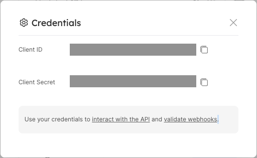
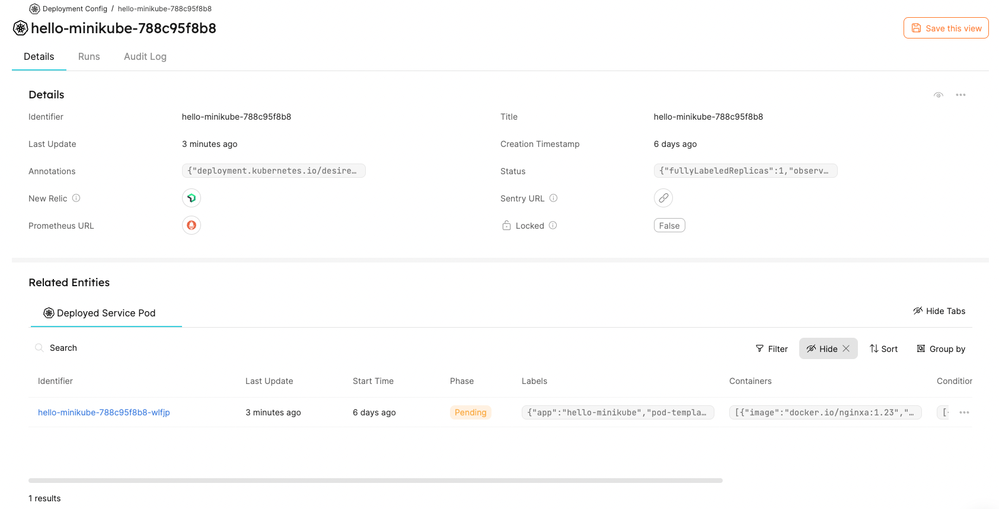
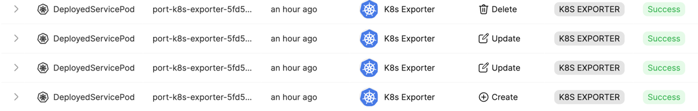

# Quickstart

Here you'll find a step-by-step guide to installing the K8s Exporter in your Kubernetes Cluster.

:::info
The helm chart with full installation & usage guide can be found [here](https://github.com/port-labs/helm-charts/tree/main/charts/port-k8s-exporter).
:::

:::note Prerequisites

- [Helm](https://helm.sh) must be installed to use the chart. Please refer to
  Helm's [documentation](https://helm.sh/docs) to get started.
- You will need your Port `CLIENT_ID` and `CLIENT_SECRET`. To find your Port API credentials go to [Port](https://app.getport.io), click on `Crednetials` at the bottom left corner and you will be able to view and copy your `CLIENT_ID` and `CLIENT_SECRET`:

<center>



</center>
:::

1. Add Port's Helm repo by using the following command:

```
helm repo add port-labs https://port-labs.github.io/helm-charts
```

If you already added this repo earlier, run `helm repo update` to retrieve
the latest versions of the charts. You can then run `helm search repo port-labs` to see the charts.

2. Prepare Port Blueprints and Kubernetes Exporter `config.yaml` configuration file.

For example, in order to export your Kubernetes `Replica Sets` and `Pods` to Port, you may use the following Port Blueprints definitions, and `config.yaml`:

<details>
<summary> DeploymentConfig Blueprint </summary>

```json showLineNumbers
{
  "identifier": "DeploymentConfig",
  "title": "Deployment Config",
  "icon": "Cluster",
  "schema": {
    "properties": {
      "newRelicUrl": {
        "type": "string",
        "format": "url",
        "title": "New Relic",
        "description": "Link to the new relic dashboard of the service",
        "default": "https://newrelic.com"
      },
      "sentryUrl": {
        "type": "string",
        "format": "url",
        "title": "Sentry URL",
        "description": "Link to the new sentry dashboard of the service",
        "default": "https://sentry.io/"
      },
      "prometheusUrl": {
        "type": "string",
        "format": "url",
        "title": "Prometheus URL",
        "default": "https://prometheus.io"
      },
      "locked": {
        "type": "boolean",
        "title": "Locked",
        "default": false,
        "description": "Are deployments currently allowed for this configuration",
        "icon": "Lock"
      },
      "creationTimestamp": {
        "type": "string",
        "title": "Creation Timestamp",
        "format": "date-time"
      },
      "annotations": {
        "type": "object",
        "title": "Annotations"
      },
      "status": {
        "type": "object",
        "title": "Status"
      }
    },
    "required": []
  },
  "mirrorProperties": {},
  "formulaProperties": {},
  "calculationProperties": {},
  "relations": {}
}
```

</details>

<details>
<summary> DeployedServicePod Blueprint </summary>

```json showLineNumbers
{
  "identifier": "DeployedServicePod",
  "title": "Deployed Service Pod",
  "icon": "Cluster",
  "schema": {
    "properties": {
      "startTime": {
        "type": "string",
        "title": "Start Time",
        "format": "date-time"
      },
      "phase": {
        "type": "string",
        "title": "Phase",
        "enum": ["Pending", "Running", "Succeeded", "Failed", "Unknown"],
        "enumColors": {
          "Pending": "yellow",
          "Running": "blue",
          "Succeeded": "green",
          "Failed": "red",
          "Unknown": "darkGray"
        }
      },
      "labels": {
        "type": "object",
        "title": "Labels"
      },
      "containers": {
        "title": "Containers",
        "type": "array"
      },
      "conditions": {
        "type": "array",
        "title": "Conditions"
      }
    },
    "required": []
  },
  "mirrorProperties": {},
  "formulaProperties": {},
  "calculationProperties": {},
  "relations": {
    "DeploymentConfig": {
      "target": "DeploymentConfig",
      "required": false,
      "many": false
    }
  }
}
```

</details>

<details>
<summary> Port K8s Exporter config.yaml </summary>

```yaml showLineNumbers
resources: # List of K8s resources to list, watch, and export to Port.
  - kind: apps/v1/replicasets # group/version/resource (G/V/R) format
    selector:
      query: .metadata.namespace | startswith("kube") | not # JQ boolean query. If evaluated to false - skip syncing the object.
    port:
      entity:
        mappings: # Mappings between one K8s object to one or many Port Entities. Each value is a JQ query.
          - identifier: .metadata.name
            title: .metadata.name
            blueprint: '"DeploymentConfig"'
            properties:
              creationTimestamp: .metadata.creationTimestamp
              annotations: .metadata.annotations
              status: .status
  - kind: v1/pods
    selector:
      query: .metadata.namespace | startswith("kube") | not
    port:
      entity:
        mappings:
          - identifier: .metadata.name
            title: .metadata.name
            blueprint: '"DeployedServicePod"'
            properties:
              startTime: .status.startTime
              phase: .status.phase
              labels: .metadata.labels
              containers: (.spec.containers | map({image, resources})) + .status.containerStatuses | group_by(.image) | map(add)
              conditions: .status.conditions
            relations:
              DeployedReplicaSet: .metadata.ownerReferences[0].name
```

</details>

:::info

- A reference of available Kubernetes Resources to list, watch, and export can be found [here](https://kubernetes.io/docs/reference/kubernetes-api/)
- We leverage [JQ JSON processor](https://stedolan.github.io/jq/manual/) to give you the power to map and transform K8s objects to Port Entities.

:::

3. After configuring the `config.yml` file from the previous step. Install the `Kubernetes Exporter` chart by using the following command:

```
helm install my-port-k8s-exporter port-labs/port-k8s-exporter \
    --create-namespace --namespace port-k8s-exporter \
    --set secret.secrets.portClientId=CLIENT_ID --set secret.secrets.portClientSecret=CLIENT_SECRET \
    --set-file configMap.config=config.yaml
```

Done! the exporter will begin creating and updating objects from your Kubernetes cluster as Port Entities shortly.

For instance, you can see a `Deployment Config` and its `Pods` in a single Port Entity page:



:::note
The Kubernetes Exporter was instructed to fill in only some properties in a `Deployment Config` Entity. By its nature, it will keep the values of other properties untouched.
:::

And you can look for the respective audit logs with an indication of the Kubernetes Exporter as the source:


