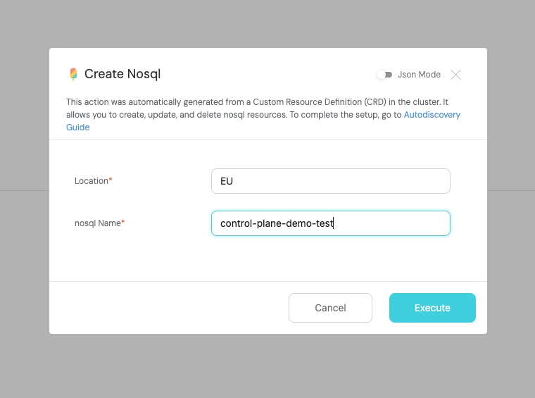
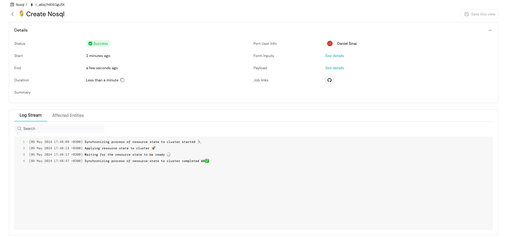
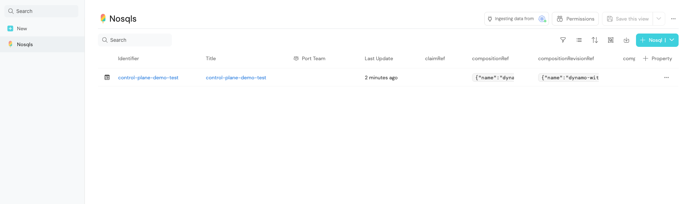

import PortTooltip from "/src/components/tooltip/tooltip.jsx"

# Let developers consume Kubernetes API extensions

### Introduction

Kubernetes provides a great way of extending its API which is via Custom Resource Definitions (CRDs). CRDs allow you to define your API objects and controllers to manage them. This is a powerful feature that allows you to extend Kubernetes to manage any kind of resources.
This guide will show you how to integrate Kubernetes CRDs with Port and expose them in the Port UI for developers to use, without the need of creating Kubernetes Exporter mappings and blueprints.

:::tip Prerequisites
- Port account
- Kubernetes cluster
- Deployed operator that listens to a CRD
- GitHub account
:::

### The goal of this guide

In this guide, we will deploy Port's [Kubernetes Exporter](../build-your-software-catalog/sync-data-to-catalog/kubernetes/kubernetes.md) to export Kubernetes CRDs to Port as <PortTooltip id="blueprint">blueprints</PortTooltip> and the relevant <PortTooltip id="action">actions</PortTooltip> to create, update and delete those resources and listen to changes in those resources and reflect them in Port's UI without the need of creating a mapping and blueprints upfront.
Then we will connect a GitHub account using Port's [GitHub integration](../build-your-software-catalog/sync-data-to-catalog/git/github/github.md) to provision CRs directly into the Kubernetes cluster, or optionally with GitOps.
After completing it, you will get a sense of how it can benefit different personas in your organization:

- Developers will be able to use any CRDs directly in a UI.
- Platform engineers will be able to query the data and get insights about the usage of the CRDs and Kubernetes resources.
- Platform engineers will be able to serve any CRDs to developers in a self-service manner.

### 1. (Optional) Creating a Crossplane XRD & Composition or using an existing CRD

**If you already have a CRD that you want to expose in Port, you can skip this step.**


If you don't have a CRD and you would like to create one, you can use Crossplane's XRD to create a CRD like we do in this guide or to install any operator that applies CRD into your cluster. You can follow the [Crossplane XRD documentation](https://docs.crossplane.io/latest/concepts/composite-resource-definitions/) to create a CRD.
For this guide, we followed the [AWS DynamoDB composition example](https://docs.crossplane.io/latest/getting-started/provider-aws-part-2/)

### 2. Installing the Kubernetes Exporter with `crdsToDiscover` flag

The Kubernetes Exporter can be installed with the `crdsToDiscover` flag which is a JQ pattern to discover and export CRDs to Port as blueprints and actions. In this example we will use [Helm](https://helm.sh/) to install the Kubernetes Exporter, but for more installation options please visit the [Kubernetes Exporter documentation](../build-your-software-catalog/sync-data-to-catalog/kubernetes/kubernetes.md#installation)

:::note

With the pattern below, the Kubernetes Exporter will discover CRDs that are managed by [Crossplane's XRD](https://docs.crossplane.io/latest/concepts/composite-resource-definitions/) and that are not namespaced scoped. This is just an example, and you can adjust the pattern to match your own CRDs - even if they are managed by a custom operator.
:::

Here is a script that will help you install the Kubernetes Exporter with the `crdsToDiscover` flag.

if you already have the Kubernetes Exporter installed just [add to your configuration](../build-your-software-catalog/sync-data-to-catalog/kubernetes/kubernetes.md#updating-exporter-configuration) the `crdsToDiscover` flag with the JQ pattern that matches your CRDs
```bash
# highlight-start
echo 'crdsToDiscover: ".metadata.ownerReferences[0].kind == \"CompositeResourceDefinition\" and .spec.scope != \"Namespaced\""' > config.yaml
# highlight-end 

helm upgrade --install my-port-k8s-exporter port-labs/port-k8s-exporter \
    --create-namespace --namespace port-k8s-exporter \
    --set secret.secrets.portClientId=YOUR_PORT_CLIENT_ID \
    --set secret.secrets.portClientSecret=YOUR_PORT_CLIENT_SECRET \
    --set stateKey="k8s-exporter"  \
    --set eventListenerType="POLLING"  \
    --set overwriteConfigurationOnRestart=true \
    --set "extraEnv[0].name"="CLUSTER_NAME" \
    --set "extraEnv[0].value"=YOUR_PORT_CLUSTER_NAME \
    --set-file configMap.config=config.yaml
```

After the Kubernetes Exporter is installed, you can check the logs to see if the CRDs are being discovered and exported to Port.
If everything, succeeded you should see the relevant `blueprints` its `actions` in Port's UI

### 3. Connecting a GitHub workflow

Now, to execute the action we need to add some workflow to it for Port to trigger the action, the workflow that we will configure will do the operations in the Kubernetes cluster using the kubeconfig that we will provide as a secret in the GitHub repository.

1. Go to the [GitHub control plane example repo](https://github.com/port-labs/control-plane-demo) and use it as a template to create your own repo by clicking on the `Use this template` button.

2. [Install Port's GitHub app](../build-your-software-catalog/sync-data-to-catalog/git/github/github.md#installation) in the GitHub account where you cloned the template.

3. [Add GitHub secrets](https://docs.github.com/en/actions/security-guides/using-secrets-in-github-actions#creating-secrets-for-a-repository) the following secrets:
    - `PORT_CLIENT_ID` - Your Port Client ID.
    - `PORT_CLIENT_SECRET` - Your Port Client Secret.
    - `KUBE_CONFIG` - The base64 `kubeconfig` of the Kubernetes cluster where the CRDs are deployed. You can get the kubeconfig by running the following command:
        Here is a snippet to encode your kubeconfig and copy it to your clipboard:
        ```bash
        cat $HOME/.kube/config | base64 | pbcopy
        ```
4. Now after everything is set up we the last thing we need to do is to change the organization name and the repository name in Port's Action, to your repository and org name where the workflow belongs.
You can do that by going to the [Self-Service Tab](https://app.getport.io/self-serve) -> Hovering the wanted action -> Clicking on the 3 dots -> Clicking on `Edit Action` -> And in the `Backend` tab, Change the `organization` and `repository` fields to your organization and repository.

:::note
**GitOps**

For the sake of simplicity, the GitHub workflow we are using in this example is accessing directly into the Kubernetes cluster.

Sometimes for production environments, this solution is not sufficient because of the requirement of extra auditing, in this case, you can use GitOps to deploy the resources into the cluster.

If you would like to use this method, at the same repo you cloned there is another workflow which is called `.github/workflows/gitops.yml` that works purely with GitOps which you can integrate with ArgoCD for example.
:::


### 4. Executing the action

* Now that everything is set up, go to the [Self-Service Tab](https://app.getport.io/self-serve) and execute the Create action.


* After the action is executed, click on the action run and logs will show up, if everything is succeeded we should see the following logs.


* You are done! Now you can see the created resources in [Port's Catalog](https://app.getport.io/nosqls) and at AWS console 🚀


:::note
You can also use the Update and Delete actions to update and delete the resources.
:::


### Conclusion

By leveraging the power of the K8s API extensions, platform engineers can keep using K8S as the control plane and on top of that, developers can consume the resources directly from Port's UI with ease, while platform engineers can keep track of the usage of the resources.

### Troubleshooting

* If you are not seeing the CRDs in Port's UI, check the logs of the Kubernetes Exporter to see if the CRDs are being discovered and exported to Port.

* If the action is stuck in progress make sure you changed the Action Organization + Repository to your own repository and organization.

* If the action is failing, it can be from a various set of problems, make sure the secrets `PORT_CLIENT_ID`, `PORT_CLIENT_SECRET` and `KUBE_CONFIG` are set correctly and check the logs of the action to see what is the problem.


### Next Steps

- Enrich the catalog and visualize the Runtime existing objects in your K8s cluster, by following the [Visualize services' k8s runtime guide](./visualize-service-k8s-runtime.md).
- Port allows multiple ways to enhance the experience of executing `Actions`, feel free to alter the `Action` in Port to your needs by visiting [Action Documentation](../create-self-service-experiences/create-self-service-experiences.md).
- [Sync data](../build-your-software-catalog/sync-data-to-catalog/sync-data-to-catalog.md) and create more `Blueprints` to enrich the data beyond what exists in K8S.
- Build dashboards and reports to visualize the usage of the CRDs and resources in your K8s cluster by following the [Build dashboards and reports guide](../customize-pages-dashboards-and-plugins/dashboards/dashboards.md).