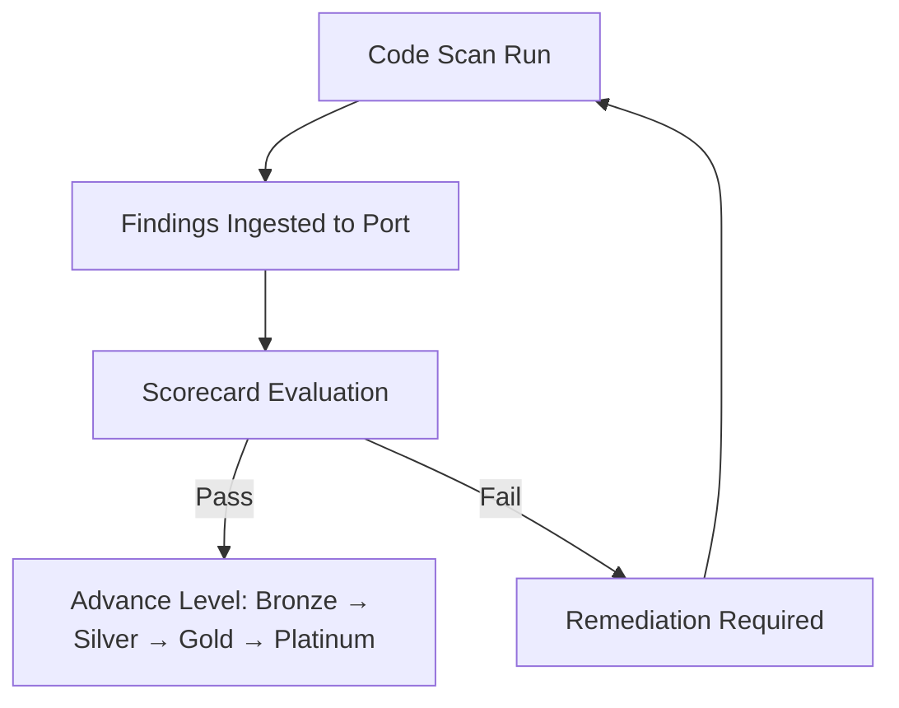

# PCI DSS Code Security Scorecard

The **PCI DSS Code Security Scorecard** is designed to continuously track compliance with PCI DSS requirements by leveraging code scans and vulnerability data.  
It helps teams enforce secure coding practices, identify weaknesses early, and measure progress towards PCI compliance maturity.

This scorecard evaluates repositories and services based on:
- Scan recency
- Severity of open vulnerabilities
- Cryptographic hygiene
- Exposure of public-facing assets
- Secure dependency management

# Dependencies
- Depends on [OWASP Top 10 Scorecard](/guides/all/owasp-top-10-scorecard) to make use of some of the aggregation properties generated previously

By organizing into levels, all teams can progressively improve security posture and demonstrate compliance readiness.

---

## Scorecard

- Scorecard requires making use of new properties on Snyk Target that are described in the next section "New Properties".
- Scorecard was created on Repository Blueprint with all the mirrored properties from Snyk Target.

<details>
<summary><b>PCI DSS Scorecard (Click to expand)</b></summary>

```json showLineNumbers
{
  "identifier": "pci_dss_code_security",
  "title": "PCI DSS Code Security",
  "rules": [
    {
      "identifier": "sast_recent",
      "level": "Bronze",
      "query": {
        "combinator": "and",
        "conditions": [
          {
            "operator": "<=",
            "property": "sast_last_scan_days",
            "value": 30
          }
        ]
      },
      "description": "PCI 6.3.1—continuous vulnerability identification",
      "title": "Detected ≤ 30 days ago"
    },
    {
      "identifier": "open_critical_thresh",
      "level": "Bronze",
      "query": {
        "combinator": "and",
        "conditions": [
          {
            "operator": "=",
            "property": "open_critical",
            "value": 0
          }
        ]
      },
      "description": "No Critical SAST findings",
      "title": "Open Critical Threshold"
    },
    {
      "identifier": "class_no_inj_auth",
      "level": "Silver",
      "query": {
        "combinator": "and",
        "conditions": [
          {
            "operator": "=",
            "property": "a3_injection",
            "value": 0
          },
          {
            "operator": "=",
            "property": "a1_access_control_flaws",
            "value": 0
          }
        ]
      },
      "description": "Injection, AuthN AuthZ, Hardcoded secrets",
      "title": "Class Absence - Injection,  Auth"
    },
    {
      "identifier": "hardcoded_secrets",
      "level": "Silver",
      "query": {
        "combinator": "and",
        "conditions": [
          {
            "operator": "=",
            "property": "hardcoded_secrets",
            "value": 0
          }
        ]
      },
      "description": "No leaked/open secrets",
      "title": "Hardcoded Secrets"
    },
    {
      "identifier": "insecure_crypto",
      "level": "Gold",
      "query": {
        "combinator": "and",
        "conditions": [
          {
            "operator": "=",
            "property": "a2_cryptographic_failures",
            "value": 0
          }
        ]
      },
      "description": "No insecure crypto",
      "title": "Insecure Crypto"
    },
    {
      "identifier": "asv_pass_parity",
      "level": "Gold",
      "query": {
        "combinator": "and",
        "conditions": [
          {
            "operator": "=",
            "property": "max_risk_score_replacing_asv",
            "value": 400
          }
        ]
      },
      "description": "ASV pass/fail parity for public-facing assets.",
      "title": "ASV Pass Parity"
    },
    {
      "identifier": "max_risk_score",
      "level": "Platinum",
      "query": {
        "combinator": "and",
        "conditions": [
          {
            "operator": "containsAny",
            "property": "$team",
            "value": [
              "example_team"
            ]
          }
        ]
      },
      "description": "Max Risk Score (Alternate to CVSS Scoring)",
      "title": "Max Risk Score"
    },
    {
      "identifier": "no_high_open_source",
      "level": "Platinum",
      "query": {
        "combinator": "and",
        "conditions": [
          {
            "operator": "=",
            "property": "open_sca_high",
            "value": 0
          }
        ]
      },
      "description": "No High severity open source vulnerabilities",
      "title": "No High Open Source"
    },
    {
      "identifier": "no_high_code_issues",
      "level": "Platinum",
      "query": {
        "combinator": "and",
        "conditions": [
          {
            "operator": "=",
            "property": "open_sast_high",
            "value": 0
          }
        ]
      },
      "description": "No High severity code issues",
      "title": "No High Code Issues"
    }
  ],
  "levels": [
    {
      "color": "paleBlue",
      "title": "Basic"
    },
    {
      "color": "bronze",
      "title": "Bronze"
    },
    {
      "color": "silver",
      "title": "Silver"
    },
    {
      "color": "gold",
      "title": "Gold"
    },
    {
      "color": "lime",
      "title": "Platinum"
    }
  ]
}
```
</details>


## New Properties

New properties have been created on Snyk Target Blueprint and then shown as mirrored properties on Repository blueprint. This can be attached to a service blueprint as well or as deemed appropriate to where the data is most relevant. 

<details>
<summary><b>PCI DSS Scorecard (Click to expand)</b></summary>

```json showLineNumbers
{
    "hardcoded_secrets": {
      "title": "hardcoded_secrets",
      "icon": "Bug",
      "type": "number",
      "target": "snykVulnerability",
      "query": {
        "combinator": "and",
        "rules": [
          {
            "property": "category",
            "operator": "in",
            "value": [
              "CWE-798",
              "CWE-259",
              "CWE-321",
              "CWE-547",
              "CWE-260"
            ]
          }
        ]
      },
      "calculationSpec": {
        "func": "count",
        "calculationBy": "entities"
      }
    },
```
</details>

<details>
<summary><b>ASV Pass parity (Click to expand)</b></summary>
```json showLineNumbers
{
 "asv_pass_parity": {
      "title": "ASV Pass Parity",
      "icon": "Bug",
      "type": "number",
      "description": "Risk Scoring",
      "target": "snykVulnerability",
      "query": {
        "combinator": "and",
        "rules": [
          {
            "property": "type",
            "operator": "=",
            "value": "package_vulnerability"
          },
          {
            "property": "status",
            "operator": "=",
            "value": "open"
          },
          {
            "property": "score",
            "operator": ">=",
            "value": 500
          }
        ]
      },
      "calculationSpec": {
        "func": "count",
        "calculationBy": "entities"
      },
      "pathFilter": [
        {
          "fromBlueprint": "snykVulnerability",
          "path": [
            "project",
            "snyk_target"
          ]
        }
      ]
    },
```
</details>

<details>
<summary><b>Maximum Risk Score aggregation(Click to expand)</b></summary>
```json showLineNumbers
{
    "max_risk_score": {
      "title": "Max risk score",
      "icon": "Bug",
      "type": "number",
      "description": "Alternate to ASV Pass Parity CVSS > 4",
      "target": "snykVulnerability",
      "query": {
        "combinator": "and",
        "rules": [
          {
            "property": "type",
            "operator": "=",
            "value": "package_vulnerability"
          },
          {
            "property": "status",
            "operator": "=",
            "value": "open"
          }
        ]
      },
      "calculationSpec": {
        "func": "max",
        "property": "score",
        "calculationBy": "property"
      },
      "pathFilter": [
        {
          "fromBlueprint": "snykVulnerability",
          "path": [
            "project",
            "snyk_target"
          ]
        }
      ]
    },
```
</details>


<details>
<summary><b>Critical severity package vulnerabilities(Click to expand)</b></summary>
```json showLineNumbers
{
    "open_sca_critical": {
      "title": "Open SCA Critical",
      "icon": "Bug",
      "type": "number",
      "target": "snykVulnerability",
      "query": {
        "combinator": "and",
        "rules": [
          {
            "property": "type",
            "operator": "=",
            "value": "package_vulnerability"
          },
          {
            "property": "status",
            "operator": "=",
            "value": "open"
          },
          {
            "property": "severity",
            "operator": "=",
            "value": "critical"
          }
        ]
      },
      "calculationSpec": {
        "func": "count",
        "calculationBy": "entities"
      },
      "pathFilter": [
        {
          "fromBlueprint": "snykVulnerability",
          "path": [
            "project",
            "snyk_target"
          ]
        }
      ]
    },
```
</details>

<details>
<summary><b>High severity package vulnerabilities(Click to expand)</b></summary>
```json showLineNumbers
{
    "open_sca_high": {
      "title": "Open SCA High",
      "icon": "Bug",
      "type": "number",
      "target": "snykVulnerability",
      "query": {
        "combinator": "and",
        "rules": [
          {
            "property": "severity",
            "operator": "=",
            "value": "high"
          },
          {
            "property": "status",
            "operator": "=",
            "value": "open"
          },
          {
            "property": "type",
            "operator": "=",
            "value": "package_vulnerability"
          }
        ]
      },
      "calculationSpec": {
        "func": "count",
        "calculationBy": "entities"
      },
      "pathFilter": [
        {
          "fromBlueprint": "snykVulnerability",
          "path": [
            "project",
            "snyk_target"
          ]
        }
      ]
    },
```
</details>

<details>
<summary><b>High severity code vulnerabilities(Click to expand)</b></summary>
```json showLineNumbers
{
    "open_sast_high": {
      "title": "Open SAST High",
      "icon": "Bug",
      "type": "number",
      "target": "snykVulnerability",
      "query": {
        "combinator": "and",
        "rules": [
          {
            "property": "status",
            "operator": "=",
            "value": "open"
          },
          {
            "property": "type",
            "operator": "=",
            "value": "code"
          },
          {
            "property": "severity",
            "operator": "=",
            "value": "high"
          }
        ]
      },
      "calculationSpec": {
        "func": "count",
        "calculationBy": "entities"
      },
      "pathFilter": [
        {
          "fromBlueprint": "snykVulnerability",
          "path": [
            "project",
            "snyk_target"
          ]
        }
      ]
    }
```
</details>

<details>
<summary><b>SAST Last Scan Days (Click to expand)</b></summary>
```json showLineNumbers
{
    "sast_last_scan_days": {
      "title": "SAST Last Scan Days",
      "icon": "Calendar",
      "type": "number",
      "description": "Number of days since the last SAST scan",
      "target": "snykTarget",
      "query": {
        "combinator": "and",
        "rules": [
          {
            "property": "lastScanDate",
            "operator": "exists"
          }
        ]
      },
      "calculationSpec": {
        "func": "daysSince",
        "property": "lastScanDate",
        "calculationBy": "property"
      }
    }
}
```
</details>

<details>
<summary><b>Open Critical Vulnerabilities (Click to expand)</b></summary>
```json showLineNumbers
{
    "open_critical": {
      "title": "Open Critical",
      "icon": "Bug",
      "type": "number",
      "description": "Number of open critical severity vulnerabilities",
      "target": "snykVulnerability",
      "query": {
        "combinator": "and",
        "rules": [
          {
            "property": "status",
            "operator": "=",
            "value": "open"
          },
          {
            "property": "severity",
            "operator": "=",
            "value": "critical"
          }
        ]
      },
      "calculationSpec": {
        "func": "count",
        "calculationBy": "entities"
      },
      "pathFilter": [
        {
          "fromBlueprint": "snykVulnerability",
          "path": [
            "project",
            "snyk_target"
          ]
        }
      ]
    }
}
```
</details>

## Scorecard Levels

The scorecard uses **five maturity levels**, with each level building on the rules from the previous one.

| Level      | Description                                                                                 |
|------------|---------------------------------------------------------------------------------------------|
| **Basic**  | Default level. Indicates that the entity is in PCI scope but has not yet met Bronze criteria. |
| **Bronze** | Ensures regular scanning and that no critical vulnerabilities remain open.                    |
| **Silver** | Enforces strong secure coding practices, eliminating injection flaws, access control issues, and secrets exposure. |
| **Gold**   | Focuses on cryptographic security and external vulnerability exposure management.             |
| **Platinum** | Represents the highest standard, requiring zero high-risk issues and strict dependency security. |

> **How levels work:**  
> - To reach a higher level, **all rules in that level and all lower levels must pass**.  
> - This creates a clear maturity path from basic hygiene to advanced compliance.

---

## Rules by Level

Below are all rules organized by the level at which they apply.

---

### Bronze Level

#### 1. SAST Scan Recency
- **Identifier:** `sast_recent`
- **Goal:** Ensure regular static application security testing (SAST).
- **Rule:** `sast_last_scan_days <= 30`
- **Description:**  
  PCI DSS 6.3.1 requires continuous vulnerability identification.  
  This rule ensures a SAST scan has been run within the last 30 days.

---

#### 2. No Open Critical Issues
- **Identifier:** `open_critical_thresh`
- **Goal:** Prevent critical vulnerabilities from remaining unresolved.
- **Rule:** `open_critical = 0`
- **Description:**  
  There must be **zero open critical vulnerabilities** in the codebase.

---

### Silver Level

#### 3. No Injection or Access Control Issues
- **Identifier:** `class_no_inj_auth`
- **Goal:** Eliminate high-severity vulnerabilities in input validation and access control.
- **Rule:**
  ```text
  a3_injection = 0
  a1_access_control_flaws = 0
  ```

- **Description:**
  Addresses critical categories such as:

  - Injection flaws (e.g., SQL injection, XSS)
  - Broken authentication and authorization logic

---

#### 4. No Hardcoded Secrets

- **Identifier:** `hardcoded_secrets`
- **Goal:** Prevent sensitive credentials from being exposed in code.
- **Rule:** `hardcoded_secrets = 0`
- **Description:**
  Detects and blocks hardcoded passwords, API keys, and other secrets.

---

### Gold Level

#### 5. Secure Cryptography

- **Identifier:** `insecure_crypto`
- **Goal:** Ensure proper use of secure algorithms and key management practices.
- **Rule:** `a2_cryptographic_failures = 0`
- **Description:**
  Detects use of weak cryptographic algorithms or incorrect implementation of crypto operations.

---

#### 6. ASV Parity for Public-Facing Assets

- **Identifier:** `asv_pass_parity`
- **Goal:** Align with PCI DSS **Approved Scanning Vendor (ASV)** pass/fail standards.
- **Rule:** `max_risk_score_replacing_asv = 400`
- **Description:**
  Ensures public-facing services do not have vulnerabilities equivalent to CVSS ≥ 4.0.

> **Key Note:**
> CVSS data is not directly available in this system.
> Instead, we use **Snyk Risk Score** as a proxy, with a threshold of **400** chosen to approximate the CVSS 4.0 boundary required by PCI DSS for external scans.

---

### Platinum Level

#### 7. Max Risk Score Validation

- **Identifier:** `max_risk_score`
- **Goal:** Apply alternate or stricter risk scoring models for specific teams or services.
- **Rule:**

  ```text
  $team containsAny ["example_team"]
  ```
- **Description:**
  Allows team-specific compliance requirements to be enforced at the highest level.

---

#### 8. No High-Risk Open Source Vulnerabilities

- **Identifier:** `no_high_open_source`
- **Goal:** Maintain a secure open-source dependency posture.
- **Rule:** `open_sca_high = 0`
- **Description:**
  Requires **zero high-severity vulnerabilities** in all open-source components.

---

#### 9. No High-Risk Code Issues

- **Identifier:** `no_high_code_issues`
- **Goal:** Ensure all high-risk static analysis findings are remediated.
- **Rule:** `open_sast_high = 0`
- **Description:**
  There must be **no high-severity SAST issues** remaining unresolved.

---

## Summary of Rule Coverage

| Level        | PCI Focus Area                   | Key Rules                                   |
| ------------ | -------------------------------- | ------------------------------------------- |
| **Bronze**   | Scan frequency & critical issues | SAST recency, No open critical issues       |
| **Silver**   | Secure coding & secrets hygiene  | Injection/Auth flaws, No hardcoded secrets  |
| **Gold**     | Cryptography & external exposure | Secure crypto, ASV parity                   |
| **Platinum** | Zero-tolerance for high risks    | No high SAST, No high SCA, Max risk scoring |

---

## Implementation Steps

### 1. Ingest Scan Data

Ensure outputs from scanning tools are mapped to Port properties:

* `sast_last_scan_days`
* `open_critical`
* `a3_injection`
* `a1_access_control_flaws`
* `hardcoded_secrets`
* `open_sca_high`
* `open_sast_high`
* `max_risk_score_replacing_asv`

---

### 2. Deploy via Port or Pulumi

- **Direct JSON upload:**
  Use the JSON configuration directly in the Port UI.

- **Infrastructure-as-code approach:**
  Convert the JSON to TypeScript and deploy using the [Port Pulumi provider](https://docs.port.io/).

---

### 3. Monitor Compliance Progress

* View real-time compliance status directly within Port.
* Use levels as **milestones** to measure progression toward PCI DSS compliance.
* Generate reports for PCI DSS audits using scorecard data as automated evidence.

---

## Benefits of This Scorecard

- **Automated Compliance Tracking**
  Continuously validates PCI DSS compliance without manual intervention.

- **Actionable Insights**
  Highlights specific areas needing remediation at both code and dependency levels.

- **Maturity Measurement**
  Provides a clear path for teams to progress from basic hygiene to advanced compliance.

- **Audit Readiness**
  Simplifies PCI audits by providing up-to-date evidence of secure development practices.

---

## Compliance Flow



This visual shows how code scan results flow through the system, get evaluated, and determine compliance level progression.

---

## Key Takeaways

- **Bronze → Platinum** represents progressive enforcement of PCI DSS secure coding requirements.
- Using **Snyk Risk Score** as a proxy ensures external exposure checks align with ASV expectations even without direct CVSS data. In the future iterations, the intent will be to ingest CVSS Score detail for all `package vulnerabilities`.
- This scorecard provides a practical, automated way to track and improve compliance continuously.
- This scorecard can serve as a starting point.

