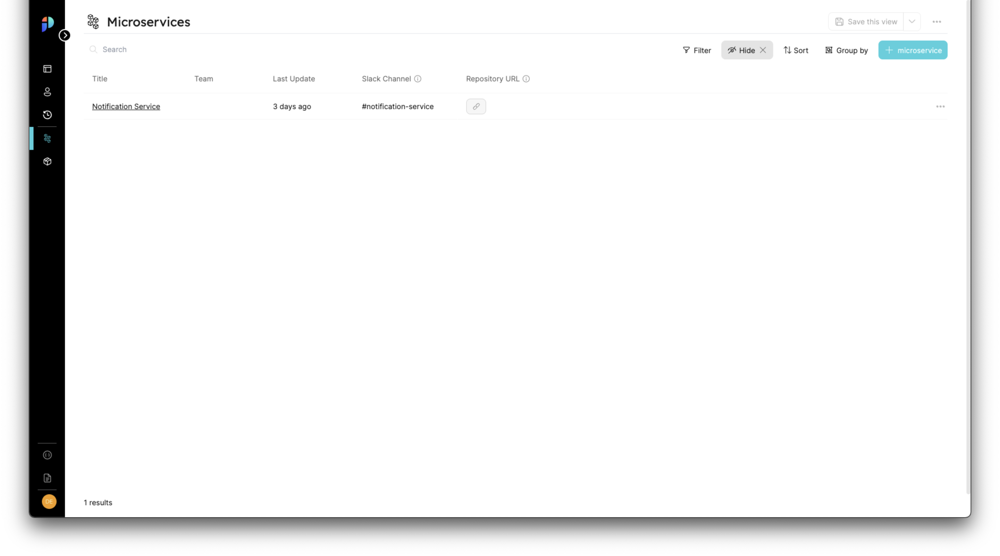
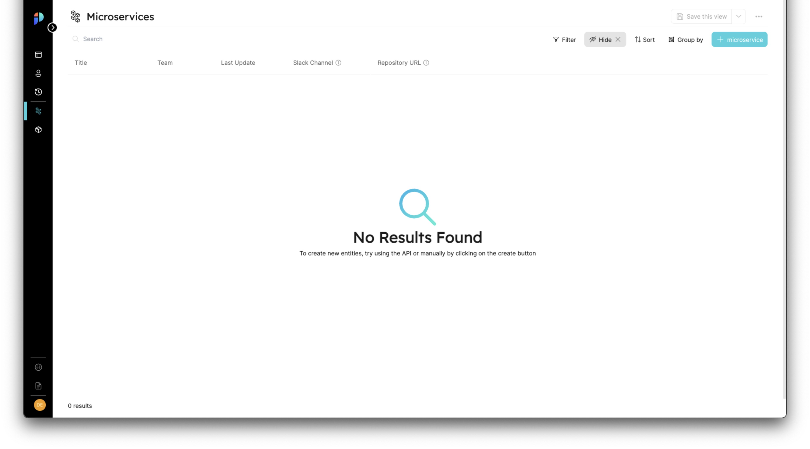
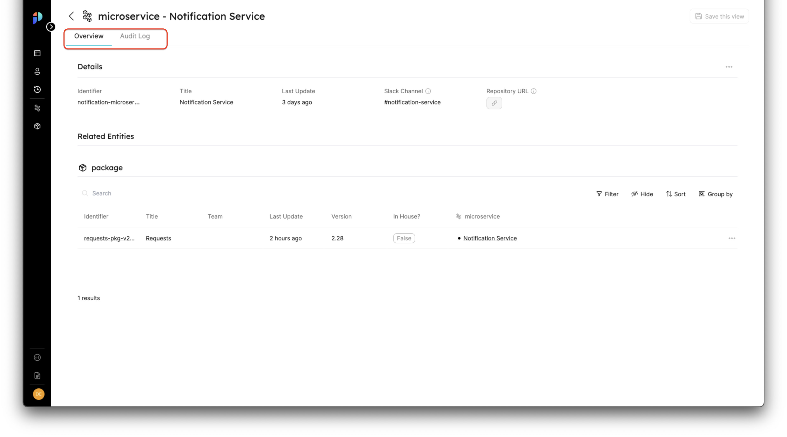

# Pages

A page is a viewing component that displays data of entities in a few forms, such as table form, data summary, etc.

### Basic Concepts of Pages
- blueprint's **default pages**: Created automatically when a blueprint is created, and located in the navigation bar. They contain a single table widget.
- Pages are **dynamic**: We can create multiple pages, each of which displays data according to the filtering parameters we set for it.
- **Entity pages**: Created automatically for each new entity we create.

### Pages Architecture

**1. **Pages are built from **Widgets**.

:::note Widgets
A Widget is a view component from which Pages are built.
It contains the entity type, and a default configuration of the view. 
:::

A page can hold a single widget or multiple widgets, for example: 
- A full table view widget.
- Details section widget in an entity page.
  

**2. **Pages can contain **tabs**.

:::note Tabs
A tab is a sub-page view of a page, and itself is a page.
:::
   
   Pages can be separated into several tabs, each of which is a page that holds one or many widgets.

   Default Tabs:
   - Overview
   - Audit Log  

:::note Pages Hierarchy
**Pages** contain Widgets and Tabs.  
**Tabs** are pages within pages.
:::

## Blueprint Page

A full page table widget that holds all of the blueprints specific entities. 

#### Default view

## Entity Page

A page that holds 2-tabs (default), and two widgets of the details of the entity and table(s) of its related entity(ies). 

:::note Relations within an entity page
**Related entities** of an entity are presented in the entity page as separate table widgets. 
:::

## Page operations

## Widget operations

### Table Widget

