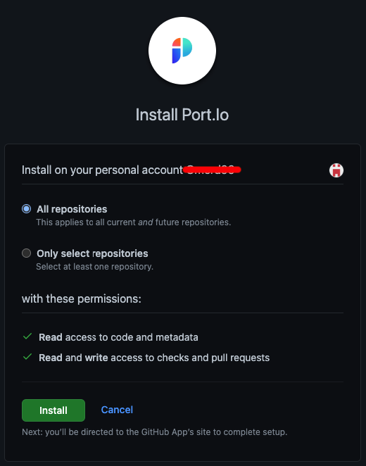

# GitHub App

Our Github app allows you to quickly and easily map out your Software Catalog according to your existing code repositories and projects

You can visit [our GitHub App](https://github.com/apps/getport-io) page to get started.

Here you'll find a step-by-step guide to installing the GitHub App of Port.

## What does our GitHub application give you?

- Automatic mapping of your and creation of your Microservices in Port, based on your existing code repositories
- Automatic updates to the entities mapped from Github based on updates to the `port.yml` file
- Additional metadata provided by Github, available directly from Port

## How does our GitHub App Work?

In order to use the Github App all you need to do is include a `port.yml` file in your code repositories, or multiple `port.yml` files in your Monorepo.

The `port.yml` file format is very similar to a standard Port Entity, here is an example:

```yaml showLineNumbers
apiVersion: v0.1
identifier: example
title: Example
blueprint: Microservice
properties: 
  repository: https://github.com/port-labs/github-app-setup-example
  owner: port-labs
  runtime: NodeJs
  slack-channel: prod-alerts
  grafana: https://play.grafana.org/d/000000012/grafana-play-home
```

### Triggers

Merging a branch to the `main` (default) branch will trigger the app look for the input type.

### Permissions

Port's Github App requires the following permissions:

- **Read** access to code and metadata
- **Read** and **write** access to checks and pull requests

:::note
You will also be prompted to confirm these permissions when first installing the App
:::

### GitHub environment variables

| variable name | Type | Description | 
| ----------- | ----------- | ----------- | 
| `identifier` | `String` | A unique identifier. <br /> **Note that** while the identifier is unique, it can be changed after creation. |


## Installing Port's GitHub application

:::note Prerequisites 
- A registered organization in Port. 
- Your Port user role is set to `DevOps`.
::: 

### Installation

1. Go to the [GitHub App page](https://github.com/apps/getport-io).

2. Click `Install`.

    

3. Choose to which repositories you wish to install the app:

    

4. You'll be redirected to Port, please **log in**.


5. Once Logged in, see the success indication on the top of the screen:

    


## Trying out our App with mock data

:::note
This repo is `private` at the moment, so you’ll get a 404.
Please contact us with your GitHub user for access.
:::

1. Clone our example repo: [github-app-setup-example](https://github.com/port-labs/github-app-setup-example)
2. Use the `microservice.json` file as a base for your Blueprint (Make sure that the `dataSource` key has the value `Github` in it)
3. Once you are satisfied with your blueprint, go ahead and create it in Port
4. You'll see an integration icon attached to the blueprint Node

    

    

5. Now let's get the data inside Port:

    If you already have a `port.yml` file in the `main` branch of the cloned example repository, update it to match the blueprint that you created (The example itself does not require any changes, so if you just created the blueprint without changing `microservice.json`, it should all work out of the box)

    If you don't have a `port.yml` file, please create one in your repository in a format that matches the example shown in [How does our GitHub App Work?](#how-does-our-github-app-work) and then commit it/merge it into the `main` branch

6. After the changes have been merged, you should see the data specified in the `port.yml` file appear in the page matching your new blueprint in Port!