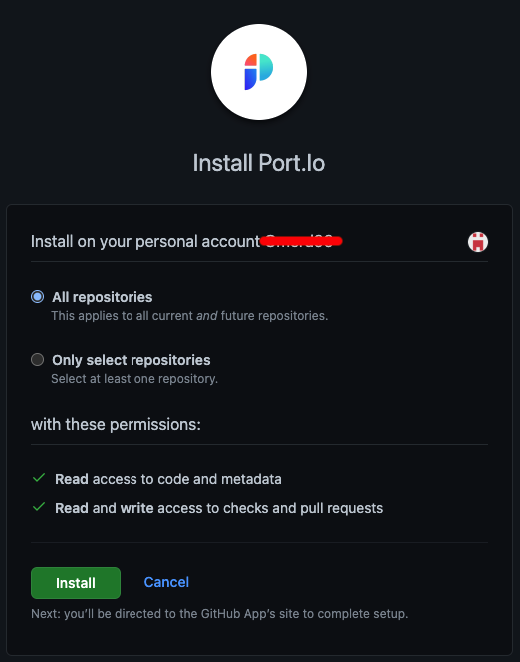
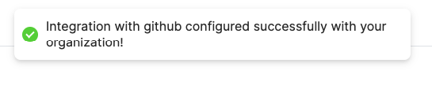

# Installation

## Installing Port's GitHub application

:::note Prerequisites 
- A registered organization in Port. 
- Your Port user role is set to `Admin`.
::: 

### Installation

1. Go to the [GitHub App page](https://github.com/apps/getport-io).

2. Click `Install`.

    

3. Choose to which repositories you wish to install the app:

    

4. You'll be redirected to Port, please **log in**.

5. Once Logged in, see the success indication on the top of the screen:

    
