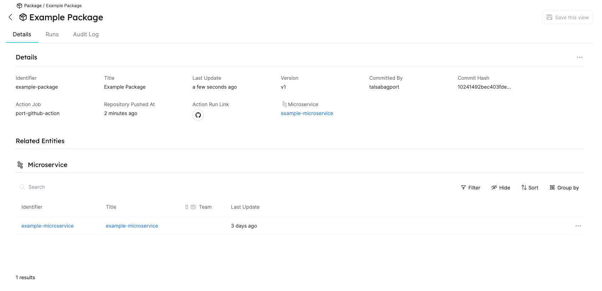

# Action

Our integration with GitHub Action allows you to create/update entities in Port. 

Here you'll find a step-by-step guide to use the Port GitHub Action.

## What does our GitHub Action give you?

- Create new entities of existing blueprints and relations.
- Update existing entities with new information (title, properties, relations, etc...).

## Usage

:::note Prerequisites

Existing blueprint and relation(s) to use.
:::


### Create / Update (Upsert) Entity

Add the following to your workflow yml file:

```yaml
- uses: port-labs/port-github-action@v1
  with:
    clientId: ${{ secrets.CLIENT_ID }}
    clientSecret: ${{ secrets.CLIENT_SECRET }}
    identifier: example-package
    title: Example Package
    blueprint: Package
    properties: |
      {
        "version": "v1",
        "committedBy": "${{ github.actor }}",
        "commitHash": "${{ github.sha }}",
        "actionJob": "${{ github.job }}",
        "repoPushedAt": "${{ github.event.repository.pushed_at}}",
        "runLink": "${{ format('{0}/actions/runs/{1}', github.event.repository.html_url, github.run_id) }}"
      }
    relations: |
      {
        "package-microservice": {"identifier": "example-microservice"}
      }
```

That's it! The entity is created or updated, and is visible in the UI.



For more information, checkout the [public repository](https://github.com/port-labs/port-github-action).
