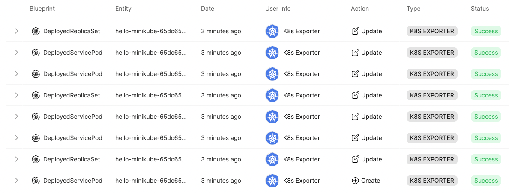

# K8s Exporter

Our integration with K8s allows you to export K8s objects to Port as entities of existing blueprints.

Here you'll find a step-by-step guide to installing the K8s Exporter in your K8s Cluster.

## What does our K8s Exporter give you?

- List and export existing K8s objects in your cluster.
- Watch live for changes (Create/Update/Delete) of K8s objects and apply it in Port.
- Configure which K8s objects are relevant, and the how to map and transform objects to Port entities.

## Installation using Helm Chart

:::info
The helm chart with full installation & usage guide can be found [here](https://github.com/port-labs/helm-charts/tree/main/charts/port-k8s-exporter).
:::

:::note Prerequisites

[Helm](https://helm.sh) must be installed to use the chart. Please refer to
Helm's [documentation](https://helm.sh/docs) to get started.
:::

1. Add Port's Helm repo as follows:

```
helm repo add port-labs https://port-labs.github.io/helm-charts
```

If you had already added this repo earlier, run `helm repo update` to retrieve
the latest versions of the packages. You can then run `helm search repo port-labs` to see the charts.

2. Prepare the exporter `config.yaml` configuration file. Look [here](https://github.com/port-labs/helm-charts/tree/main/charts/port-k8s-exporter#exporter) for instructions and example.

:::note

For this section, you will need to have the `PORT_CLIENT_ID` and `PORT_CLIENT_SECRET`

To find your Port API credentials go to [Port](https://app.getport.io), click on `Credentials` at the bottom left corner and you will be able to view and copy your `Client ID` and `Client Secret`:
:::

3. Install the `K8s Exporter` chart using `config.yaml` from previous step, and the following command:

```
helm install my-port-k8s-exporter port-labs/port-k8s-exporter \
    --create-namespace --namespace port-k8s-exporter \
    --set secret.secrets.portClientId=PORT_CLIENT_ID --set secret.secrets.portClientSecret=PORT_CLIENT_SECRET \
    --set-file configMap.config=config.yaml
```

Done! Shortly, you should see entities reported in Port.


