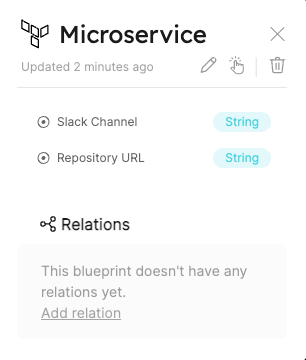
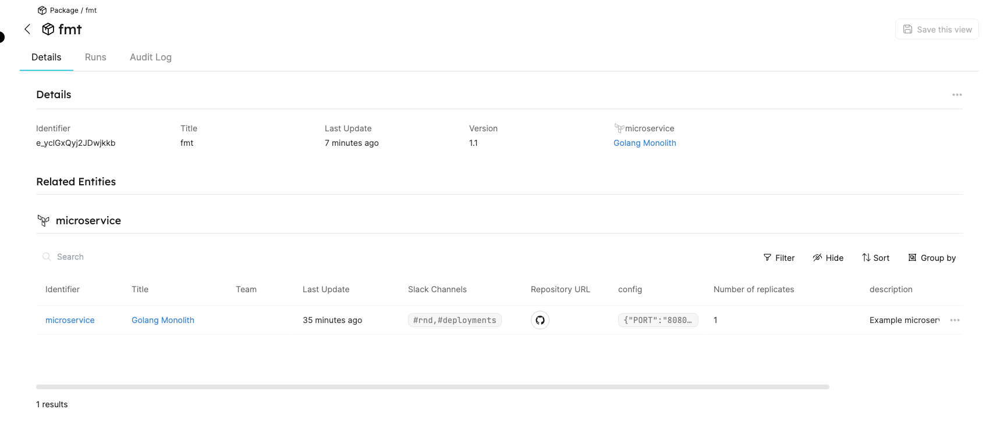

# Terraform Provider

Our integration with Terraform allows you to combine the state of your infrastructure with the entities representing them in Port. For the official documentation of the Port Terraform provider checkout out the [registry page](https://registry.terraform.io/providers/port-labs/port/)

Here you'll find a step-by-step guide to installing the Port Terraform Provider.

## What does our Terraform Provider give you?

- Automatic management of entities based on resources in terraform files.
- The option to define resources in yml files and reflect them in Port using the provider

## Installation

:::note Prerequisites

Terraform CLI (Installation guide: https://learn.hashicorp.com/tutorials/terraform/install-cli).
:::

First, require the provider in your terraform configuration (refer [here](https://registry.terraform.io/providers/port-labs/port-labs/latest/docs/resources/entity) for our resources schema):

```hcl
terraform {
  required_providers {
    port-labs = {
      source  = "port-labs/port-labs"
      version = "~> 0.0.1"
    }
  }
}

provider "port-labs" {
  client_id = "{YOUR CLIENT ID}"     # or set the env var PORT_CLIENT_ID
  secret    = "{YOUR CLIENT SECRET}" # or set the env var PORT_CLIENT_SECRET
}
```

To make terraform install the port provider, run the command:

```shell
terraform init
```

The command should print something like this when the `init` command is finish:

`Terraform has been successfully initialized!`

In order to validate that the module initialization worked, run the command:

```shell
 terraform plan
```

The result should be : `No changes. Your infrastructure matches the configuration.`

## Usage

Assume you have a blueprint for your microservices, and that a microservice has two properties: `slackChannel` and `repoUrl`.

:::tip

For an example how to create a blueprint, please refer to the [Create a blueprint](../tutorials/blueprint-basics.md#create-blueprints) in the [blueprint basics](../tutorials/blueprint-basics.md) tutorials
:::

For example:



### Creating a resource

Let's say we want to add a new microservice entity (e.g. Golang service), we can describe it as a resource in our terraform file:

For example:

```hcl
resource "port-labs_entity" "golang_monolith" {
  title     = "Golang Monolith"
  blueprint = "microservice"
  properties {
    name  = "slackChannel" # should match the identifier of the property in the blueprint schema.
    items = ["#rnd", "#deployments"]
    type  = "array"
  }
  properties {
    name  = "repoUrl"
    value = "https://github.com"
    type  = "string"
  }
  properties {
    name  = "config"
    value = jsonencode({ "PORT" : "8080" })
    type  = "object"
  }
  properties {
    name  = "description"
    value = "Example microservice"
    type  = "string"
  }
  properties {
    name  = "isDeployed"
    value = "true"
    type  = "boolean"
  }
   properties {
    name  = "numberOfReplicates"
    value = 1
    type  = "number"
  }
}
```

- Run the command `terraform plan` to see the resulting set of actions terraform will take: (You should see this result `Plan: 1 to add, 0 to change, 0 to destroy`)

To create the `Golang Monolith` entity, run:

```shell
terraform apply
```

:::note Prerequisites
Don't forget to set your port client id and secret in order for the provider to authenticate with Port's API:

```shell
export `PORT_CLIENT_ID`=YOUR_CLIENT_ID
export `PORT_CLIENT_SECRET`=YOUR_CLIENT_SECRET
```

:::

That's it! the entity should now be created and visible in the UI.


For more examples, see the examples and test cases in the [public repository](https://github.com/port-labs/terraform-provider-port).

### Create a resource with a relation

Let's say we also created a blueprint that defines a `package` and a relation between package and microservice.
:::tip
For more information, go to the [relation basics page](../tutorials/relation-basics.md)
:::

We can describe it as a resource with a relation section in our terraform file:

```hcl
resource "port-labs_entity" "package" {
  title     = "fmt"
  blueprint = "package"
  relations {
    name       = "package-microservice"  # the name should match the identifier of the relation
    identifier = "microservice" # the identifier should match the identifier property in the target blueprint.
  }
  properties {
    name  = "version"
    value = 1.1
    type  = "number"
  }
}
```

After running the command `terraform applay` again, you should see this result:



We successfully created a entitiy that related to the microserivce(Golang Monolith) we created previously.

### Update a resource

- To update a resource, change the value of the resource in the terraform configuration files and use the command `terraform apply`.

### Delete a resource

- To delete a resource, you need to run `terraform destory --target port-labs.{resource-name}`.
