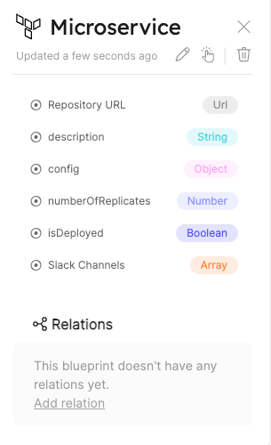

# Terraform Provider

Our integration with Terraform allows you to combine the state of your infrastructure with the entities representing them in Port. For the official documentation of the Port Terraform provider checkout out the [registry page](https://registry.terraform.io/providers/port-labs/port/)

Here you'll find a step-by-step guide to installing the Port Terraform Provider.

## What does our Terraform Provider give you?

- Automatic managing entities based on resources in terraform files.
- Being able to define resources in Yml files and reflect them by terraform commands to Port.0

## Installation

:::note Prerequisites

Terraform CLI (Installation guild: https://learn.hashicorp.com/tutorials/terraform/install-cli).
:::

First, require the provider in your terraform configuration:

```hcl
terraform {
  required_providers {
    port-labs = {
      source  = "port-labs/port-labs"
      version = "~> 0.0.1"
    }
  }
}

provider "port-labs" {
  client_id = "{YOUR CLIENT ID}"     # or set the env var PORT_CLIENT_ID
  secret    = "{YOUR CLIENT SECRET}" # or set the env var PORT_CLIENT_SECRET
}
```

to make terraform install the port provider, run the command:

```shell
terraform init
```

The command should print something like this when the init command is finish:

`Terraform has been successfully initialized!`

For checking if the the initialize is good, run the command:

```shell
 terraform plan
```

The result should be : `No changes. Your infrastructure matches the configuration.`

## Usage

Assume you have a blueprint for your microservices, and that a microservice has two properties: `slackChannel` and `repoUrl`. (Navigate to blueprint basic tutorial for guidance of how creating blueprint)

For example:



Let's say we want to add a new microservice entity (e.g. Golang service), we can describe it as a resource in our terraform file:

For example:

```hcl
resource "port-labs_entity" "golang_monolith" {
  title = "Golang Monolith"
  blueprint = "microservice" # should be match to exatch identifier of the blueprint
  properties {
    name = "slackChannel"
    value = "#data-query"
    type = "string"
  }
  properties {
    name = "repoUrl"
    value = "https://github.com"
    type = "string"
  }
}
```

- run the command `terraform plan` for seeing the perform the actions.(You should see this result: `Plan: 1 to add, 0 to change, 0 to destroy`)

to create the `Golang Monolith` entity, run:

```shell
terraform apply
```

:::note Prerequisites
Don't forget to set your port client id and secret in order for the provider to authenticate with the Port's API:

```shell
export PORT_CLIENT_ID=YOUR_CLIENT_ID
export PORT_CLIENT_SECRET=YOUR_CLIENT_SECRET
```

:::

That's it! the entity should now be created and visible in the UI.


For more examples, see the examples and test cases in the [public repository](https://github.com/port-labs/terraform-provider-port).
