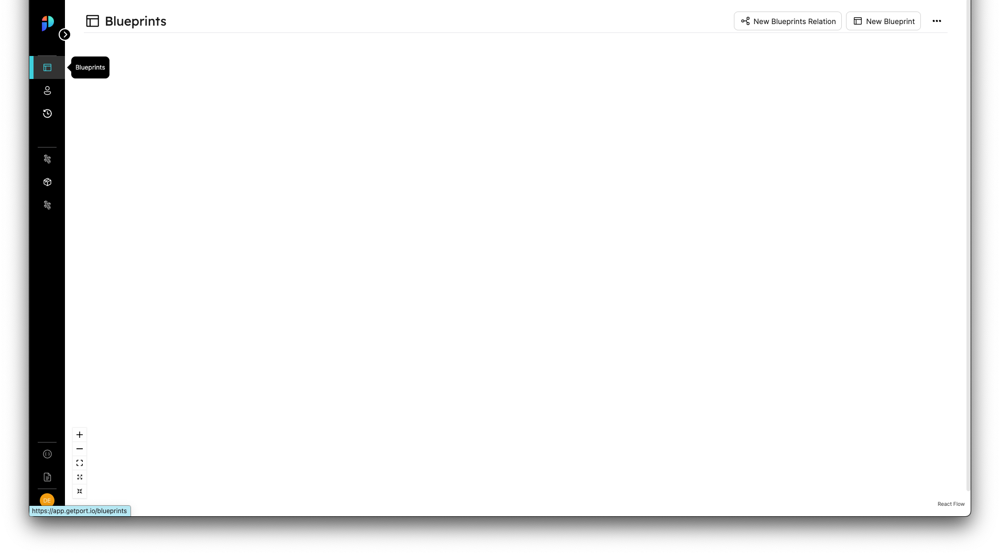
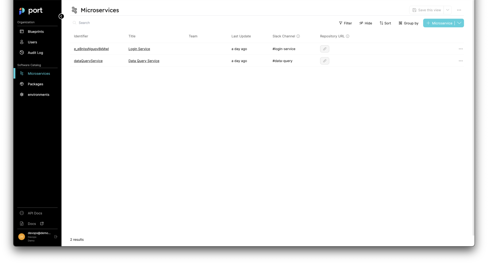
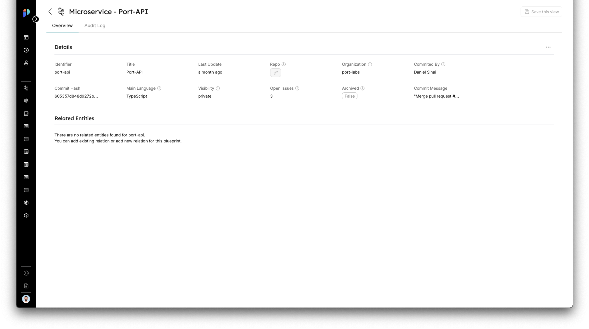
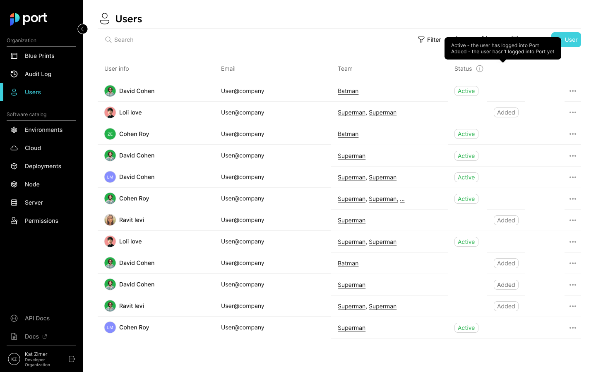

# Port Platform Overview

## What is Port

Welcome to Port! :wave:

Whether you are a DevEx, platform, or DevOps engineer, Port helps you create your custom Developer Portal in no time! With Port, you can build the perfect setup and workflow for your organizational needs, in order to make your developer's lives much easier with self-service capabilities

### Port as a Builder

Our approach is to let you build anything with maximum flexibility. Therefore, we took a **builder-based** approach, in which you can build your asset landscape whichever way works for you. We don't enforce anything on how you build your catalog.

### We are API-first

<mark>And it is not just an empty claim.</mark>

We built Port with an **API-First approach**, meaning that our product and API go hand in hand, consequently benefiting our development velocity and our users, too. You can use our API to perform any operation on the Platform, while we provide you with the logic and the detailed documentation.

:::note
We Use the **OpenAPI 3** specification.  
Visit our [Swagger.](https://api.getport.io/static/index.html#/)
:::

## Main Points

- **Blueprints** are the main building blocks in Port, they represent software & infrastructure assets.
- **Entities** are objects that match the types defined by Blueprints.
- A **Page** holds all the information you need for a specific Blueprint, Entity, and more.
- There are a few different ways you can make actions in Port:
  - Via the **UI**.
  - Using our **API**.
  - Using 3rd party app integrations, for example Slack (Coming soon).
  - CLI (Coming soon).
- Audit Log, User management, granular permissions, and more are available on the Port platform.

## Blueprints Page

### First, What's a Blueprint?

A **Blueprint** is the _most basic_ building block in Port. It represents assets that can be managed in Port, such as `Microservice`, `Environments`, `Packages`, `Clusters`, `Databases`, and many more.

Blueprints are completely customizable, and they support any number of properties the user chooses, all of which can be modified as you go.

### Our building-space

The Blueprints page is the main system page, in which you can create your full asset layout: create new Blueprints, connect between them, edit or delete them, and set advanced operations on top of every one of them.

When you first log in to Port, you will see an empty Blueprints page, like this one:

### How to Create a Blueprint?

There are two ways to create a Blueprint:

- Through the UI
- Using API

:::tip
To create your first blueprint, please see our [quickstart guide](../welcome/quickstart).
:::

## Navigation Bar

On the left sidebar of the platform you can find the main navigation bar.

It is divided into two sections: `Organization` and `Software Catalog`.

The `Organization` section holds the following system pages:

- [Blueprints](#first-whats-a-blueprint)
- [Users](#the-users-page)
- [Audit Log](#the-audit-log)

The `Software Catalog` holds all of the [pages](#main-pages).

## Pages

### How is a port page created?

#### Main Pages

A new page is created whenever a new Blueprint is created. The page will appear on the left side of the navigation bar, and its name will be either the title of the Blueprint, or the identifier name (if the title is not set).

Every Blueprint's page is its main page, showing a full-page table view containing the [Entities](#whats-an-entity) of a specific Blueprint.

#### Entity Pages

Every [Entity](#whats-an-entity) has its page, showing a summary of the Entity's data and other related entities.

:::note

#### What's an entity?

An Entity is the object instance of a Blueprint, and it represents software component data,as defined by the Blueprint properties.

See [Port Components](./port-components/) for further details.
:::

### Saved Views

Pages can also be created from any main page, by creating saved views:

## The Audit Log

In Port, we store every event in a visual log that shows which events took place on different Blueprints and Entities. For example: which Entity was modified, who created the action, what type of event was it, what is the event’s status and when did the event occur.

The page is divided into 2 tabs:

- Entities
- Blueprints
- Runs

## The Users page

Port has a dedicated for managing all users, showing a list of all users, including their group membership.

### Managing Users

TBD

### Managing Teams

TBD

## Getting help

| Link                                                                                                    | Description                                                               |
| ------------------------------------------------------------------------------------------------------- | ------------------------------------------------------------------------- |
| **Product Docs**                                                                                        | You are here!                                                             |
| [API Docs](../api-reference)                                                                            | Our full API docs                                                         |
| [API Swagger](https://api.getport.io/static/index.html#/)                                               | Our Swagger host                                                          |
| [Community](https://join.slack.com/t/devex-community/shared_invite/zt-1bmf5621e-GGfuJdMPK2D8UN58qL4E_g) | Our DevEx community will help you with best practices and success stories |
| Contact Us                                                                                              | Directly to our Slack channel                                             |
| Status Page                                                                                             | TBD                                                                       |
