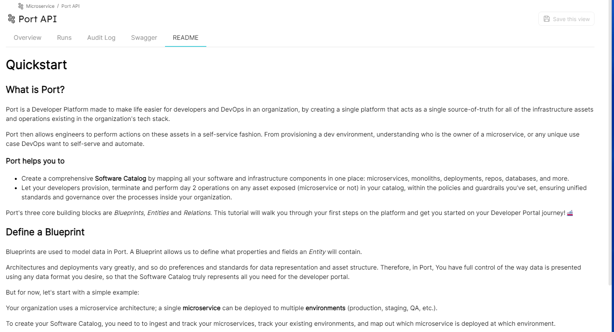
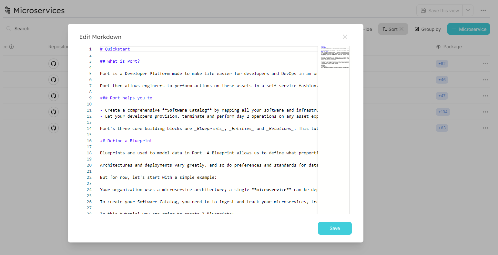

# Markdown

## Definition in Blueprint

```json showLineNumbers
{
  "title": "Markdown Property",
  "type": "string",
  "format": "markdown",
  "description": "An Markdown property"
}
```

:::note
You can see the openAPI on Specific Entity Page.
:::

## Example




