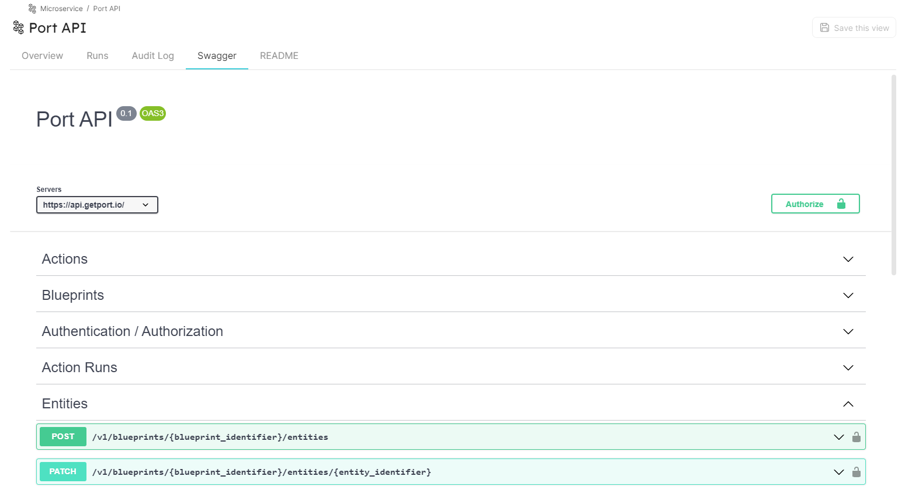

# OpenAPI

Port supports importing and displaying [OpenAPI](https://www.openapis.org/) specification files as [Swagger UI](https://swagger.io/) tabs.

By using the combination of `"type": "object` and `"spec": "open-api"` in a [Blueprint property](../port-components/blueprint.md#blueprint-properties), Port will display the Swagger UI matching the spec file provided in the [Specific Entity Page](../port-components/page.md#entity-page). In addition it will also provide advanced functionality such as performing HTTP calls to the spec target directly from Port.

## OpenAPI property definition in Blueprint schema

```json showLineNumbers
{
  "title": "Open API",
  "type": "object",
  "spec": "open-api",
  "description": "Open-API Prop"
}
```

## Example

Here is how the Swagger tab in the Specific Entity Page looks when an OpenAPI spec is provided:


