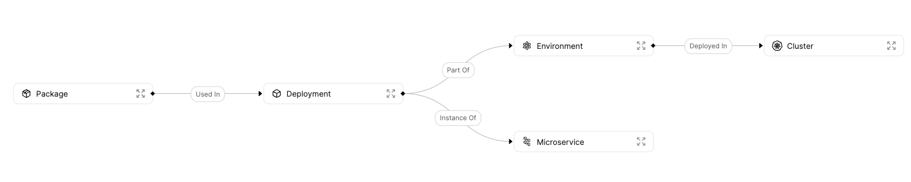
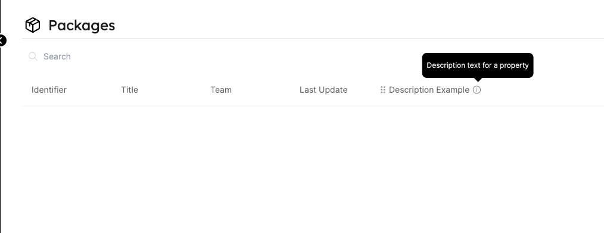
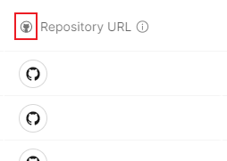

# Blueprint

## What is a Blueprint?

A Blueprint is _our basic_ building block in Port. It represents assets that can be managed in Port, such as `Microservice`, `Environments`, `Packages`, `Clusters`, `Databases`, and many more.

Blueprints are completely customizable, and they support any number of properties the user chooses, all of which can be modified as you go.

## Defining your blueprints

Before you start, there are a few things to consider when defining your Blueprints:

1. **What part of your infrastructure do you want to manage**, or in other words, what is the best way to catalog your software and infrastructure to reflect the architecture that matters for the developer portal experience? For example, in one organization, the focus could be managing microservices (with clusters, deployments, etc...). While in another, it could be understanding what dev environments the organization has in a given moment.

2. **What properties characterize your assets?** For example, a microservice’s characteristics could be its owner, a link to its Github repository, a relevant slack channel and a health check status.

3. **What are the relationships between the different assets?** For example, relations between microservices and deployments that track where each microservice is deployed.

:::note
By the end of this section, you should have a Blueprint architecture similar to this in mind:


:::

## Blueprint structure

### Blueprint JSON schema

Each Blueprint is represented by a [Json schema](https://json-schema.org/), as shown in the following section:

```json showLineNumbers
{
  "identifier": "UniqueID",
  "title": "Title",
  "description": "Description",
  "icon": "Service",
  "formulaProperties": {},
  "schema": {
    "properties": {
      "foo": {
        "type": "string",
        "title": "Foo"
      },
      "bar": {
        "type": "number",
        "title": "Bar"
      },
      "date": {
        "type": "string",
        "format": "date-time",
        "title": "Date"
      }
    },
    "required": []
  },
  "relations": {}
}
```

---

### Structure table

| Field                  | Type     | Description                                                                                                   | Optional Values                                                                                                                               |
| ---------------------- | -------- | ------------------------------------------------------------------------------------------------------------- | --------------------------------------------------------------------------------------------------------------------------------------------- |
| `identifier`           | `String` | Unique identifier.<br /> Note that while the identifier is unique, it can be changed after creation           |
| `title`                | `String` | The Blueprint's name                                                                                          |
| `description`          | `String` | Description for the Blueprint.<br /> This value is visible to users when hovering on the info icon in the UI. |
| `icon`                 | `String` | Icon for the Blueprint's graph node, and Entities of the Blueprint                                            | Icon options: `Airflow, Ansible, Argo, Aws, Azure, Blueprint, Bucket, Cloud,...` <br /><br />See the full icon list [below](#full-icon-list). |
| `formulaProperties`    | `Object` | Contains the properties that are defined using [formula templates](./formula-properties)                      | Example: "`repo-link`": "`https://github.com/{{$identifier}}`"                                                                                |
| `schema`               | `Object` | Object containing two more nested fields, including `properties` and `required`                               | See the schema structure [here](#blueprint-schema).                                                                                           |
| `changelogDestination` | `Object` | Defines the destination where events that happen within the Blueprint's context will be delivered             | See the object structure [here](#changelog-destination).                                                                                      |

#### Special blueprint fields

| Field              | Type     | Description                                                                                                                                                         | Optional Values                                                        |
| ------------------ | -------- | ------------------------------------------------------------------------------------------------------------------------------------------------------------------- | ---------------------------------------------------------------------- |
| `relations`        | `Object` | Contains the [Relations](./relation) of the Blueprint                                                                                                               |
| `mirrorProperties` | `Object` | Becomes available when a Relation is defined between two blueprints.<br />A Mirror Property represents additional data queried from the related [Entity](./entity). | See more details on the [Mirror Properties](./mirror-properties) page. |

#### Full icon list

:::info Available Icons
`Airflow, Ansible, Argo, Aws, Azure, Blueprint, Bucket, Cloud, Cluster, CPU, Customer, Datadog, DefaultEntity, DefaultProperty, DeployedAt, Deployment, DevopsTool, Docs, Environment, Git, Github, GitVersion, GoogleCloud, GPU, Grafana, Jenkins, Lambda, Link, Lock, Microservice, Moon, Node, Okta, Package, Permission, Server, Service, Terraform`
:::

#### Blueprint schema

```json showLineNumbers
    "schema"; {
            "properties": {},
            "required": []
        }
```

| Schema field | Type     | Description                                                                                                                           |
| ------------ | -------- | ------------------------------------------------------------------------------------------------------------------------------------- |
| `properties` | `Object` | See our [`properties`](#blueprint-properties) section for more details.                                                               |
| `required`   | `List`   | A list of the **required** properties, out of the `properties` object list. <br /> These are mandatory fields to fill in the UI form. |

## Blueprint properties

Each Blueprint has a `properties` section under its `schema`. In this section, you can define all of the unique properties that describe your asset.

For Example:

```json showLineNumbers
"string_prop": {
    "title": "My String Property",
    "type": "string",
    "default": "foo",
    "icon": "Microservice",
    "description": "This is a string property"
}
```

Now let's look at the structure of this property definition and also explore the entire set of options for a single property:

| Field         | Type                    | Description                                                                                                                                                                                                                                                                                                                                                                   |
| ------------- | ----------------------- | ----------------------------------------------------------------------------------------------------------------------------------------------------------------------------------------------------------------------------------------------------------------------------------------------------------------------------------------------------------------------------- |
| `title`       | `String`                | Property name                                                                                                                                                                                                                                                                                                                                                                 |
| `type`        | `String`                | **Mandatory field.** The data type of the property. You can explore all available types in the [Property Types](#property-types) section                                                                                                                                                                                                                                      |
| `format`      | `String`                | Specific data format to pair with some of the available types. You can explore all formats in the [String Formats](#string-property-formats) section                                                                                                                                                                                                                          |
| `pattern`     | `String`                | [Regular expression](https://en.wikipedia.org/wiki/Regular_expression) (regex) pattern to specify the set of allowed values for the property. You can see an example in the [String regular expression patterns](#string-regular-expression-patterns) section                                                                                                                 |
| `default`     | Should match the `type` | Default value for this property in case an Entity is created without explicitly providing a value.                                                                                                                                                                                                                                                                            |
| `icon`        | `String`                | Icon for the property column in the [Blueprint page](./page#blueprint-page), in the [Entity page](./page#entity-page) and in the [Entity creation](../../tutorials/entity-basics.md#from-the-ui) form <br /><br />See the full icon list [above](#full-icon-list).                                                                                                            |
| `description` | `String`                | Description of the property.<br /> This value is visible to users when hovering on the info icon in the UI. It provides detailed information about the use of a specific property.                                                                                                                                                                                            |
| `enumColors`  | `Object`                | Define colors for enum fields. <br /> Can be added only if an enum field exists. <br /> Each key is one of the defined enum options and each value is one of the following colors: <br /> [blue, turquoise, orange, purple, lightBlue, pink, yellow, green, red, darkGray] <br /><br /> Notice: In case enum is defined and enumColor field is not default colors will be set |

:::tip
We highly recommend you set a `description`, so your developers will understand the property’s context.


:::

## Property types

```json {3} showLineNumbers
"string_prop": {
    "title": "My String Property",
    "type": "string",
    "default": "foo",
    "description": "This is a string property"
}
```

We currently support the following types:

| `type`    | Description                                                                                              | Example values                               |
| --------- | -------------------------------------------------------------------------------------------------------- | -------------------------------------------- |
| `string`  | A free-text string value                                                                                 | `"This is a string field"`                   |
| `number`  | Numeric field (including integers, doubles, floats, etc...)                                              | `1`, `2.3`, `5e3`,...                        |
| `boolean` | Boolean field                                                                                            | A `true` or `false`                          |
| `object`  | A well formatted object (i.e. python dictionary, javascript object, JSON, etc...)                        | `{ 'key1': 'value1', 'key2': 'value2', ...}` |
| `array`   | A multi-element array                                                                                    | `[1,2,3]`, `["a","b","c"]`                   |
| `enum`    | Field with a pre-defined set of allowed values. Can be used with properties of type `string` or `number` | `["Option 1", "Option 2", "Option 3"]`       |

:::note
Those are the `properties` that our API supports. See [API reference](../../api-reference).
:::

### Examples

Here is how property definitions look like for all available types (remember that only the `type` field is mandatory):

### String

```json showLineNumbers
{
  "title": "String Property",
  "type": "string",
  "description": "A string property",
  "default": "foo"
}
```

### Number

```json showLineNumbers
{
  "title": "Number Property",
  "type": "number",
  "description": "A number property",
  "default": 42
}
```

### Boolean

```json showLineNumbers
{
  "title": "Boolean Property",
  "type": "boolean",
  "description": "A boolean property",
  "default": true
}
```

### Object

```json showLineNumbers
{
  "title": "Object Property",
  "type": "object",
  "description": "An object property",
  "default": {
    "foo": "bar"
  }
}
```

### Array

```json showLineNumbers
{
  "title": "Array Property",
  "type": "array",
  "description": "An array property",
  "default": [1, 2, 3]
}
```

### Objects Array

```json showLineNumbers
{
  "title": "Array of Objects",
  "type": "array",
  "items": {
    "type": "object"
  },
  "description": "An array property",
  "default": [
    {
      "foo": "bar",
      "version": 1
    }
  ]
}
```

### URLs Array

```json showLineNumbers
{
  "title": "Array of URLs",
  "type": "array",
  "items": {
    "type": "string",
    "format": "url"
  },
  "description": "An array of URLs property"
}
```

### Enum

```json showLineNumbers
{
  "title": "Enum field",
  "type": "string",
  "enum": ["Option 1", "Option 2", "Option 3"],
  "enumColors": {
    "Option 1": "red",
    "Option 2": "green",
    "Option 3": "blue"
  },
  "description": "Enum dropdown menu"
}
```

## String property formats

```json {3-4} showLineNumbers
"string_prop": {
    "title": "My String Property",
    "type": "string",
    "format": "url",
    "default": "foo",
    "description": "This is a string property"
}
```

We currently support the following `string` formats:

| `format`    | Description                   | Example values                            |
| ----------- | ----------------------------- | ----------------------------------------- |
| `url`       | Formatted URL                 | `"https://getport.io"`                    |
| `email`     | Formatted Email               | `"port@getport.io"`                       |
| `date-time` | Formatted ISO string datetime | `"2022-04-18T11:44:15.345Z"`              |
| `ipv4`      | Standard IPv4 address         | `127.0.0.1`                               |
| `ipv6`      | Standard IPv6 address         | `FE80:CD00:0A20:0CDE:1257:1C34:211E:729C` |

:::note
Those are the `format` types that our API supports. See [API reference](../../api-reference).
:::

### Examples

Here is how to use property formats:

### URL

```json showLineNumbers
{
  "title": "URL Property",
  "type": "string",
  "format": "url",
  "description": "A URL property",
  "default": "https://getport.io"
}
```

### Email

```json showLineNumbers
{
  "title": "Email Property",
  "type": "string",
  "format": "email",
  "description": "An Email property",
  "default": "mor@getport.io"
}
```

### Date Time

```json showLineNumbers
{
  "title": "Datetime Property",
  "type": "string",
  "format": "date-time",
  "description": "A datetime property",
  "default": "2022-04-18T11:44:15.345Z"
}
```

### IPv4

```json showLineNumbers
{
  "title": "IPv4 Property",
  "type": "string",
  "format": "ipv4",
  "description": "An IPv4 property",
  "default": "127.0.0.1"
}
```

### IPv6

```json showLineNumbers
{
  "title": "IPv6 Property",
  "type": "string",
  "format": "ipv6",
  "description": "An IPv6 property",
  "default": "0000:0000:0000:0000:0000:0000:0000:0000"
}
```

## String regular expression patterns

In order to use a regex pattern for a property value, both the `"type": "string"` and the `"pattern": "[REGEX_PATTERN]"` keys need to be used in the property JSON.

A regex pattern will limit the set of legal values only to ones that are matched by the specified `[REGEX_PATTERN]`:

```json {3-4} showLineNumbers
"regex_prop": {
    "title": "Regex Pattern Property",
    "type": "string",
    "pattern": "[a-zA-Z0-9]",
    "description": "A property that supports values specified by a regex pattern",
    "default": "Port1337"
}
```

In the example above, the pattern `[a-zA-Z0-9]` sets the following rules:

- Letters in the range `a-z` will be matched, in both lowercase and uppercase form
- Digits in the range `0-9` will be matched
- Any combination of characters and digits from the previous rules will be matched

:::tip
Port supports standard Javascript regex syntax ([ECMA 262](https://www.ecma-international.org/publications-and-standards/standards/ecma-262/)), for quick reference of some of the available regex syntax, refer to the [JSON Schema docs](https://json-schema.org/understanding-json-schema/reference/regular_expressions.html)
:::

## Property icons

You can add icons to properties:

```json {4} showLineNumbers
"string_prop": {
    "title": "My String Property",
    "type": "string",
    "icon": "Github",
    "default": "foo",
    "description": "This is a string property"
}
```

The icon will be displayed in the column header of the property (in the example above - `repoUrl`):



For a list of available icons refer to the [full icon list](#full-icon-list)

## Changelog destination

The `changelogDestination` object controls whether events that happen in the context of the Blueprint are reported to a user configured destination, and if so to which destination.

Events that the `changelogDestination` configuration will report on include:

- Changes to the Blueprint schema'
- Creation of new Entities that match the type of the Blueprint;
- Changes to Entities that match the type of the Blueprint;
- And more.

The `changelogDestination` supports 2 configurations:

- [Webhook](../self-service-actions/port-execution-architecture/port-execution-webhook.md)
- [Kafka](../self-service-actions/port-execution-architecture/port-execution-kafka.md)

:::tip
If you don't want to send changelog events to any destination, you can simply remove the `changeLog` destination from the Blueprint JSON.
:::

### Changelog destination structure fields

| Field  | Type     | Description                                                                                                                                   | Example values              |
| ------ | -------- | --------------------------------------------------------------------------------------------------------------------------------------------- | --------------------------- |
| `type` | `string` | Defines the changelog destination type                                                                                                        | Either `WEBHOOK` or `KAFKA` |
| `url`  | `string` | Defines the webhook URL where Port sends changelog events to via HTTP POST request. <br></br> Can be added only if `type` is set to `WEBHOOK` | `https://example.com`       |

For more information about Port's changelog capabilities, refer to the [Port execution architecture](../self-service-actions/port-execution-architecture/port-execution-architecture.md) page.

## Mirror properties

When two Blueprints are connected via a Relation, a new set of properties becomes available to Entities in the source Blueprint.

Those new properties are called `mirrorProperties`, you can learn more about them in the [mirrorProperties](./mirror-properties) page.

## Next Steps

[Explore How to Create, Edit, and Delete Blueprints with basic examples](../../tutorials/blueprint-basics.md)

[Dive into advanced operations on Blueprints with our API ➡️ ](../../api-reference)
