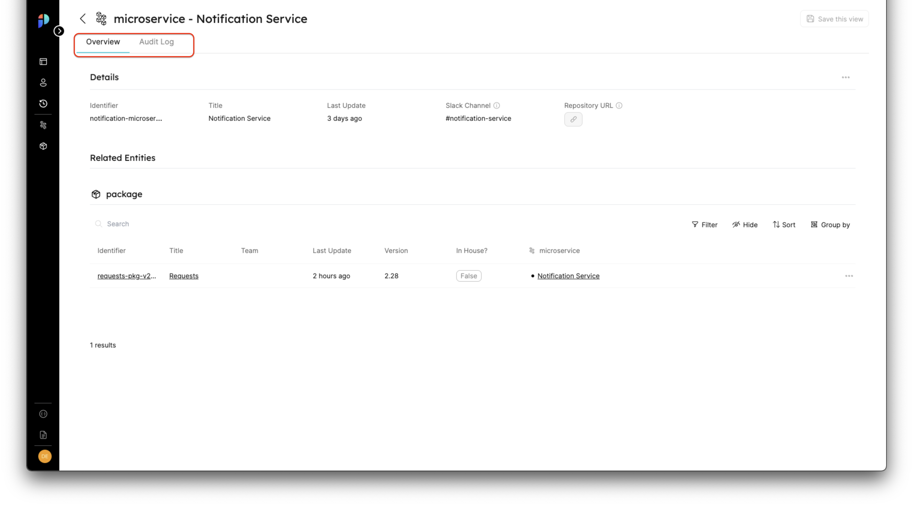
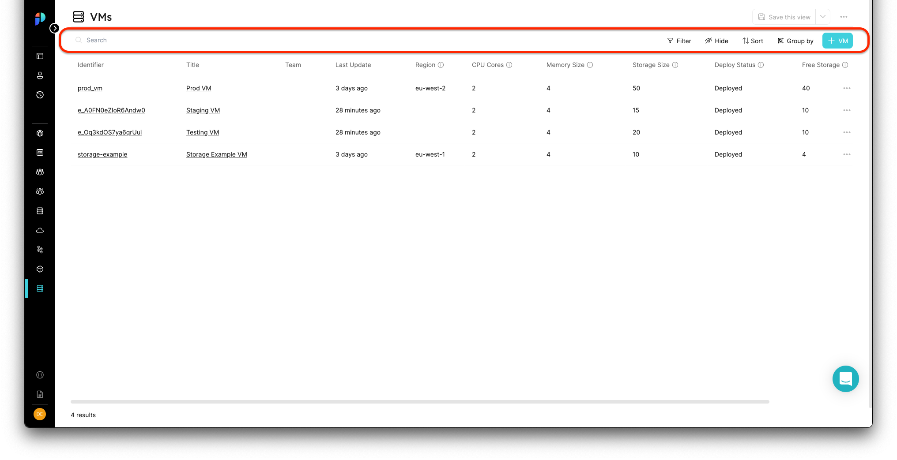
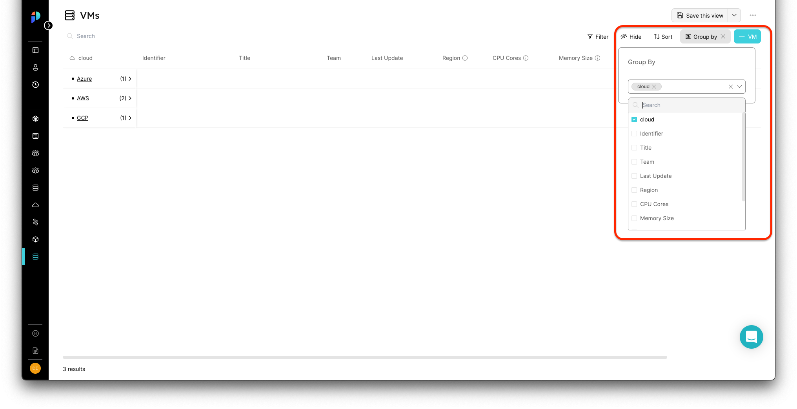

# Page

## What is a Page?

A page is a viewing component that displays Entity data in different forms such as a table form, data summary, etc.

### Basic concepts of pages

- **Blueprint default page:** automatically appears when a Blueprint is created, and is located in the navigation bar. It contains a single table widget.
- **Pages are dynamic:** We can create multiple pages that display different data according to the filters you set in advance.
- **Entity pages:** automatically appear for each new Entity you create.

### Pages architecture

1. **Pages are built from Widgets**.

:::note Widgets
A widget is a viewing component from which Pages are built. It contains the Entity type, and a default configuration of the view.

:::

A page can hold a single widget or multiple widgets, for example:

- A full table view widget.
- Details section widget in an Entity page.

1. **Pages can contain tabs**.

:::note Tabs
A tab is a sub-page within a page.
:::

Pages can be separated into several tabs, each of which is a page that holds one or many widgets.

**Default Tabs:**

- Overview
- Audit Log

:::note Pages Hierarchy
**Pages** contain Widgets and Tabs.  
**Tabs** are pages within pages.
:::

## Blueprint Page

A full page table widget that holds all of the Blueprints specific Entities.

#### Default view

## Entity Page

Each Entity has a specific page that contains two tabs (by default).

The first tab is the `Overview` tab, which shows two widgets: the Entity details and a table(s) of its related Entity(ies). The second tab is an `Audit Log` tab that contains a full-page table widget.

:::note Relations within an entity page
**Related entities** of an Entity are presented on the Entity page as a list of table widgets containing the related Entity(ies) data.
:::

## Page operations

Each page type has a set of operations that can be performed from the UI.  
The table below summarizes the available operations according to the page type:

| Page type                                     | Save a view | Save view as  a new page | Edit page | Delete page |
| --------------------------------------------- | :---------: | :---------------------------: | :-------: | :---------: |
| Blueprint page (Default Page)                 |      V      |               V               |     X     |      X      |
| Entity page                                   |      V      |               X               |     X     |      X      |
| Users page                                    |      V      |               X               |     X     |      X      |
| Audit log page                                |      V      |               X               |     X     |      X      |
| Custom page (generated from save as new page) |      V      |               V               |     V     |      V      |

:::info Default page
The default page is automatically created when a new Blueprint is created. That page is directly tied to its Blueprint and it cannot be edited or deleted.

In order to edit or delete the default Blueprint page, the Blueprint itself should be edited or deleted. (Using the filter, sort, group by and other table widget controls to change the layout of the default Blueprint page is available directly from the default page)
:::

All page operations are available on the right top bar, as shown here: (In accordance with the table above)

### Saving views

Every change made on a specific page, such as [widget operations](#widgets), enables the `Save this view` button.  
Clicking on it will save the new view for all users.

:::note
The ability to save a view for all users is available only for the **Admin role**.
:::

### Saving new pages

Each time a change is made on a page, and the `Save this view` becomes enabled, you can press the small arrow on its right side to open the drop menu.

After clicking the `Save as a new page` button, a window will pop up:

:::note
When saving a new page or editing an existing one, a set of icons is available to you:

:::

### Edit or delete a page

#### Editing pages

By clicking the `...` button on the top right corner, you can edit the page name and its icon.

Editing a page:

#### Deleting pages

:::note
An Entity page is deleted automatically when the connected Entity is deleted.
:::

## Widgets

A widget is a UI component that shows data to the user.
On Port, we have a few types of widgets:

- Table widget.
- Summary (Details) widget.

## Table widget operations

Table operations are used to define the user’s view of the Port platform.

:::tip
We highly recommend using the table operations to provide a clean and accurate view of the platform for your developers.

:::

All table operations are available on the top bar of the table:

### Filter

Filtering a table is done using the following menu:

You can define any filtering operator with a suitable value, in order to filter anything.

You can filter according to one or many fields while setting the relation between each field filter: `And/Or`.

:::note
We support the following filtering operators: `'contains', '=', '!=', 'begins with', 'Has any of', 'end with', 'does not contain', 'does not begin with', 'does not end with'`.
:::

### Sort

Sorting the table is done on the following menu:

You can sort by one or more fields of any kind. We support `Ascending` and `Descending` sorting options.

:::note
Sorting a specific column can be done by clicking on the column title.
:::

### Hide

Hiding table columns is done on the following menu:

You can decide whether each field is viewable to users or not.

:::tip
We highly recommend hiding irrelevant data from users, in order to provide them a clean work environment with few irrelevant distractions.
:::

### Group By

Grouping by Entities is done on the following menu:

You can group results according to any field in the table.

:::tip
Group by is recommended when you want to create custom views for users, such as Microservices by Owners.

Just create your `group by` setting, add additional viewing settings if needed, and Save the page **as a new view** ([See How](#saving-new-pages)).
:::

### Search

We provide a free search option on tables. Searching on a table is available on the left side of the top bar:

[Explore Advanced Operations on Pages with our API ➡️ ](../../api-reference)
