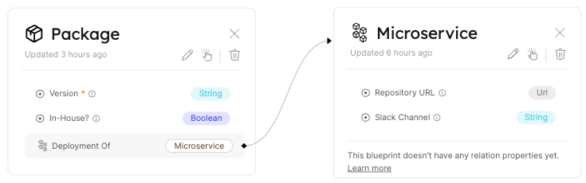

# Relation

## What is a Relation?

**Relations** enable us to make connections between Blueprints, consequently connecting the Entities based on these Blueprints. Doing so provides logical context to the Software Catalog.

**For example**, in order see where your `microservices` are deployed, you need to create a Relation between your `microservices` and `deployment` Blueprints.

## Relation JSON structure

The basic structure of a Relation object:

```json showLineNumbers
"UniqueId": {
    "title": "Title",
    "target": "Blueprint target identifier",
    "required": true
}
```

:::info
A Relation exists under the `relations` key in the [Blueprint JSON schema](./blueprint.md#blueprint-json-schema)
:::

---

## Structure table

| Field        | Type      | Description                                                                                                      |
| ------------ | --------- | ---------------------------------------------------------------------------------------------------------------- |
| `identifier` | `String`  | Unique identifier                                                                                                |
| `title`      | `String`  | Relation name that will be shown in the UI                                                                       |
| `target`     | `String`  | Target Blueprint identifier.                                                                                     |
| `required`   | `Boolean` | Boolean flag to define whether the target Entity is a must when creating a new Entity from the source Blueprint. |

:::tip

The title allows you to give human-readable names to Relations. For example, A `Package` <-> `Deployment` Relation can describe how those two are related.

Using titles also allows you to conveniently access Relations programmatically in a generic way while keeping the UI readable.

For example, you can define a convention where all Relations are named in a specific format:

- `{blueprint_1}-{blueprint_2}`
- `{blueprint_1}-to-{blueprint_2}`
- `{blueprint_1}<->{blueprint_2}`
- Anything similar that works for you

This will allow you to interact with Relations with code in a generic way, without impacting UX.
:::

## Relation example

Please see the following example of a relation between `microservices` and a `deployment` Blueprint.
Let's say we have those two Blueprints defined, and we want to connect between them, in a way that the `deployment` is the `source` and `microservice` is the `target`.

We need to add the following JSON schema of the relation to the `deployment` Blueprint's `relations` object:

```json showLineNumbers
"deployment-2-microservice": {
  "title": "Deployment Of",
  "target": "microservice",
  "required": false
}
```

Resulting in this outcome in the UI:


:::info
Our `source` to `target` relations are one-to-many, at the moment. That means the `target` Blueprint can have many entities of the `source` blueprint.

For example, a `deployment -> microservices` Relation can translate to a `microservice` being deployed many times, while a `deployment` represents a single `microservice`.
:::

:::note
We will support many-to-many relations soon!
:::

## Byproducts of a relation

### Relation object for entities

When two Blueprints are related, creating an Entity of the `source` Blueprint will show an additional option - a `Relation`.

This will add a property under the `relations` section, as shown in the [relations section.](./entity#related-entities)

### Mirror properties

Creating a Relation between multiple Blueprints allows you to use **Mirror Properties** to enrich the data attached to your Entities, by querying additional data from related Entities with fewer steps.

You can learn more about these properties in the [Mirror Properties](./mirror-properties) page.

## Next Steps

[Explore How to Create, Edit, and Delete Relations with basic examples](../../tutorials/relation-basics.md)

[Dive into advanced operations on Relations with our API ➡️ ](../../api-reference)
