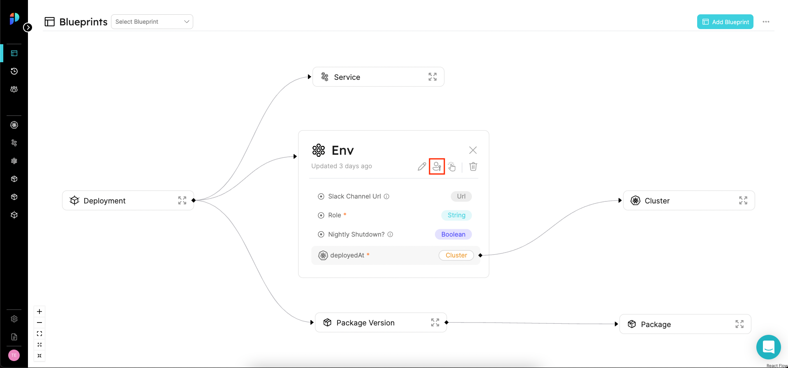
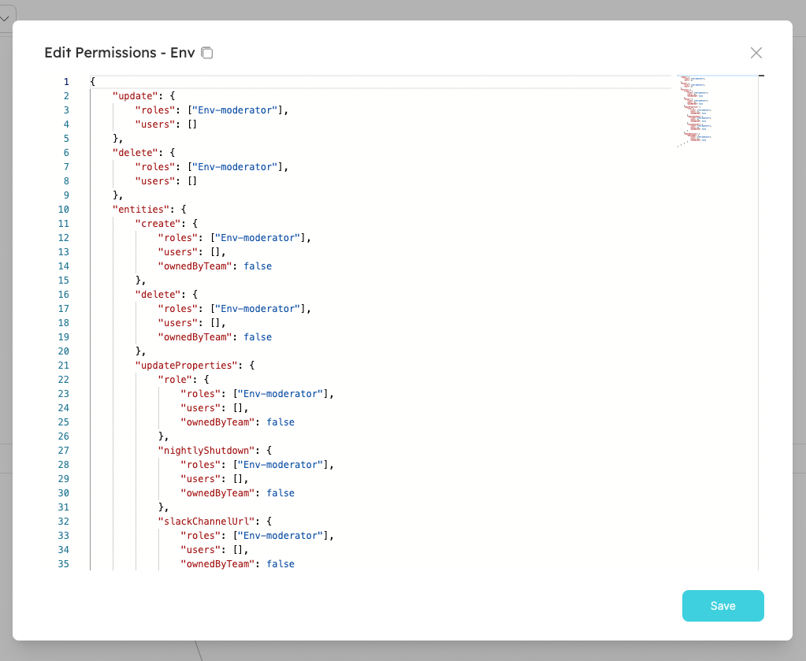
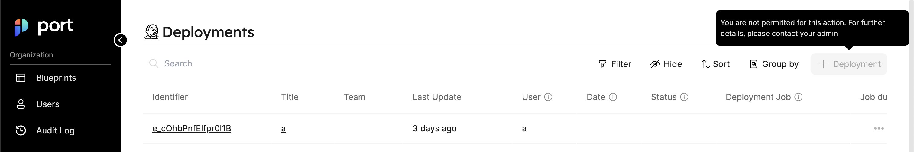
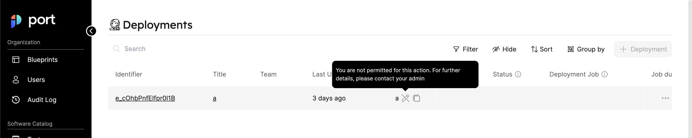

# Permission controls

In Port, you can set granular permissions to **Blueprints** and **Actions**, according to users and teams.

**How is it beneficial for your organization?**

Admins will have control over their Software Catalog in Port, by setting **granular permissions** for every component. In addition, user experience will improve, by displaying and granting control over specific Entities to their designated users, thus preventing information overload.

In Port, you can enforce permissions by [Roles](#roles), and/or by [Team Ownership](#setting-permissions-by-team-ownership).

## Roles

There are 3 types of roles. Below are their out-of-the-box permissions:

| Role                         | Description                                                                                                     |
| ---------------------------- | --------------------------------------------------------------------------------------------------------------- |
| **Admin**                    | Perform any operation on the platform                                                                           |
| **Moderator** of a Blueprint | Perform any operation on a specific Blueprint and its Entities. A user can be a moderator of several Blueprints |
| **Member**                   | Read-only permissions + permissions to execute Actions                                                          |

:::info
The **Moderator** role is uniquely created for each Blueprint in the platform upon creation.
For example, creating the Blueprint `Env` will generate a role named `Env-moderator`, which can perform any operation on the `Env` Blueprint and its Entities.
:::

As mentioned above, these permissions are given by default when you first set up your organization, based on the behaviors we learned are best-practices.
However, as part of Port's [builder-approach](../../faq/faq.md#whats-a-builder-based-developer-portal), you can decide and control the permissions you want to grant, in the way that suits your organization best. We'll explore those options down below and in the [tutorials section](../../tutorials/tutorials.md).

:::info
In addition to the permissions designated for each role, permissions are also inherited from the role below them:

**Admin** > **Moderator** > **Member**

For example, if **Members** are allowed to edit `Cluster` Entities, then `Microservices` **Moderators** are also allowed to edit them (**Admins** can edit all Entities under all Blueprints).
:::

You can view (and edit) each user’s role in the users table (via the main menu):


:::info
Refer to the [Users and Teams](./users-and-teams-management) section for more information about the users page
:::

## Working with Permissions

In this section we'll show you a few examples of ways to use permissions in your organization, and how to apply them.

### Use-case examples

The following configurations, among others, are available when using permissions management:

1. Entities can be made immutable/partially immutable (can only create/delete/modify) for specific users/roles. For example:
   a. `Deployment` Entities are immutable for all roles, and `Cluster` Entities are editable only by the **Moderators**.
   b. **Members** can create a new `Microservice` Entity, but are not permitted to delete a `Microservice` Entity.
2. Each Entity property/relation can be immutable separately for specific users/roles. For example, the `repository_link` property can be immutable for all roles (except **Admin**).
3. Allow specific users/roles to modify only Entities [owned by their team](#setting-permissions-by-team-ownership). For example, **Members** can edit only `Microservices` that belong to their team.
4. Actions execution grant permissions can be given to specific users or roles. For example, you can allow every **Member** to create a new `Deployment` Entity, however only `Deployment` **Moderators** can perform a day-2 Action of "adding resources".

### Setting permissions for a Blueprint (and its Actions)

To set permissions for a Blueprint, click on the permissions icon of the desired Blueprint in the Blueprints page:



This will open the following window:



As you can see, every operation that can be performed on the Blueprint or its Entities is listed in the JSON and can be controlled.

For example, If you want to enable **Members** to register Entities of `Env` Blueprint, you can change the JSON as follows:

```json showLineNumbers
{
  "entities": {
    "register": {
      "roles": ["Env-moderator", "Member"], // changed from ["Env-moderator"]
      "users": [],
      "ownedByTeam": false
    }
  }
}
```

To allow only **Admins** to change the property `slackChannelUrl`, remove the Moderator role:

```json showLineNumbers
{
  "entities": {
    "updateProperties": {
      "slackChannelUrl": {
        "roles": [], // changed from ["Env-moderator"]
        "users": [],
        "ownedByTeam": false
      }
    }
  }
}
```

To grant permissions for a specific user to edit the `deployedAt` relation, add to the users array:

```json showLineNumbers
{
  "entities": {
    "updateRelations": {
      "deployedAt": {
        "roles": ["Env-moderator"],
        "users": ["some-user@myorg.com"], // changed from []
        "ownedByTeam": false
      }
    }
  }
}
```

By default, **Member** users can execute every new Action of the Blueprint. If necessary, you can change it. For example, you can allow **Moderators** (and **Admins**) to only execute the Action `clone_env`:

```json showLineNumbers diff
{
  "actions": {
    "clone_env": {
      "execute": {
        "roles": ["Env-moderator"], // changed from ["Env-moderator", "Member"]
        "users": [],
        "ownedByTeam": false
      }
    }
  }
}
```

### Setting permissions by team ownership

You will notice that some operations have the `ownedByTeam` flag. This allows you to set permissions by team ownership, rather than by Roles or direct assignment.
For example, the following JSON will allow **every user**, regardless of their roles, to perform the Action `delete_env` on `Env` Entities that belong to a team they are part of (entities that have the [`team` property](../port-components/entity#teams-and-ownership) set):

```json showLineNumbers
{
  "actions": {
    "delete_env": {
      "execute": {
        "roles": ["Env-moderator"],
        "users": [],
        "ownedByTeam": true // changed from false
      }
    }
  }
}
```

:::info
The `team` field is not mandatory! You can give a user access to create `Env`, regardless of their team.
:::

### Global VS granular permissions

When granting write permissions for Entities of a Blueprint, you have 2 levels of control:

1. Global permissions - create/update an Entity as a whole. For example, allow **Member** users to update `Env` Entities (all the properties and relations).
2. Granular permissions - control which properties and relations a user/role can update when creating or updating an Entity. For example, allow **Member** users to only update the property `slackChannelUrl` of `Env` Entities.

To apply granular permissions for a Blueprint, use the `updateProperties` and `updateRelations` fields in the JSON.
The following change will allow **Member** users to update _only_ the `slackChannelUrl` property of `Env` Entities:

```json showLineNumbers
{
  "entities": {
    "updateProperties": {
      "slackChannelUrl": {
        "roles": ["Env-moderator", "Member"], // changed from ["Env-moderator"]
        "users": [],
        "ownedByTeam": false
      }
    }
  }
}
```

If you want to apply global permissions, use the `update` field in the JSON.
The following change will allow **Member** users to update _every_ property/relation of `Env` Entities that are owned by their team:

```json showLineNumbers
{
  "entities": {
    "update": {
      "roles": ["Env-moderator"],
      "users": [],
      "ownedByTeam": true // changed from false
    }
  }
}
```

:::caution
Using global permissions overrides any granular permission that has been set!
If both permission types are set, then the global setting will be used when evaluating permissions.
:::

:::info
`update`, `updateProperties` and `updateRelations` settings apply when registering new Entities as well. This means that a user can't register a new Entity with a property (or relation) that he doesn't have permissions to edit.  
:::

### Edge-cases

In some occasions, it's possible to apply permissions in a way that deadlocks users from interacting with the platform.
While these cases are valid, they might be a little counterintuitive.
Here are a few examples of how can you grant a user permissions, but still not enable him to perform the operation due to other restrictions:

1. If the user has permissions to edit any property (except for a required property) - then the user will not be able to register or update the Entity as a whole because he can't provide the required property.
2. If the `ownedByTeam` setting is enabled for registration, and the user does not have permissions to edit the `team` property - then the user will not be able to register the Entity since he can't mark it as owned by his team.

## UI behavior

Configuring user permissions is reflected in Port's UI. The UI also includes indication messages when trying to perform actions. For example:

The `register` and `unregister` buttons will be disabled in the UI, in accordance with the Blueprint permissions (unauthorized users/groups will not be able to register or unregister entities).



The `edit property` button will be disabled according to the permissions:



Immutable properties (restricted properties) will be hidden from users when modifying Entities.

## API

Please see the [Blueprint Permissions](../../api-reference/#tag/Blueprints/paths/~1v1~1blueprints~1%7Bblueprint_identifier%7D~1permissions) and [Actions Permissions](../../api-reference/#tag/Actions/paths/~1v1~1blueprints~1%7Bblueprint_identifier%7D~1actions~1%7Baction_identifier%7D~1permissions/get) sections in our [API reference](../../api-reference/)
