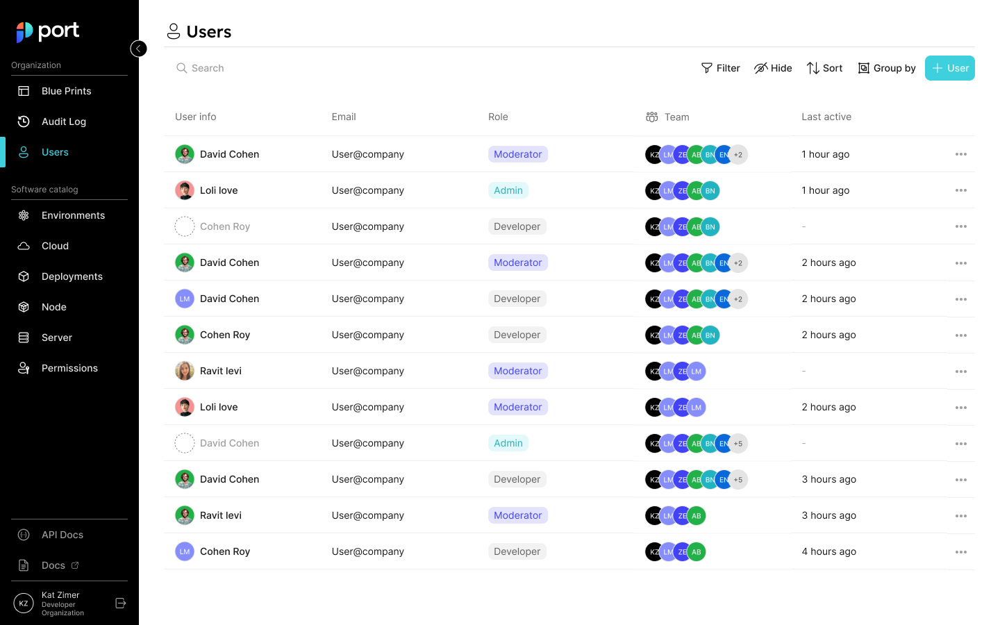

# Permissions

In Port, you can set granular permissions to any component according to users and groups. 

**What are the benefits?**

This will help admins set **granular permissions** for every component in Port, which will give them more control over their catalog. It will also help provide users with a better experience by showing and giving them control only over entities that are relevant to them, thus preventing information overload.

## Roles

Three roles are available in Port:

| Role | Description |
| --- | --- |
| Admin | Can perform any action on the platform (Creating blueprints, relations, and entities, modifying and deleting them).    It can also create users and teams, and modify them. |
| Moderator | Can perform any action on specific blueprints (edit properties, relations, entities, etc).   A user can be a moderator of several blueprints. |
| Member | Can view and perform actions on entities (create, modify, delete) according to its permissions. |

### Admin role

Users with the admin role can:

- Define granular permissions for any user/team in Port
- Have full control of the platform
- Delegate responsibilities on blueprints to moderators
- Control the experience of the developers in Port

### Moderator role

Users with the moderator role can:

- Manage one or several blueprints - create and modify properties, relations, actions, entities, etc.

### Member role

Users with the member role can:

- Easily view entities that they own/they are responsible for
- Have better clarity on available actions in the portal, without the risk of changing critical/immutable objects.

:::info
In addition to the permissions specific to each role, they also inherit the permissions of the role below them:

Admin > Moderator > Member

For example, if members are allowed to edit `Cluster` entities, then `Cluster` moderators are also allowed to edit them (admins can edit all entities under all blueprints).
:::

You can view each user’s role in the users table (via the main menu):

:::info
Refer to the [Teams and users](./users-and-teams-management) section for more information about the Users page
:::

## Working with Permissions

:::caution
At the moment, please contact us to assign roles for your users on Port, and to set blueprint permissions.
:::

### Permissions use-case examples

Using permissions management, the following configurations (and more) are available

1. Blueprints can be made immutable/partially immutable (can only create/delete/modify) for specific users/roles. 
    1. Example - Deployments are immutable for all roles, and Clusters are editable only by the moderators
    2. Example - Members can create a new Microservice but are not permitted to delete a Microservice
2. Each blueprint property and/or relation can be immutable separately for specific users/roles.
    1. Example - The `repository_link` property can be immutable for all roles
3. Allow specific users/roles to only modify entities owned by their team.
    1. Example - members can edit only Microservices that belong to their team

### UI behavior

Configuring user permissions is reflected in Port's UI and also includes indication messages when trying to perform actions. For example:

The `Register` and `Unregister` buttons will be disabled in the UI according to the blueprint permissions (Unauthorized users/groups will not be able to register or unregister entities).
    

    
The `edit property` button will be disabled according to the permissions
    

    
Immutable properties (Restricted properties) will be hidden from users when modifying entities

## Teams and permissions

Using the `team` field, you can give a team permissions over a specific blueprint.

This means that performing actions (create, modify, delete) on entities will be available to all users of the specified team, in addition to permissions provided by specific roles. 

:::info
The `team` field is not mandatory!

This means you can give a user access to create microservices, regardless of their team.
:::

We support manually creating your teams list in Port, as well as integrating with identity providers, such as Okta and AzureAD.

:::note
Okta and Azure integrations are available only after integrating the relevant identify provider.

For more details see [Single Sign-On (SSO)](../../single-sign-on/)
:::

## API

Please see the [Users](../../api-reference/#tag/Teams), [Apps](../../api-reference/#tag/Apps) and [Roles](../../api-reference/#tag/Roles) sections in our [API reference](../../api-reference/)

:::info
For now, any permission change is done via the API. Soon we will provide an easy-to-use UI for complete permission management 🚀

Until then, we will be happy to assist with any permissions adjustments you want to perform in your environment
:::