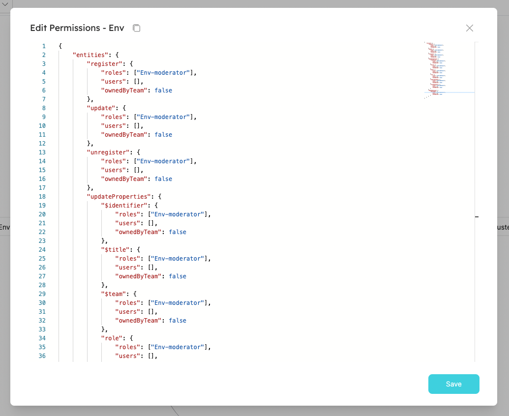

# Permission controls

In Port, you can set granular permissions to **Blueprints** and **Actions**, according to users and teams.

**Why is it beneficial for your organization?**

Admins will have control over their Software Catalog in Port, by setting **granular permissions** for every component. In addition, user experience will improve, by showing and giving the users individual control only over Entities that are relevant to them, thus preventing information overload.

In Port, we have 2 ways to enforce permissions, by Roles and by Ownership:

## Roles

There are 3 types of roles. Which have the following permissions out-of-the-box:

| Role                     | Description                                                                                                  |
| ------------------------ | ------------------------------------------------------------------------------------------------------------ |
| Admin                    | Perform any action on the platform.                                                                          |
| Moderator of a Blueprint | Perform any action on a specific Blueprint and it's Entities. A user can be moderator of several Blueprints. |
| Member                   | Read-only permissions. And permissions to execute Actions                                                    |

As mentioned above, these permissions are given by default when you first set up your organization, based on the behaviours we learned to be best-practices.
However, as part of Port's [builder-approach](#whats-a-builder-based-developer-portal), we let you decide and control the permissions you want to grant, in a way that fits your organization best. We'll explore those options down below and in the tutorials section.

:::info
In addition to the permissions specific to each role, they also inherit the permissions of the role below them:

Admin > Moderator > Member

For example, if members are allowed to edit `Cluster` Entities, then `Microservices` moderators are also allowed to edit them (admins can edit all Entities under all Blueprints).
:::

You can view (and edit) each user’s role in the users table (via the main menu):


:::info
Refer to the [Users and Teams](./users-and-teams-management) section for more information about the users page
:::

## Ownership

In addition to Role-based permissions, you can use the [`team` property](../port-components/entity#teams-and-ownership) to define permissions for Entities.

## Working with Permissions

In this section we'll show a few examples of the different ways you can use permissions in your organization, and show how to apply them.

### Permissions use-case examples

Using permissions management, the following configurations, among others, are available:

1. Entities can be made immutable/partially immutable (can only create/delete/modify) for specific users/roles.
   1. Example - "Deployment" Entities are immutable for all roles, and "Cluster" Entities are editable only by the moderators.
   2. Example - Members can create a new "Microservice" Entity but are not permitted to delete a "Microservice" Entity.
2. Each Entity property/relation can be immutable separately for specific users/roles.
   1. Example - The `repository_link` property can be immutable for all roles (except Admin).
3. Allow specific users/roles to only modify Entities owned by their team.
   1. Example - Members can edit only "Microservices" that belong to their team.
4. Actions execution grants can be given to specific users or roles
   1. Example - Allow every Member to create a new "Deployment" Entity but only "Deployment" moderators can perform a day-2 Action of "adding resources".

### Setting permissions for a Blueprint (and it's Actions)

To set permissions for a Blueprint, click on the permissions icon of the desired Blueprint in the Blueprints page:


This will open the following window:



As you can see, every operation that can be done on the Blueprint or it's Entities is listed in the JSON and can be controlled.

For example, If we want to enable a specific user to update the Blueprint, you can change the JSON to be like so:

```json showLineNumbers
{
  "update": {
    "roles": ["Env-moderator"],
    "users": ["some-user@myorg.com"]
  }
}
```

To enable Members to create Entities of "Env" Blueprint :

```json showLineNumbers
{
  "entities": {
    "create": {
      "roles": ["Env-moderator", "Member"],
      "users": [],
      "ownedByTeam": false
    }
  }
}
```

To allow only Admins to change the property `slackChannelUrl`, remove the Moderator role:

```json showLineNumbers
{
  "entities": {
    "updateProperties": {
      "slackChannelUrl": {
        "roles": [],
        "users": [],
        "ownedByTeam": false
      }
    }
  }
}
```

### Teams and permissions

You'll notice that some operations have the `ownedByTeam` flag. This allows you to set permissions by team ownership, rather than by Roles or direct assignment.
For example, doing this:

```json showLineNumbers
{
  "actions": {
    "delete_env": {
      "execute": {
        "roles": ["Env-moderator"],
        "users": [],
        "ownedByTeam": true
      }
    }
  }
}
```

Will allow **every user**, regardless of its Roles, to perform the Action "delete_env" on "Env" Entities that belong to a team he is a part of (entities that have the `team` property set).

:::info
The `team` field is not mandatory! You can give a user access to create "Env", regardless of their team.
:::

:::note
Okta and Azure integrations are available only after integrating the relevant identity provider.

For more details see [Single Sign-On (SSO)](../../single-sign-on/)
:::

## UI Behavior

Configuring user permissions is reflected in Port's UI. The UI also includes indication messages when trying to perform actions. For example:

For example, the `register` and `unregister` buttons will be disabled in the UI, according to the Blueprint permissions (unauthorized users/groups will not be able to register or unregister entities).


The `edit property` button will be disabled according to the permissions:


Immutable properties (restricted properties) will be hidden from users when modifying Entities.

## API

Please see the [Blueprint Permissions](../../api-reference/#tag/Blueprints/paths/~1v1~1blueprints~1%7Bblueprint_identifier%7D~1permissions) and [Actions Permissions](../../api-reference/#tag/Actions/paths/~1v1~1blueprints~1%7Bblueprint_identifier%7D~1actions~1%7Baction_identifier%7D~1permissions/get) sections in our [API reference](../../api-reference/)
