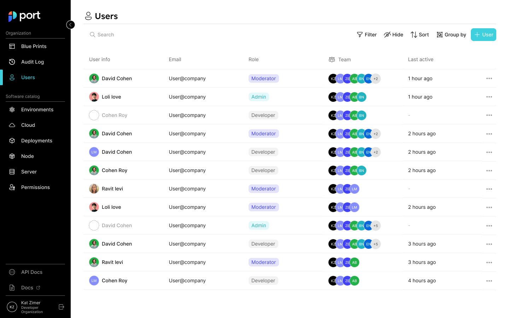
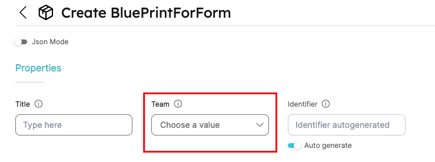

# Teams and users management

In Port, you can control and manage all your users and teams, in one place.

This allows admins to manage their users and teams inside Port:

1. Manage users (via the users page);
2. Promote ownership of assets within the organization (with team assignments);
3. Set granular permissions on the portal (permission management).

It will also benefit developers, who could:

1. Know what software assets they own and are responsible for;
2. View and perform actions on their assets, according to their role and team belonging.

## Users page

Users management is done from the **Users page**.

Each user is defined by the following properties:

1. Basic information - image, name, and email.
2. Role - the user’s permissions level (see the [Permission controls](./permissions-controls) section);
3. Teams - a `team` is a group of users that owns Entities (see the [Team](#team-system-property) section).



:::caution
Modifying roles and teams via the users page will become available soon!
:::

## `Team` system property

Each Entity has a system property called `team`, that allows you to set which team owns the Entity. As an admin, you can also set Blueprint permissions according to this field.

Entity JSON example with `team` field:

```json showLineNumbers
{
  "identifier": "",
  "title": "",
  "team": "",
  "blueprint": "TestBlueprint",
  "properties": {
    "prop1": ""
  },
  "relations": {}
}
```

Team dropdown selector in the Entity create/edit page:



| Field | Type | Description                                            | Default      |
| ----- | ---- | ------------------------------------------------------ | ------------ |
| team  | List | System field that defines the team that owns an Entity | `"team": ""` |

- We support the manual creation of teams on Port, as well as integrating with identity providers, such as [Okta](../../single-sign-on/okta.md) and [AzureAD](../../single-sign-on/azure-ad.md), to import existing teams.
- When users log in to Port, their groups will be pulled automatically from their identity provider, and the allowed team values will be updated accordingly.

:::info
Okta and AzureAD integrations are only available after configuring SSO from the relevant identity provider, refer to the [Single Sign-On (SSO)](../../single-sign-on/) section for more details
:::
