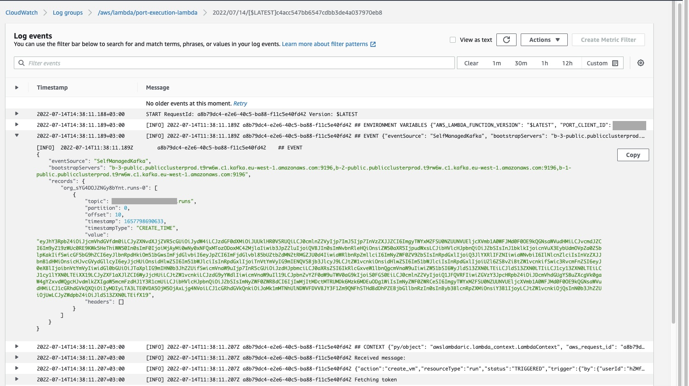

# Setting up a basic execution runner using AWS Lambda

In this guide, we will show how to deploy a new `AWS Lambda function` that will subscribe to the `runs` topic and perform the correct action based on the invocations performed in Port.

## Prerequisites

- AWS CLI installed and configured to your desired AWS account
- A Port API `CLIENT_ID` and `CLIENT_SECRET`
- Connection credentials to the Kafka topic provided to you by Port, they should look similar to this:

```json showLineNumbers
KAFKA_BROKERS=b-1-public.publicclusterprod.t9rw6w.c1.kafka.eu-west-1.amazonaws.com:9196,b-2-public.publicclusterprod.t9rw6w.c1.kafka.eu-west-1.amazonaws.com:9196,b-3-public.publicclusterprod.t9rw6w.c1.kafka.eu-west-1.amazonaws.com:9196
KAFKA_RUNS_TOPIC=YOUR_ORG_ID.runs
KAFKA_AUTHENTICATION_MECHANISM=scram-sha-512
KAFKA_ENABLE_SSL=true
KAFKA_USERNAME=YOUR_KAFKA_USERNAME
KAFKA_PASSWORD=YOUR_KAFKA_PASSWORD
```

You can always refer to our examples [code repository](https://github.com/port-labs/port-serverless-examples) to view the example shown here, and also other similar examples you can use to get started quickly

:::note
This repo is `Private` at the moment, so you’ll get a 404.
Please contact us with your GitHub user for access.
:::

Interaction with Port will be performed primarily using the API in this example, but of course every action can be performed using the web UI as well.

## Scenario

You want to learn about Port’s execution capabilities, In order to do that, you want to create a new execution function that deploys a new VM in your AWS cloud environment

## Creating the VM blueprint

Let’s configure a `VM` blueprint, the blueprint base structure is:

```json showLineNumbers
{
  "identifier": "vm",
  "title": "VM",
  "icon": "Server",
  "schema": {
    "properties": {
      "region": {
        "title": "Region",
        "type": "string",
        "description": "Region of the VM"
      },
      "cpu_cores": {
        "title": "CPU Cores",
        "type": "number",
        "description": "Number of allocated CPU cores"
      },
      "memory_size": {
        "title": "Memory Size ",
        "type": "number",
        "description": "Amount of allocated memory (GB)"
      },
      "storage_size": {
        "title": "Storage Size",
        "type": "number",
        "description": "Amount of allocated storage (GB)"
      },
      "deployed": {
        "title": "Deploy Status",
        "type": "string",
        "description": "The deployment status of this VM"
      }
    },
    "required": []
  },
  "disableEditing": false,
  "enableResponsibleTeamEdit": false,
  "disabledProperties": [],
  "disabledRelations": [],
  "formulaProperties": {}
}
```

Here is code in `python` to create this blueprint (remember to insert your `CLIENT_ID` and `CLIENT_SECRET` in order to get an access token)

<details>
<summary>Click here to see the code</summary>

```python showLineNumbers
import requests

CLIENT_ID = 'YOUR_CLIENT_ID'
CLIENT_SECRET = 'YOUR_CLIENT_SECRET'

API_URL = 'https://api.getport.io/v1'

credentials = {'clientId': CLIENT_ID, 'clientSecret': CLIENT_SECRET}

token_response = requests.post(f'{API_URL}/auth/access_token', json=credentials)

access_token = token_response.json()['accessToken']

headers = {
    'Authorization': f'Bearer {access_token}'
}

blueprint = {
    "identifier": "vm",
    "title": "VM",
    "icon": "Server",
    "schema": {
        "properties": {
            "region": {
                "title": "Region",
                "type": "string",
                "description": "Region of the VM"
            },
            "cpu_cores": {
                "title": "CPU Cores",
                "type": "number",
                "description": "Number of allocated CPU cores"
            },
            "memory_size": {
                "title": "Memory Size ",
                "type": "number",
                "description": "Amount of allocated memory (GB)"
            },
            "storage_size": {
                "title": "Storage Size",
                "type": "number",
                "description": "Amount of allocated storage (GB)"
            },
            "deployed": {
                "title": "Deploy Status",
                "type": "string",
                "description": "What is the deployment status of this VM"
            }
        },
        "required": []
    },
    "disableEditing": False,
    "enableResponsibleTeamEdit": False,
    "disabledProperties": [],
    "disabledRelations": [],
    "formulaProperties": {}
}

response = requests.post(f'{API_URL}/blueprints', json=blueprint, headers=headers)

print(response.json())
```

</details>


## Creating the VM CREATE action

Now let’s configure an action, we will add a `CREATE` action, that means every time a developer will create a new VM entity, it will invoke this action.

Here is our action JSON:

```json showLineNumbers
{
  "identifier": "create_vm",
  "title": "Create VM",
  "icon": "Server",
  "description": "Create a new VM in cloud provider infrastructure",
  "trigger": "CREATE",
  "invocationMethod": "KAFKA",
  "userInputs": {
    "properties": {
      "title": {
        "type": "string",
        "title": "Title of the new VM"
      },
      "cpu": {
        "type": "number",
        "title": "Number of CPU cores"
      },
      "memory": {
        "type": "number",
        "title": "Size of memory"
      },
      "storage": {
        "type": "number",
        "title": "Size of storage"
      },
      "region": {
        "type": "string",
        "title": "Deployment region",
        "enum": ["eu-west-1", "eu-west-2", "us-west-1", "us-east-1"]
      }
    },
    "required": ["cpu", "memory", "storage", "region"]
  }
}
```

Here is code in `python` to create this action (remember to insert your `CLIENT_ID` and `CLIENT_SECRET` in order to get an access token)

:::note Specifying the target blueprint
Note how we use the `vm` blueprint identifier to add the action to our new blueprint
:::

<details>
<summary>Click here to see code</summary>

```python showLineNumbers
import requests

CLIENT_ID = 'YOUR_CLIENT_ID'
CLIENT_SECRET = 'YOUR_CLIENT_SECRET'

API_URL = 'https://api.getport.io/v1'

credentials = {'clientId': CLIENT_ID, 'clientSecret': CLIENT_SECRET}

token_response = requests.post(f'{API_URL}/auth/access_token', json=credentials)

access_token = token_response.json()['accessToken']

headers = {
    'Authorization': f'Bearer {access_token}'
}

blueprint_identifier = 'vm'

action = {
    'identifier': 'create_vm',
    'title': 'Create VM',
    'icon': 'Server',
    'description': 'Create a new VM in cloud provider infrastructure',
    'trigger': 'CREATE',
    'invocationMethod': 'KAFKA',
    'userInputs': {
        'properties': {
            'title': {
                'type': 'string',
                'title': 'Title of the new VM'
            },
            'cpu': {
                'type': 'number',
                'title': 'Number of CPU cores'
            },
            'memory': {
                'type': 'number',
                'title': 'Size of memory'
            },
            'storage': {
                'type': 'number',
                'title': 'Size of storage'
            },
            'region': {
                'type': 'string',
                'title': 'Deployment region',
                'enum': ['eu-west-1', 'eu-west-2', 'us-west-1', 'us-east-1']
            }
        },
        'required': [
            'cpu', 'memory', 'storage', 'region'
        ]
    }
}

response = requests.post(f'{API_URL}/blueprints/{blueprint_identifier}/actions', json=action, headers=headers)

print(response.json())
```

</details>


Now that we have our action configured, we can begin invoking it.

Our actions need a runner that will receive the invocation message and perform some action based on the data provided.

## Setting up our AWS resources

In this example, we will deploy an AWS Lambda function written in python that will do exactly that.

**Our AWS setup will require the following resources:**

- A secret stored in Secrets Manager with the Kafka authentication credentials
- An AWS Lambda execution role with access to the new secret
- An AWS Lambda layer for our extra python libraries
- Our AWS Lambda is configured with our example python code, the code layer and execution role we created. Configured with a Kafka Trigger

### Creating a secret for our Lambda

Our Lambda function will use a `secret` configured in AWS Secret Manager to authenticate with the personal Kafka topic provided by Port, let’s go ahead and create that secret in the AWS CLI:

```bash showLineNumbers
# Remember to replace YOUR_KAFKA_USERNAME and YOUR_KAFKA_PASSWORD with the real username and password provided to you by Port
# You can change the secret name to any name that works for you
aws secretsmanager create-secret --name "PortKafkaAuthCredentials" --secret-string '{"username":"YOUR_KAFKA_USERNAME", "password":"YOUR_KAFKA_PASSWORD"}'
```

You should see output similar to the following:

```json showLineNumbers
{
  "ARN": "arn:aws:secretsmanager:eu-west-1:1111111111:secret:PortKafkaAuthCredentials-aaaaaa",
  "Name": "PortKafkaAuthCredentials",
  "VersionId": "aaaaa00a-00aa-0000-00a0-00000aa00a0a"
}
```

:::info Saving the `ARN`
Make sure to save the `ARN` value, we will need it to create an execution role for our Lambda function which can access the newly created secret.
:::

### Creating an execution role

Before we deploy our Lambda function, it needs an [execution role](https://docs.aws.amazon.com/lambda/latest/dg/lambda-intro-execution-role.html) with access to the Kafka username and password secret we created, let’s create a [basic execution role](https://docs.aws.amazon.com/lambda/latest/dg/gettingstarted-awscli.html#with-userapp-walkthrough-custom-events-create-iam-role) with `assumeRole` permission and basic permissions for `cloudWatch`

```bash showLineNumbers
aws iam create-role --role-name lambda-port-execution-role --assume-role-policy-document '{"Version": "2012-10-17","Statement": [{ "Effect": "Allow", "Principal": {"Service": "lambda.amazonaws.com"}, "Action": "sts:AssumeRole"}]}'
```

You should see output similar to the following:

```json showLineNumbers
{
  "Role": {
    "Path": "/",
    "RoleName": "lambda-port-execution-role",
    "RoleId": "AROAQFOXMPL6TZ6ITKWND",
    "Arn": "arn:aws:iam::123456789012:role/lambda-port-execution-role",
    "CreateDate": "2020-01-17T23:19:12Z",
    "AssumeRolePolicyDocument": {
      "Version": "2012-10-17",
      "Statement": [
        {
          "Effect": "Allow",
          "Action": [
            "secretsmanager:GetResourcePolicy",
            "secretsmanager:GetSecretValue",
            "secretsmanager:DescribeSecret",
            "secretsmanager:ListSecretVersionIds"
          ],
          "Resource": [
            "arn:aws:secretsmanager:eu-west-1:1111111111:secret:PortKafkaAuthCredentials-aaaaaa"
          ]
        },
        {
          "Effect": "Allow",
          "Action": "secretsmanager:ListSecrets",
          "Resource": "*"
        }
      ]
    }
  }
}
```

:::info saving the `ARN`
Again, make sure to save the `Arn` value, we will use it when deploying our Lambda function
:::

Let’s attach basic Lambda execution permissions to this role with the following command:

```bash showLineNumbers
aws iam attach-role-policy --role-name lambda-port-execution-role --policy-arn arn:aws:iam::aws:policy/service-role/AWSLambdaBasicExecutionRole
```

Now let’s add the following policy (You can refer to this [AWS document](https://docs.aws.amazon.com/mediaconnect/latest/ug/iam-policy-examples-asm-secrets.html) for more information), we’ll create a file called `execution-policy.json` and paste the following content:

:::note
Remember to replace `ARN` value listed under `Resource` with the `ARN` you received as output when creating the **secret**
:::

```json showLineNumbers
{
  "Version": "2012-10-17",
  "Statement": [
    {
      "Effect": "Allow",
      "Action": [
        "secretsmanager:GetResourcePolicy",
        "secretsmanager:GetSecretValue",
        "secretsmanager:DescribeSecret",
        "secretsmanager:ListSecretVersionIds"
      ],
      "Resource": [
        "arn:aws:secretsmanager:eu-west-1:1111111111:secret:PortKafkaAuthCredentials-aaaaaa"
      ]
    },
    {
      "Effect": "Allow",
      "Action": "secretsmanager:ListSecrets",
      "Resource": "*"
    }
  ]
}
```

Now let’s update the execution role (we’re assuming the `execution-policy.json` file is in the same directory as the terminal you are running the command from):

```bash showLineNumbers
aws iam put-role-policy --role-name lambda-port-execution-role --policy-name managed-kafka-secret-access-policy --policy-document file://execution-policy.json
```

### Creating an AWS Lambda layer

Now let’s create a [Lambda Layer](https://docs.aws.amazon.com/lambda/latest/dg/configuration-layers.html) that will include the extra libraries our Lambda will use.

Our Lambda only needs the [requests](https://pypi.org/project/requests/) library, but we also threw in [jsonpickle](https://pypi.org/project/jsonpickle/0.3.0/) for some of the log output to make the Lambda logs more verbose and easier to understand when getting started modifying the code.

Let’s just run all of the commands to both create the layer zip and deploy it to AWS (be sure to specify the region that you want the layer and lambda to be available in):

```bash showLineNumbers
# Create layer directory and specify requests as a required library
mkdir lambda_layer
cd lambda_layer
echo requests==2.28.1 > requirements.txt
echo jsonpickle==2.2.0 >> requirements.txt

# Create layer based on requirements.txt in python/ directory
pip install -r requirements.txt --platform manylinux2014_x86_64 --target ./python --only-binary=:all:
# Create a zip of the layer
zip -r layer.zip python
# Upload a new layer version to AWS
aws lambda publish-layer-version --layer-name lambda_port_execution_package_layer --description "Python pacakges layer for lambda Port execution example" --compatible-runtimes python3.6 python3.7 python3.8 python3.9 --zip-file fileb://layer.zip --region eu-west-1
```

You should see output similar to the following:

```json showLineNumbers
{
  "Content": {
    "Location": "https://awslambda-eu-west-1-layers.s3.eu-west-1.amazonaws.com/snapshots/123456789012/my-layer-4aaa2fbb-ff77-4b0a-ad92-5b78a716a96a?versionId=27iWyA73cCAYqyH...",
    "CodeSha256": "tv9jJO+rPbXUUXuRKi7CwHzKtLDkDRJLB3cC3Z/ouXo=",
    "CodeSize": 169
  },
  "LayerArn": "arn:aws:lambda:eu-west-1:123456789012:layer:lambda_port_execution_package_layer",
  "LayerVersionArn": "arn:aws:lambda:eu-west-1:123456789012:layer:lambda_port_execution_package_layer:1",
  "Description": "Python pacakges layer for lambda Port execution example",
  "CreatedDate": "2018-11-14T23:03:52.894+0000",
  "Version": 1,
  "CompatibleArchitectures": ["x86_64"],
  "LicenseInfo": "MIT",
  "CompatibleRuntimes": ["python3.6", "python3.7", "python3.8", "python3.9"]
}
```

:::info
Again, make sure to save the `LayerVersionArn` value, we will use it when deploying our Lambda function
:::

### Creating the Lambda function

Now we can get to creating our Lambda function, the function is very basic and has specific comments where your actual execution runner logic should go.

<details>
<summary>Click here to see the function code</summary>

```python showLineNumbers
# file: lambda_function.py
# lambda entrypoint: lambda_handler

import base64
import os
import logging
import jsonpickle
import json
import requests
import traceback

logger = logging.getLogger()
logger.setLevel(logging.INFO)

CLIENT_ID = os.environ['PORT_CLIENT_ID']
CLIENT_SECRET = os.environ['PORT_CLIENT_SECRET']

CREATE_TRIGGER = 'CREATE'

API_URL = 'https://api.getport.io/v1'


def convert_status_code_to_run_status(status_code: int):
    if 200 <= status_code < 300:
        return "SUCCESS"
    if status_code >= 400:
        return "FAILURE"
    return "IN_PROGRESS"


def get_port_api_token():
    '''
    Get a Port API access token

    This function uses a global ``CLIENT_ID`` and ``CLIENT_SECRET``
    '''
    credentials = {'clientId': CLIENT_ID, 'clientSecret': CLIENT_SECRET}

    token_response = requests.post(f'{API_URL}/auth/access_token', json=credentials)
    access_token = token_response.json()['accessToken']

    return access_token


def report_to_port(run_id: str ,entity_props: dict):
    '''
    Reports to Port on a new entity based on provided ``entity_props``
    '''
    logger.info('Fetching token')
    token = get_port_api_token()

    blueprint_identifier = 'vm'

    headers = {
        'Authorization': f'Bearer {token}'
    }

    params = {
      'run_id': run_id
    }

    entity = {
        'identifier': entity_props['title'].replace(' ', '-').lower(),
        'title': entity_props['title'],
        'properties': {
            'cpu_cores': entity_props['cpu'],
            'memory_size': entity_props['memory'],
            'storage_size': entity_props['storage'],
            'region': entity_props['region'],
            'deployed': 'Deploying'
        }
    }

    logger.info('Creating entity:')
    logger.info(json.dumps(entity))
    response = requests.post(f'{API_URL}/blueprints/{blueprint_identifier}/entities', json=entity, headers=headers, params=params)
    logger.info(response.status_code)
    logger.info(json.dumps(response.json()))

    return response.status_code


def report_action_status(run_context: dict, status: str):
    '''
    Reports to Port on the status of an action run ``entity_props``
    '''
    logger.info('Fetching token')
    token = get_port_api_token()

    headers = {
        'Authorization': f'Bearer {token}'
    }

    run_id = run_context['runId']

    body = {
        "status": status,
        "message": {
            "message": f"The action status is {status}"
        }
    }

    logger.info(f'Reporting action {run_id} status:')
    logger.info(json.dumps(body))
    response = requests.patch(f'{API_URL}/actions/runs/{run_id}', json=body, headers=headers)
    logger.info(response.status_code)
    logger.info(json.dumps(response.json()))

    return response.status_code


def lambda_handler(event, context):
    '''
    Receives an event from AWS, if configured with a Kafka Trigger, the event includes an array of base64 encoded messages from the different topic partitions
    '''
    logger.info('## ENVIRONMENT VARIABLES\r' + jsonpickle.encode(dict(**os.environ)))
    logger.info('## EVENT\r' + jsonpickle.encode(event))
    logger.info('## CONTEXT\r' + jsonpickle.encode(context))
    for messages in event['records'].values():
        for encoded_message in messages:
            try:
                message_json_string = base64.b64decode(encoded_message['value']).decode('utf-8')
                logger.info('Received message:')
                logger.info(message_json_string)
                message = json.loads(message_json_string)

                run_id = message['context']['runId']

                # "message" includes one execution invocation object
                # You can use the message object as shown here to filter the handling of different actions you configured in Port
                action_type = message['payload']['action']['trigger']
                if action_type != CREATE_TRIGGER:
                    return {'message': 'Message not directed to our service'}

                # # # # # # # # # # # # # # # # # # # # # # # # # # # # #
                # Your handler code for the action execution comes here #
                # # # # # # # # # # # # # # # # # # # # # # # # # # # # #

                # All of the input fields you specified in the action invocation are available under message['payload']['properties']
                # For this example, we are simply invoking a simple reporter function which will send data about the new entity to Port
                status_code = report_to_port(run_id, message['payload']['properties'])
                report_action_status(run_id, convert_status_code_to_run_status(status_code))
            except Exception as e:
                traceback.print_exc()
                logger.warn(f'Error: {e}')
    return {"message": "ok"}


if __name__ == "__main__":
    pass

```

</details>


### Deploying the Lambda function

In order to deploy our Lambda function, we will run the following commands from the terminal.

:::info using our saved `ARN`s
Be sure to replace `ROLE_ARN` with the ARN we received an output when we created an execution role for the Lambda
:::

Note the comment where you need to paste in the Lambda code to the new file:

```python showLineNumbers
mkdir port_execution_lambda
cd port_execution_lambda
touch lambda_function.py
# Open lambda_function.py in your favorite editor or IDE and paste
# in the python code written above
# Once the code is in, we can package the lambda and deploy it
zip -FSr function.zip lambda_function.py
# Now let's deploy the Lambda to AWS
aws lambda create-function --function-name port-execution-lambda \
--zip-file fileb://function.zip --handler lambda_function.lambda_handler --runtime python3.9 \
--role ROLE_ARN --timeout 30
```

You should see output similar to the following:

```json showLineNumbers
{
    "FunctionName": "port-execution-lambda",
    "FunctionArn": "arn:aws:lambda:us-east-2:123456789012:function:port-execution-lambda",
    "Runtime": "python3.9",
    "Role": "arn:aws:iam::123456789012:role/lambda-port-execution-role",
    "Handler": "lambda_function.lambda_handler",
    "CodeSha256": "FpFMvUhayLkOoVBpNuNiIVML/tuGv2iJQ7t0yWVTU8c=",
    "Version": "$LATEST",
    "TracingConfig": {
        "Mode": "PassThrough"
    },
    "RevisionId": "88ebe1e1-bfdf-4dc3-84de-3017268fa1ff",
    ...
}
```

We are just a few steps away from a complete execution flow!

### Putting everything together

There are just a few more steps left:

- Add our layer to the Lambda function
- Add the Port `CLIENT_ID` and `CLIENT_SECRET` as environment variables to our Lambda
- Add the Kafka trigger

In order to add the layer, we just need to run a simple CLI command:

```bash showLineNumbers
# Be sure to replace the LAYER_VERSION_ARN with the value you saved
# from the layer creation output
aws lambda update-function-configuration --function-name port-execution-lambda \
--layers LAYER_VERSION_ARN
```

You should see output showing that the `Layers` array of the Lambda now includes our layer

Now let’s add the client_id and secret variables:

```bash showLineNumbers
# Be sure to replace YOUR_CLIENT_ID and YOUR_CLIENT_SECRET with real values
aws lambda update-function-configuration --function-name port-execution-lambda --environment "Variables={PORT_CLIENT_ID=YOUR_CLIENT_ID,PORT_CLIENT_SECRET=YOUR_CLIENT_SECRET}" --query "Environment"
```

You should see as output all of the environment variables configured for your Lambda

:::note
If your function needs multiple other environment variables, it would be easier to put them all in a JSON file (for example `environment.json`) and run the following command:

```bash showLineNumbers
aws lambda update-function-configuration --function-name port-execution-lambda --environment file://environment.json --query "Environment"
```

:::

Time to add our Kafka trigger

```bash showLineNumbers
# Remember to replace YOUR_ORG_ID and SECRET_ARN
aws lambda create-event-source-mapping --topics YOUR_ORG_ID.runs --source-access-configuration Type=SASL_SCRAM_512_AUTH,URI=SECRET_ARN \
          --function-name port-execution-lambda \
          --batch-size 1 --starting-position LATEST \
          --self-managed-event-source '{"Endpoints":{"KAFKA_BOOTSTRAP_SERVERS":["b-1-public.publicclusterprod.t9rw6w.c1.kafka.eu-west-1.amazonaws.com:9196", "b-2-public.publicclusterprod.t9rw6w.c1.kafka.eu-west-1.amazonaws.com:9196", "b-3-public.publicclusterprod.t9rw6w.c1.kafka.eu-west-1.amazonaws.com:9196"]}}'
```

## Triggering the action

Now that we have our Lambda configured with a Kafka trigger, every action invocation will generate a new message in the dedicated Kafka topic we specified in the trigger, that message will be sent to the Lambda function we deployed, with all of the input data required to act on the action invocation.

For more information on the data format of managed Apache Kafka triggers, refer to the [AWS docs](https://docs.aws.amazon.com/lambda/latest/dg/with-kafka.html), the code we wrote in the `lambda_handler` function already goes over all of the new messages, parses them, decodes and converts to a python dictionary for ease of use.

Now let’s invoke our function using Port API

<details>
<summary>Click here to see the API call code</summary>

```python showLineNumbers
import requests

CLIENT_ID = 'YOUR_CLIENT_ID'
CLIENT_SECRET = 'YOUR_CLIENT_SECRET'

API_URL = 'https://api.getport.io/v1'

credentials = {'clientId': CLIENT_ID, 'clientSecret': CLIENT_SECRET}

token_response = requests.post(f'{API_URL}/auth/access_token', json=credentials)

access_token = token_response.json()['accessToken']

headers = {
    'Authorization': f'Bearer {access_token}'
}

blueprint_identifier = 'vm'

action_identifier = 'create_vm'

action_run = {
    'properties': {
        'title': 'Backend Prod VM',
        'cpu': 2,
        'memory': 4,
        'storage': 50,
        'region': 'eu-west-1'
    }
}

response = requests.post(f'{API_URL}/blueprints/{blueprint_identifier}/actions/{action_identifier}/runs', json=action_run, headers=headers)

print(response.json())
```

</details>


This should send a message to our Kafka topic.

Now if we go to the CloudWatch logs for our Lambda function (Accessible in the AWS console through Lambda→functions→port-execution-lambda→Monitor→Logs→View logs in CloudWatch), we should see a log of the latest execution of our Lambda, which also includes the actual message received, and whether reporting to Port on this new VM entity succeeded:



Here is an example of the request payload received from Port, inside the Kafka message:

```json showLineNumbers
{
  "action": "create_vm",
  "resourceType": "run",
  "status": "TRIGGERED",
  "trigger": {
    "by": {
      "userId": "h2Mf13aRSCYQCUPIcqufoP4XRLwAt8Od@clients",
      "orgId": "org_sYG4DOJZNGy8bYnt"
    },
    "at": "2022-07-14T11:38:10.629Z",
    "origin": "API"
  },
  "context": {
    "entity": null,
    "blueprint": "vm",
    "runId": "run_q2mGf9ZYkFRnZJjB"
  },
  "payload": {
    "entity": null,
    "action": {
      "id": "action_9mFmogL7kQ0fISGx",
      "identifier": "create_vm",
      "title": "Create VM",
      "icon": "Server",
      "userInputs": {
        "properties": {
          "cpu": {
            "type": "number",
            "title": "Number of CPU cores"
          },
          "memory": {
            "type": "number",
            "title": "Size of memory"
          },
          "storage": {
            "type": "number",
            "title": "Size of storage"
          },
          "region": {
            "type": "string",
            "title": "Deployment region",
            "enum": ["eu-west-1", "eu-west-2", "us-west-1", "us-east-1"]
          }
        },
        "required": ["cpu", "memory", "storage", "region"]
      },
      "invocationMethod": "KAFKA",
      "trigger": "CREATE",
      "description": "Create a new VM in cloud provider infrastructure",
      "blueprint": "vm",
      "createdAt": "2022-07-14T09:39:01.885Z",
      "createdBy": "h2Mf13aRSCYQCUPIcqufoP4XRLwAt8Od@clients",
      "updatedAt": "2022-07-14T09:39:01.885Z",
      "updatedBy": "h2Mf13aRSCYQCUPIcqufoP4XRLwAt8Od@clients"
    },
    "properties": {
      "cpu": 2,
      "memory": 4,
      "storage": 50,
      "region": "eu-west-1"
    }
  }
}
```

In addition to seeing the topic message in Cloudwatch, our Lambda function code should also create a new VM entity in Port according to our provided inputs.

When the action has finished it will also mark the Action run as successful, which is how your developers can tell that the provisioning of a new VM has finished successfully.

## Next steps

This was just a very basic example on how to react to the execution `CREATE` action, we left placeholder code for you to insert your own custom logic that fits your infrastructure.

Now that you have an execution runner, maybe try exploring our [Change Log runner](./changelog-basic-change-listener-using-aws-lambda), so that you can react to changes in your Software Catalog.
