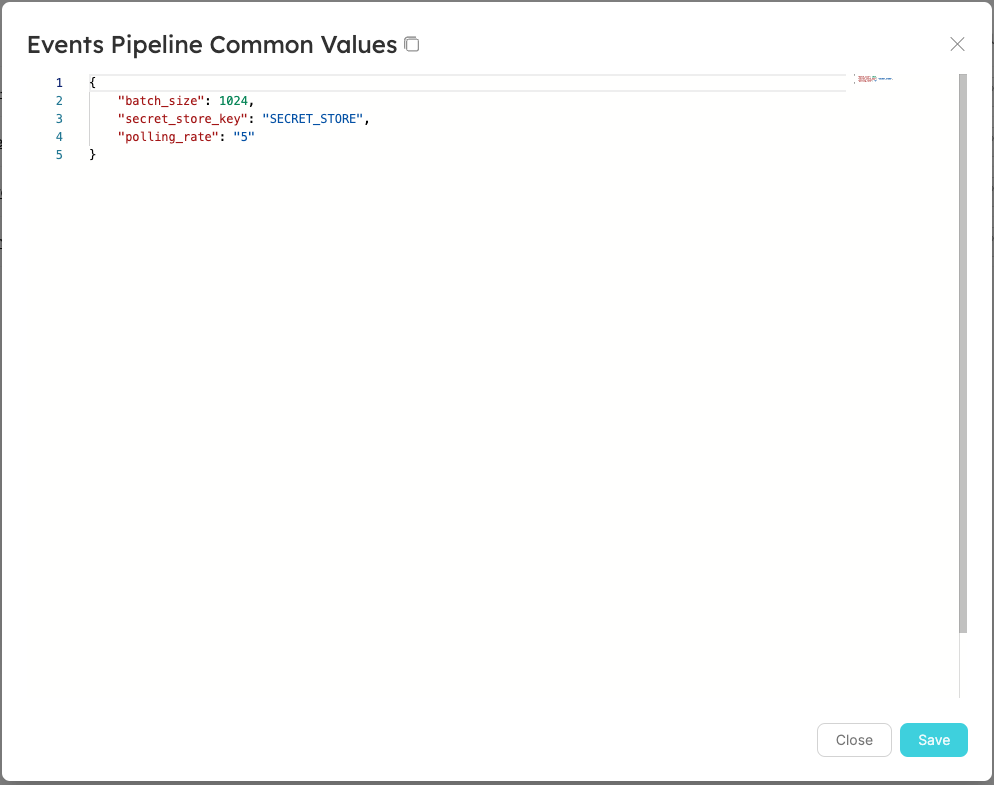

# Service Pipeline Example

Managing, tracking and simplifying the deployment of new microservices can be a difficult task.

In this example, we will show you how Port can be used to make provisioning a new service a straightforward process that is fully managed and audited, but is still convenient enough for a developer to perform on his own, without needing DevOps assistance or approval.

Using Port executions, you can easily scaffold new services and increase developer productivity:

We created a `Service` blueprint

And we also added the following actions to this blueprint:

- Create new service
- Upscale service
- Downscale service
- Delete service

Now when we go to the `Services` page, we can click on the dropdown in the `+ Service` button and choose the option - `Create service`

A menu will pop up:

Also, note that clicking the pencil icon next to one of the `Values` fields, will open a standard JSON editor (it can also be a YAML format):

After filling in the options and clicking `Execute` a new execution run will be triggered.

Port manages a Kafka Topic per customer that publishes the execution run requests, and it is possible to listen to it using any code platform you choose, or use it as a trigger, for example an AWS Lambda, as we will show in this example.

We deployed a Lambda function that is triggered by messages arriving in the Kafka Topic, that function performs the following:

- Creates a PR in our example repository, with the data provided to the execution
- Creates an initial service object, containing a link to the new PR and reporting that the status of the service is Pending

Looking at the generated PR - it includes Port metadata used to link the PR with the new Service entity in Port, in addition i**t also adds all of the values provided by the developer as json/yaml files**:

And if we look in Port, we can see an intermediate Service object, that includes all of the data provided at creation, waiting for the active state fields (such as `Status` and `Sync Status`) to be filled by a Github workflow that will trigger on PR merge:

After the PR is merged, a Github workflow is executed that reports the new Service entity status to Port, and then the Service entity has all available data fields filled:

Now that the service is up and running, we can run **day-2 operations** such as Upscale or Downscale when the service is experiencing higher/lower-than-usual traffic:

Since some of these day-2 operations can be sensitive/dangerous/expensive, we ask for confirmation (and these can also trigger an approval request from the DevOps team before being executed)

Port also exposes a **change log** Kafka Topic, by listening to that topic, you can subscribe to changes performed on every entity.
So for example if the status of a service changes from `Healthy` to `Degraded` a message will be sent to the **change log** Kafka Topic. An automatic process can listen to messages in the topic, perform automatic fixing/healthcheck validation of the service, and then update the status in Port again when the issue is resolved, that way you can always use Port as a source of truth for the status of the environment, and also use it to trigger checks and maintenance. 

**Note:** This demo example showed actions being performed using Port’s web UI, but every action and interaction we have shown here can be invoked with a REST API request

Now you have a list of all the provisioned Services:

You are also able to group by either by owner, team, project, environment, and more or even to group by all of these fields together:

Here are some code examples used in this demo:

:::note
Both example repositories are `Private` at the moment, so you’ll get a 404.
Please contact us with your GitHub user for access.
:::

[Lambda Execution Runner Example](https://github.com/port-labs/runner-github-autopr-example/blob/main/lambda_function.py) - This code sample shows how setup a simple AWS Lambda Function that reads from the Kafka Topic and performs actions based on the execution message that arrives (in this case creation of a PR and report of initial Service deployment back to Port)

[Automated Service Repository](https://github.com/port-labs/automated-pr-example) - The Lambda function shown above opens new PRs in this repository, in addition this repository has a [workflow that reports](https://github.com/port-labs/automated-pr-example/runs/7229300183?check_suite_focus=true) on the deployed Service status whenever the automated PR is merged