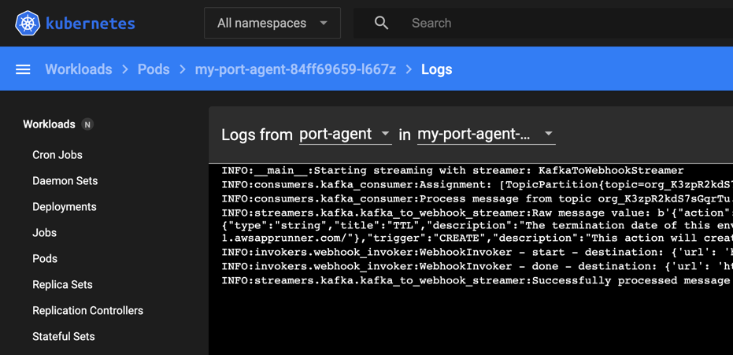

# Quickstart

This is a walkthrough of how to install the Port Execution Agent in your Kubernetes Cluster.

:::info
The helm chart with full installation guide can be found [here](https://github.com/port-labs/helm-charts/tree/main/charts/port-agent).
:::

:::note Prerequisites

- [Helm](https://helm.sh) must be installed to use the chart. Please refer to
  Helm's [documentation](https://helm.sh/docs) to get started.
- Connection credentials to Kafka, provided to you by Port.

:::

1. Add Port's Helm repo by using the following command:

```bash showLineNumbers
helm repo add port-labs https://port-labs.github.io/helm-charts
```

If you already added this repo earlier, run `helm repo update` to retrieve
the latest versions of the charts. You can then run `helm search repo port-labs` to see the charts.

2. Install the `port-agent` chart by using the following command:

:::note
Remember to replace the placeholders for `YOUR_ORG_ID`, `YOUR_KAFKA_CONSUMER_GROUP`, `YOUR_KAFKA_USERNAME` and `YOUR_KAFKA_PASSWORD`.
:::

```bash showLineNumbers
helm install my-port-agent port-labs/port-agent \
    --create-namespace --namespace port-agent \
    --set env.normal.PORT_ORG_ID=YOUR_ORG_ID
    --set env.normal.KAFKA_CONSUMER_GROUP_ID=YOUR_KAFKA_CONSUMER_GROUP \
    --set env.secret.KAFKA_CONSUMER_USERNAME=YOUR_KAFKA_USERNAME \
    --set env.secret.KAFKA_CONSUMER_PASSWORD=YOUR_KAFKA_PASSWORD
```

3. Follow one of the following guides:

- [Setting Self-Service Actions In Port](../setting-self-service-actions-in-port) - to set up a Blueprint and Self-Service Actions.
- [Changelog Listener](../../../tutorials/self-service-actions/webhook-actions/changelog-listener) - to create a Blueprint with `changelogDestination` to listen and act on changes in the Software Catalog.

When using the execution agent, in the `url` field you need to provide a URL to a service (for example, a REST API) that will accept the invocation event.

- The service can be a private service running inside your private network;
- Or it can be a public service accessible from the public internet (**note** that in this scenario, the execution agent needs corresponding outbound network rules that will allow it to contact the public service).

:::note
**IMPORTANT**: To make use of the **Port Execution Agent**, you need to configure:

- [Self-Service Action](../setting-self-service-actions-in-port#invocation-method-structure-fields) / [Change Log](../../port-components/blueprint#changelog-destination) destination `type` field value should be equal to `WEBHOOK`.
- [Self-Service Action](../setting-self-service-actions-in-port#invocation-method-structure-fields) / [Change Log](../../port-components/blueprint#changelog-destination) `agent` field value should be equal to `true`.

For example:

```json showLineNumbers
{ "type": "WEBHOOK", "agent": true, "url": "URL_TO_API_INSIDE_YOUR_NETWORK" }
```

:::

Well Done! **Port Agent** is now running in your environment, and will trigger any Webhook that you've configured (for Self-Service Actions, or changes in the Software Catalog).

When a new invocation is detected, the agent will pull it from your Kafka topic and forward it to the internal API in your private network.


