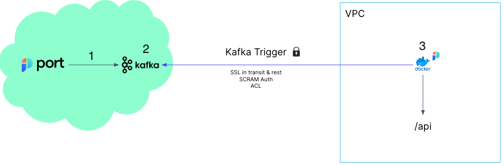

# Port Execution Topics

Port manages a Kafka Topic per customer that publishes the execution run requests.

It is possible to listen to the Kafka Topic using any code platform you choose or to use it as a trigger, for example for an AWS Lambda.

The steps shown in the image above are:

1. Port publishes an invoked `Action` or `Change` message to Kafka
2. A secure Kafka topic holds all of the action invocations and changes

:::note about topics
The actions and changes topics are separated, their formats are:
- Action Topic -  `ORG_ID.runs`
- Changes Topic - `ORG_ID.change.log`
:::

3. A listener implemented on the Client side receives the new topic message and runs code defined by the DevOps team

:::info
The listener can be anything that can read from a Kafka topic and run code based on the received message, for example:
- AWS Lambda
- Python code that reads from the topic
- Docker container running some code

You control how you interact with these topics in a way that works for your organization and your infrastructure
:::

An example flow would be:

1. A developer asks to deploy a new version of an existing `Microservice`
2. The `create` action is sent to the `runs` Kafka topic
3. An AWS Lambda function is triggered by this new action message
4. The Lambda function deploys a new version of the service
5. When the Lambda is done, it reports back to Port about the new Microservice `Deployment`