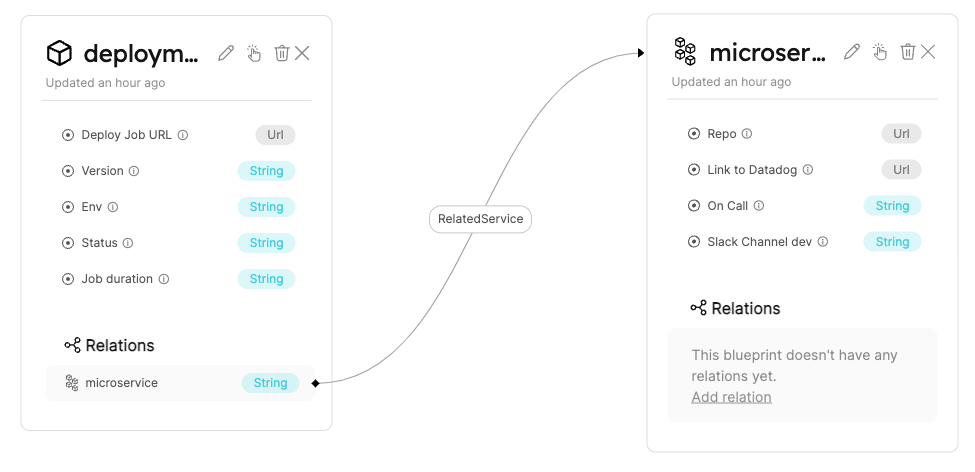
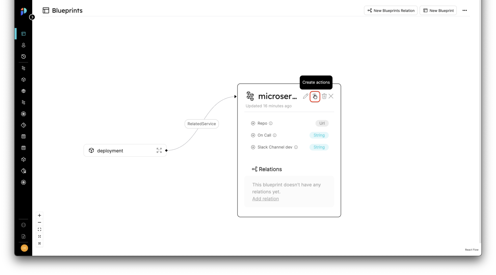
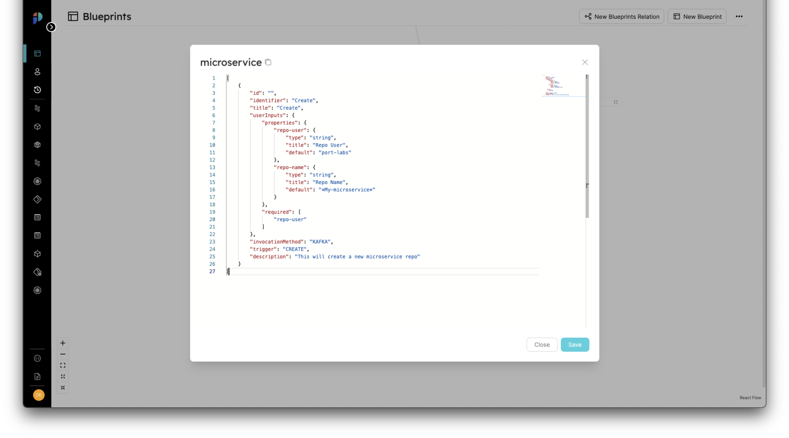
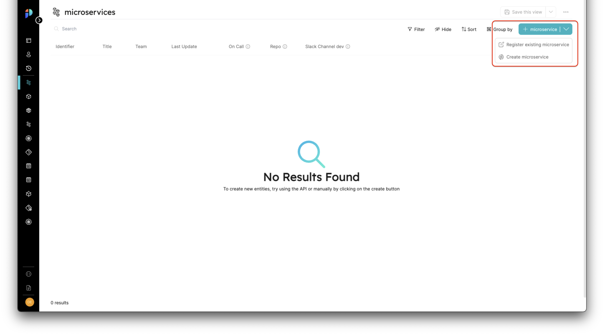
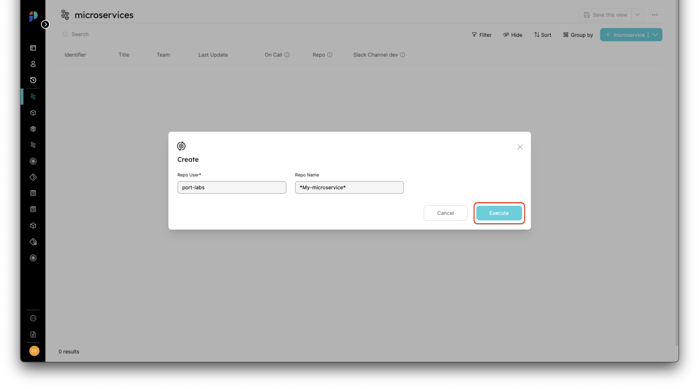
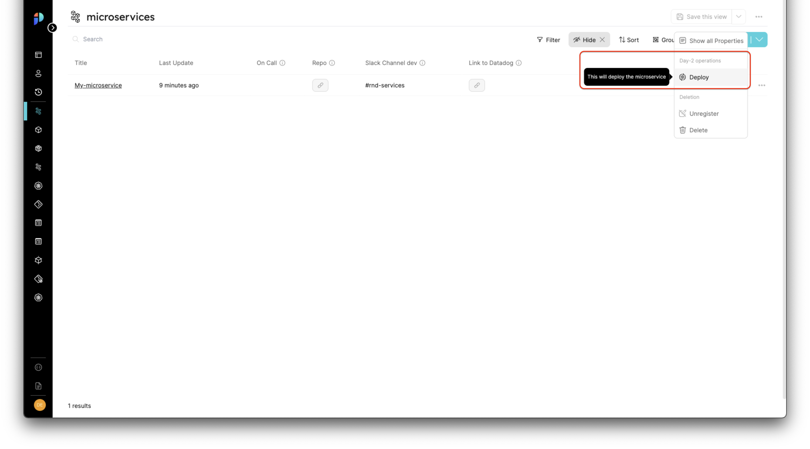

# Setting Self-Service Actions In Port

**Self-Service Actions** in Port enable developer self-service by configuring one of 3 Self-Service Action types on Blueprints and the Entities that originate from them:

- **Create** - create a new Entity by triggering a provisioning process in your infrastructure.
- **Delete** - delete an existing Entity by triggering delete logic in your infrastructure.
- **Day-2 Operations** - trigger an existing Entity’s logic in your infrastructure to update or modify the existing Entity on demand.

## Configuring a new self-service action

Let's configure new Self-Service Actions, starting with the Blueprints.

### Creating blueprints

For example, let’s create 2 Blueprints and connect them to each other:

- **Blueprint #1**: Microservice
- **Blueprint #2**: Deployment



<details>
<summary>An example Microservice Blueprint</summary>

```json showLineNumbers
{
  "identifier": "microservice",
  "title": "Microservice",
  "icon": "Microservice",
  "formulaProperties": {},
  "schema": {
    "properties": {
      "on-call": {
        "title": "On Call",
        "type": "string",
        "description": "who is the on-call for this service (Pagerduty)",
        "default": "Dev Guy"
      },
      "repo": {
        "title": "Repo",
        "type": "string",
        "format": "url",
        "description": "link to repo",
        "default": "https://www.github.com"
      },
      "link-slack-dev": {
        "title": "Slack Channel dev",
        "type": "string",
        "description": "link to Slack dev channel",
        "default": "#rnd-microservices-alerts"
      },
      "datadog-link": {
        "title": "Link to Datadog",
        "type": "string",
        "format": "url",
        "description": "link to datadog",
        "default": "https://datadog.com"
      }
    },
    "required": []
  }
}
```

</details>

<details>
<summary>An example Deployment Blueprint (with the deployment-to-microservice Relation included)</summary>

```json showLineNumbers
{
  "identifier": "deployment",
  "title": "Deployment",
  "icon": "Deployment",
  "formulaProperties": {},
  "schema": {
    "properties": {
      "version": {
        "title": "Version",
        "type": "string",
        "description": "The deployed image tag"
      },
      "environment": {
        "title": "Env",
        "type": "string",
        "description": "The Env which is deployed"
      },
      "status": {
        "title": "Status",
        "type": "string",
        "description": "Deployment status (Running, Destroyed, ...)"
      },
      "duration": {
        "title": "Job duration",
        "type": "string",
        "description": "Deployment job duration"
      },
      "job-url": {
        "title": "Deploy Job URL",
        "type": "string",
        "format": "url",
        "description": "Link to the deployment Job"
      }
    },
    "required": []
  },
  "relations": {
    "deployment-to-microservice": {
      "title": "RelatedService",
      "target": "microservice",
      "required": false
    }
  }
}
```

</details>

### Creating the blueprint self-service action

In order to create a Self-Service Action, go to the Blueprints page, expand the Microservice Blueprint and click on the `Create action` button as shown below:



After clicking the button, you should see an editor with an empty array (`[]`) appear, that's where we will add our Self-Service Action

Here is an action array with a `CREATE` action already filled in:

```json showLineNumbers
[
  {
    "identifier": "Create",
    "title": "Create",
    "userInputs": {
      "properties": {
        "repo-user": {
          "type": "string",
          "title": "Repo User",
          "default": "port-labs"
        },
        "repo-name": {
          "type": "string",
          "title": "Repo Name",
          "default": "*My-microservice*"
        }
      },
      "required": ["repo-user"]
    },
    "invocationMethod": {
      "type": "WEBHOOK",
      "url": "https://webhook.example.com"
    },
    "trigger": "CREATE",
    "description": "This will create a new microservice repo"
  }
]
```

This is how the JSON editor looks after submitting the Self-Service Action:



Now when you go to the Microservices Blueprint page, you will see a new button - `Create Microservice`:



After clicking the `Create Microservice` option, we will see a form with the inputs specified when the new action was entered to the actions array:



### More Self-Service Actions

Let's go back to the actions array of our `Microservice` Blueprint and paste in the following JSON, which has 2 additional configured actions:

```json showLineNumbers
[
  {
    "identifier": "Create",
    "title": "Create",
    "userInputs": {
      "properties": {
        "repo-user": {
          "type": "string",
          "title": "Repo User",
          "default": "port-labs"
        },
        "repo-name": {
          "type": "string",
          "title": "Repo Name",
          "default": "*My-microservice*"
        }
      },
      "required": ["repo-user"]
    },
    "invocationMethod": {
      "type": "WEBHOOK",
      "url": "https://webhook.example.com"
    },
    "trigger": "CREATE",
    "description": "This will create a new microservice repo"
  },
  {
    "identifier": "Deploy",
    "title": "Deploy",
    "icon": "Deploy",
    "userInputs": {
      "properties": {
        "environment": {
          "type": "string",
          "enum": ["Prod", "Test", "Staging"],
          "title": "Environment"
        },
        "branch": {
          "type": "string",
          "title": "Branch Name"
        },
        "commit-hash": {
          "type": "string",
          "title": "Commit Hash"
        }
      },
      "required": ["environment", "branch", "commit-hash"]
    },
    "invocationMethod": {
      "type": "WEBHOOK",
      "url": "https://webhook.example.com"
    },
    "trigger": "DAY-2",
    "description": "This will deploy the microservice"
  },
  {
    "identifier": "Delete",
    "title": "Delete",
    "userInputs": {
      "properties": {},
      "required": []
    },
    "invocationMethod": {
      "type": "WEBHOOK",
      "url": "https://webhook.example.com"
    },
    "trigger": "DELETE",
    "description": "This will delete the microservice's repo"
  }
]
```

Now when we go back to the Microservice page, if we click on the 3 dots next to an existing entity, we should see the Day-2 and delete Self-Service Actions we just added:

**Day-2:**



**Delete:**


## Self-Service Action definition structure

### Self-Service Action JSON Structure

The basic structure of a Self-Service Action:

```json showLineNumbers
{
  "identifier": "UniqueID",
  "title": "Title",
  "userInputs": {
    "properties": {
      "property1": {
        "type": "string",
        "title": "Property title",
        "default": "default value"
      },
      "property2": {
        "type": "number",
        "title": "property title",
        "default": 5
      },
      "property3": {
        "type": "string",
        "format": "entity",
        "blueprint": "microservice"
      }
    },
    "required": ["repo-user"]
  },
  "invocationMethod": {
    "type": "WEBHOOK",
    "url": "https://webhook.example.com"
  },
  "trigger": "CREATE",
  "description": "Action description"
}
```

### Structure table

| Field              | Description                                                                                                                                                                           |
| ------------------ | ------------------------------------------------------------------------------------------------------------------------------------------------------------------------------------- |
| `id`               | Internal Action ID                                                                                                                                                                    |
| `identifier`       | Action identifier                                                                                                                                                                     |
| `title`            | Action title                                                                                                                                                                          |
| `icon`             | Action icon                                                                                                                                                                           |
| `userInputs`       | An object containing `properties` and `required` keys following the standard JSON schema format as seen in [Blueprint structure](../port-components/blueprint.md#blueprint-structure) |
| `invocationMethod` | Defines the destination where invocations of the Self-Service Action will be delivered, see [invocation method](#invocation-method) for details                                       |
| `trigger`          | The type of the action: `CREATE`, `DAY-2` or `DELETE`                                                                                                                                 |
| `description`      | Action description                                                                                                                                                                    |

### Properties structure table

The following table includes the different fields that can be specified in the `properties` key:

| Field                    | Description                                                                                                                                 |
| ------------------------ | ------------------------------------------------------------------------------------------------------------------------------------------- |
| `type`                   | All the [types](../port-components/blueprint.md#property-types) Port supports - `string`, `number`, `boolean`, etc...                       |
| `title`                  | The title shown in the form when activating the Self-Service Action                                                                         |
| `format`                 | Specific data format to pair with some of the available types. You can explore all formats in the [String Formats](#string-formats) section |
| `blueprint`              | Identifier of an existing Blueprint to fetch Entities from                                                                                  |
| `description` (Optional) | Extra description for the requested property                                                                                                |
| `default` (Optional)     | Default value                                                                                                                               |
| `enum` (Optional)        | A list of predefined values the user can choose from, same format as [enum](../port-components/blueprint.md#enum)                           |

### String formats

```json {3-4} showLineNumbers
"entity_prop": {
    "title": "My string prop",
    "type": "string",
    "format": "url",
    "description": "This is an entity property"
}
```

In addition to the formats introduced in [Blueprint string property formats](../port-components/blueprint.md#string-property-formats), Port Self-Service Actions also support the following `string` formats:

| `format` | Description                            | Example values           |
| -------- | -------------------------------------- | ------------------------ |
| `entity` | An Entity from the specified Blueprint | `"notification-service"` |

#### Examples

Here is how to use property formats:

#### Entity

```json {3-5} showLineNumbers
"entity_prop": {
    "title": "My string prop",
    "type": "string",
    "format": "entity",
    "blueprint": "microservice",
    "description": "This is an entity property"
}
```

When `"format": "entity"` is used, a `blueprint` field is available.

The `blueprint` field takes an identifier of an existing Blueprint. Then, when using the configured Self-Service Action in Port's UI, the specified field will include a list of existing Entities of the selected Blueprint from your software catalog to choose from.

:::tip
For more examples, refer to [string property formats examples](../port-components/blueprint.md#examples-1).
:::

## Invocation method

The `invocationMethod` object controls where Self-Service Actions are reported to.

The `invocationMethod` supports 2 configurations:

- [Webhook](./port-execution-architecture/port-execution-webhook.md)
- [Kafka](./port-execution-architecture/port-execution-kafka.md)

### Invocation method structure fields

| Field  | Type     | Description                                                                                                                               | Example values                |
| ------ | -------- | ----------------------------------------------------------------------------------------------------------------------------------------- | ----------------------------- |
| `type` | `string` | Defines the Self-Service Action destination type                                                                                          | Either `WEBHOOK` or `KAFKA`   |
| `url`  | `string` | Defines the webhook URL where Port sends Self-Service Actions to via REST POST. <br></br> Can be added only if `type` is set to `WEBHOOK` | `https://webhook.example.com` |

## Triggering actions

We will now look at trigger examples for each action type and explain what happens behind the scenes when we execute each type.

When we click on the `execute` button of an action, a Port [action message](#action-message-structure) is published to the invocation destination specified by the user (either a POST request to the user's [Webhook](./port-execution-architecture/port-execution-webhook.md) or a message to the user's dedicated [Kafka](./port-execution-architecture/port-execution-kafka.md) topic).

For example, you can deploy a new version of your microservice when a `CREATE` action is triggered.

### CREATE action

The action is triggered from the page matching the Blueprint we configured the action on:


:::tip create vs register
When you define a `CREATE` action on a Blueprint, when viewing the Blueprint page you will notice that the create button now has a dropdown. Two options will appear: `Register` and `Create`:

- `Register` - this option is used to add a new Entity to your catalog without triggering a `CREATE` action. This option is useful for cases when an infrastructure Entity was created before using Port, and you want to import its data into the Software Catalog.

  This option is also useful for cases where an entity was created manually and you want to document it in Port after-the-fact.

- `Create` - this option will display the form containing the required `userInputs` of our actions. After clicking execute, a new execution message will be sent to Port's Kafka Topics so you can handle the create request in your infrastructure.

:::

When clicking the `Create Microservice` option, we will see a form with the inputs we specified when we entered the new action to the actions array:


### DAY-2 action

The action can be triggered by selecting it from the sub-menu of an existing Entity:


:::note DAY-2 actions
All Day-2 operations will appear in this sub-menu.
:::

### DELETE action

The action can be triggered by selecting it from the sub-menu of an existing Entity:


## Action message structure

Every invocation of a Self-Service Action publishes a new `run` message (with its own unique `runId` value). Let’s explore the structure of a Self-Service Action run message:

| Field          | Description                                                                                  | Example               |
| -------------- | -------------------------------------------------------------------------------------------- | --------------------- |
| `action`       | Action identifier                                                                            | `Create microservice` |
| `resourceType` | Resource type that triggered the action. In case of action runs, it always defaults to `run` | `run`                 |
| `status`       | Action status. In the case of action runs, it always defaults to `TRIGGERED`                 | `TRIGGERED`           |
| `trigger`      | Audit data for the action run                                                                | Example below         |
| `context`      | Contains the context of the action, and has keys for `blueprint`, `entity` and `runId`       | Example below         |
| `payload`      | Explanation below                                                                            | Example below         |

### Example Trigger

The trigger includes audit data such as who triggered the action, and when and how did they trigger it (`UI` or `API`)

```json showLineNumbers
"trigger": {
    "by": {
        "userId": "auth0|<USER>",
        "orgId": "<ORG>"
    },
    "at": "2022-07-27T17:50:58.776Z",
    "origin": "UI"
}
```

### Example context

```json showLineNumbers
"context": {
    "entity": null,
    "blueprint": "k8sCluster",
    "runId": "r_AtbOjbe45GNDElcQ"
}
```

### Self-Service Action run payload

The `payload` object contains the data of the Self-Service Action invocation, it includes the following keys:

- `entity` - The Entity the run is executed on (in the case of `DAY-2` or `DELETE`, for `CREATE` it will be null).
- `action` - Definition of the action that was triggered, includes all of the action configuration, including expected `userInputs`, `description`, etc.
- `properties` - This key includes the values provided by the developer when executing the action. The keys in this object match the keys defined under the `userInputs` key in the action definition.

Here is an example `payload` object for a `CREATE` action:

```json showLineNumbers
"payload": {
    "entity": null,
    "action": {
        "id": "action_lGviYLG6W5U9o2Qq",
        "identifier": "Create",
        "title": "Create",
        "userInputs": {
            "properties": {
                "title": {
                    "type": "string",
                    "title": "Title"
                },
                "region": {
                    "type": "string",
                    "title": "Region",
                    "enum": [
                        "prod-2-use1"
                    ],
                    "default": "prod-1-use1",
                    "description": "The region that this cluster is going to be deployed"
                },
                "version": {
                    "type": "string",
                    "title": "Version"
                },
                "type": {
                    "type": "string",
                    "title": "Type",
                    "enum": [
                        "EKS",
                        "Self-Managed"
                    ]
                }
            },
            "required": [
                "region"
            ]
        },
        "invocationMethod": { "type": "WEBHOOK", "url": "https://webhook.example.com" },
        "trigger": "CREATE",
        "description": "This will create a new k8s cluster",
        "blueprint": "k8sCluster",
        "createdAt": "2022-07-27T16:47:23.165Z",
        "createdBy": "auth0|6278b02000955c006f9132d3",
        "updatedAt": "2022-07-27T16:47:23.165Z",
        "updatedBy": "auth0|6278b02000955c006f9132d3"
    },
    "properties": {
        "region": "prod-2-use1",
        "title": "dev-env",
        "version": "1.2",
        "type": "EKS"
    }
}
```

## Next Steps

Now that you have the basics of Self-Service Actions, you can refer to our examples for some practical use-cases:

- [Setting up a basic execution runner using AWS Lambda](../../tutorials/self-service-actions/kafka-actions/execution-basic-runner-using-aws-lambda.md)
