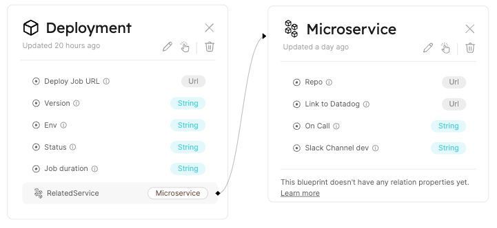
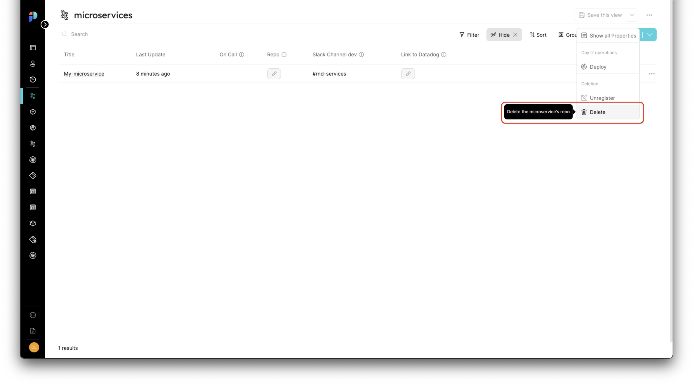

# Setting Self-Service Actions In Port

**Actions** in port make your Software Catalog active by configuring one of 3 actions types on Blueprints and their Entities:

- **Create** - A create action is meant to create a new entity, by triggering a provisioning process in your infrastructure
- **Delete** - A delete action will delete an existing entity, by triggering delete logic in your infrastructure
- **Day-2 Operations** - A Day-2 operation acts on an existing entity, and it will trigger logic in your infrastructure to update or modify the existing entity on request

## Configuring a new action

Let's configure new actions, starting with the Blueprints the actions will act upon

### Creating blueprints

For our example, let’s create 2 blueprints and connect them to each other:

- **Blueprint #1**: Microservice
- **Blueprint #2**: Deployment




<details>
<summary>An example Microservice blueprint</summary>

```json showLineNumbers
{
    "identifier": "microservice",
    "icon": "Microservice",
    "formulaProperties": {},
    "schema": {
        "properties": {
            "on-call": {
                "title": "On Call",
                "type": "string",
                "description": "who is the on-call for this service (Pagerduty)",
                "default": "Dev Guy"
            },
            "repo": {
                "title": "Repo",
                "type": "string",
                "format": "url",
                "description": "link to repo",
                "default": "https://www.github.com"
            },
            "link-slack-dev": {
                "title": "Slack Channel dev",
                "type": "string",
                "description": "link to Slack dev channel",
                "default": "#rnd-microservices-alerts"
            },
            "datadog-link": {
                "title": "Link to Datadog",
                "type": "string",
                "format": "url",
                "description": "link to datadog",
                "default": "https://datadog.com"
            }
        },
        "required": []
    },
    "dataSource": "Port"
}
```

</details>

<details>
<summary>An example Deployment blueprint</summary>

```json showLineNumbers
{
    "identifier": "deployment",
    "icon": "Deployment",
	  "formulaProperties": {},
    "schema": {
        "properties": {
            "version": {
                "title": "Version",
                "type": "string",
                "description": "The deployed image tag"
            },
            "environment": {
                "title": "Env",
                "type": "string",
                "description": "The Env which is deployed"
            },
            "status": {
                "title": "Status",
                "type": "string",
                "description": "Deployment status (Running, Destroyed, ...)"
            },
            "duration": {
                "title": "Job duration",
                "type": "string",
                "description": "Deployment job duration"
            },
            "job-url": {
                "title": "Deploy Job URL",
                "type": "string",
                "format": "url",
                "description": "Link to the deployment Job"
            }
        },
        "required": []
    },
    "dataSource": "Port"
}
```
</details>

<details>
<summary>Deployment to Microservice relation</summary>

```json showLineNumbers
{
    "title": "RelatedService",
    "identifier": "deployment-to-microservice",
    "source": "deployment",
    "target": "microservice",
    "required": false,
    "many": false
}
```

</details>

### Creating the blueprint action

In order to create an action, go to the Blueprints page, expand the Microservice blueprint and click on the `Create action` button as shown in the image:


After clicking the button, you should see an editor appear with an empty array (`[]`), this is where we will add our action

Here is an example action array with a `CREATE` action already filled in:

```json showLineNumbers
[
	{
        "identifier": "Create",
        "title": "Create",
        "userInputs": {
            "properties": {
                "repo-user": {
                    "type": "string",
                    "title": "Repo User",
                    "default": "port-labs"
                },
                "repo-name": {
                    "type": "string",
                    "title": "Repo Name",
                    "default": "*My-microservice*"
                }
            },
            "required": [
                "repo-user"
            ]
        },
        "invocationMethod": "KAFKA",
        "trigger": "CREATE",
        "description": "This will create a new microservice repo"
    }
]
```

And here is how the JSON editor looks after entering the action:


Now when you go to the Microservices blueprint page, you will see a new button - `Create Microservice`:


When clicking the `Create Microservice` option, we will see a form with the inputs we specified when we entered the new action to the actions array:


### Extending the example with more actions

Let's go back to the actions array of our `Microservice` blueprint and paste in the following JSON which has 2 additional actions configured:

```json showLineNumbers
[
    {
        "identifier": "Create",
        "title": "Create",
        "userInputs": {
            "properties": {
                "repo-user": {
                    "type": "string",
                    "title": "Repo User",
                    "default": "port-labs"
                },
                "repo-name": {
                    "type": "string",
                    "title": "Repo Name",
                    "default": "*My-microservice*"
                }
            },
            "required": [
                "repo-user"
            ]
        },
        "invocationMethod": "KAFKA",
        "trigger": "CREATE",
        "description": "This will create a new microservice repo"
    },
    {
        "identifier": "Deploy",
        "title": "Deploy",
        "icon": "Deploy",
        "userInputs": {
            "properties": {
                "environment": {
                    "type": "string",
                    "enum": [
                        "Prod",
                        "Test",
                        "Staging"
                    ],
                    "title": "Environment"
                },
                "branch": {
                    "type": "string",
                    "title": "Branch Name"
                },
                "commit-hash": {
                    "type": "string",
                    "title": "Commit Hash"
                }
            },
            "required": [
                "environment",
                "branch",
                "commit-hash"
            ]
        },
        "invocationMethod": "KAFKA",
        "trigger": "DAY-2",
        "description": "This will deploy the microservice"
    },
		{
        "identifier": "Delete",
        "title": "Delete",
        "userInputs": {
            "properties": {},
            "required": []
        },
        "invocationMethod": "KAFKA",
        "trigger": "DELETE",
        "description": "This will delete the microservice's repo"
    }
    
]
```

Now when we go back to the Microservice page, if we click on the 3 dots next to an existing entity, we should see the Day-2 and delete actions we just added:

**Day-2:**


**Delete:**



## Action definition structure

### Action JSON Structure

The basic structure of an action:

```json showLienNumbers
{
        "identifier": "UniqueID",
        "title": "Title",
        "userInputs": {
            "properties": {
                "property1": {
                    "type": "string",
                    "title": "Property title",
                    "default": "default value"
                },
                "property2": {
                    "type": "number",
                    "title": "property title",
                    "default": 5
                }
            },
            "required": [
                "repo-user"
            ]
        },
        "invocationMethod": "KAFKA",
        "trigger": "CREATE",
        "description": "Action description"
    }
```

### Structure table

| Field | Description | 
| --- | --- | 
| `id` | Internal Action ID | 
| `identifier` | Action identifier | 
| `title` | Action title | 
| `icon` | Action icon | 
| `userInputs` | An object containing `properties` and `required` keys following the standard JSON schema format as seen in [Blueprint's structure](../port-components/blueprint.md#blueprints-structure) | 
| `invocationMethod` | The methods the action is dispatched in, currently only supports `KAFKA` |
| `trigger` | The type of the action, one of `CREATE`, `DAY-2`, `DELETE` |
| `description` | The description of the action |

### Properties structure table

The following table includes the different fields that can be specified in the `properties` key

| Field | Description | 
| --- | --- | 
| `type` | All of the [types](../port-components/blueprint.md#property-types) supported by Port - `string`, `number`, `boolean`, etc... | 
| `title` | The title shown in the form when calling the action |
| `default` (Optional) | A default value |
| `enum` (Optional) | A list of predefined values the user can choose from, same format as [enum](../port-components/blueprint.md#enum) |  

## Triggering actions

We will now look at trigger examples for each action type and explain what happens in the background when we execute each type

**What happens when the `Execute` button for an action is clicked:** A Port [Action message](#action-message-structure) will be published to the secure [runs Kafka topic](./port-execution-topics), from which you can pull it and run your own custom logic. 

For example, you can deploy a new version of your Microservice when a `CREATE` action is triggered.

### CREATE action

The action can be triggered from the page matching the Blueprint we configured the action on:


When clicking the `Create Microservice` option, we will see a form with the inputs we specified when we entered the new action to the actions array:


### DAY-2 action

The action can be triggered by selecting it from the sub-menu of an existing entity:


:::note DAY-2 actions
All of the DAY-2 operations will appear in this sub-menu
:::

### DELETE action

The action can be triggered by selecting it from the sub-menu of an existing entity:


## Action message structure

Every invocation of an Action publishes a new `run` message (with its own unique `runId` value) to the [runs Kafka topic](./port-execution-topics), we will now explore the structure of an `action run` message:

| Field | Description | Example |
| --- | ---| --- |
| `action` | The action identifier | `Create microservice` |
| `resourceType` | The type of resource that triggered the action, in the case of action runs, always defaults to `run` | `run` |
| `status` | The status of the action, in the case of action runs, always defaults to `TRIGGERED` | `TRIGGERED` |
| `trigger` | Shows audit data for the action run | example below |
| `context` | An object containing the context of the action, has keys for `blueprint`, `entity` and `runId` | Example below |
| `payload` | Explanation below | Example below |

### Example Trigger

The trigger includes audit data such as: who triggered the action, when and how did he trigger it (`UI` or `API`)

```json showLineNumbers
"trigger": {
    "by": {
        "userId": "auth0|<USER>",
        "orgId": "<ORG>"
    },
    "at": "2022-07-27T17:50:58.776Z",
    "origin": "UI"
}
```

### Example context

```json showLineNumbers
"context": {
    "entity": null,
    "blueprint": "k8sCluster",
    "runId": "r_AtbOjbe45GNDElcQ"
}
```

### Action run payload

The `payload` object contains the data needed to act upon the action, it includes the following keys:

- `entity` - This is the entity the run is executed on (in the case of `DAY-2` or `DELETE`, for `CREATE` it will be `null`)
- `action` - This is the definition of the action that was triggered, it includes all of the action configuration, including the expected `userInputs`, `description`, etc...
- `properties` - This is the properties object generated from the `userInputs` used when triggering the action

Here is an example `payload` object for a `CREATE` action:

```json showLineNumbers
"payload": {
    "entity": null,
    "action": {
        "id": "action_lGviYLG6W5U9o2Qq",
        "identifier": "Create",
        "title": "Create",
        "userInputs": {
            "properties": {
                "title": {
                    "type": "string",
                    "title": "Title"
                },
                "region": {
                    "type": "string",
                    "title": "Region",
                    "enum": [
                        "prod-2-use1"
                    ],
                    "default": "prod-1-use1",
                    "description": "The region that this cluster is going to be deployed"
                },
                "version": {
                    "type": "string",
                    "title": "Version"
                },
                "type": {
                    "type": "string",
                    "title": "Type",
                    "enum": [
                        "EKS",
                        "Self-Managed"
                    ]
                }
            },
            "required": [
                "region"
            ]
        },
        "invocationMethod": "KAFKA",
        "trigger": "CREATE",
        "description": "This will create a new k8s cluster",
        "blueprint": "k8sCluster",
        "createdAt": "2022-07-27T16:47:23.165Z",
        "createdBy": "auth0|6278b02000955c006f9132d3",
        "updatedAt": "2022-07-27T16:47:23.165Z",
        "updatedBy": "auth0|6278b02000955c006f9132d3"
    },
    "properties": {
        "region": "prod-2-use1",
        "title": "dev-env",
        "version": "1.2",
        "type": "EKS"
    }
}
```

## Next Steps

Now that you have the basics of actions down, you can refer to our examples for some practical use-cases of actions:

- Setting up a basic execution runner using AWS Lambda
- Setting up a service provisioning pipeline using AWS Lambda