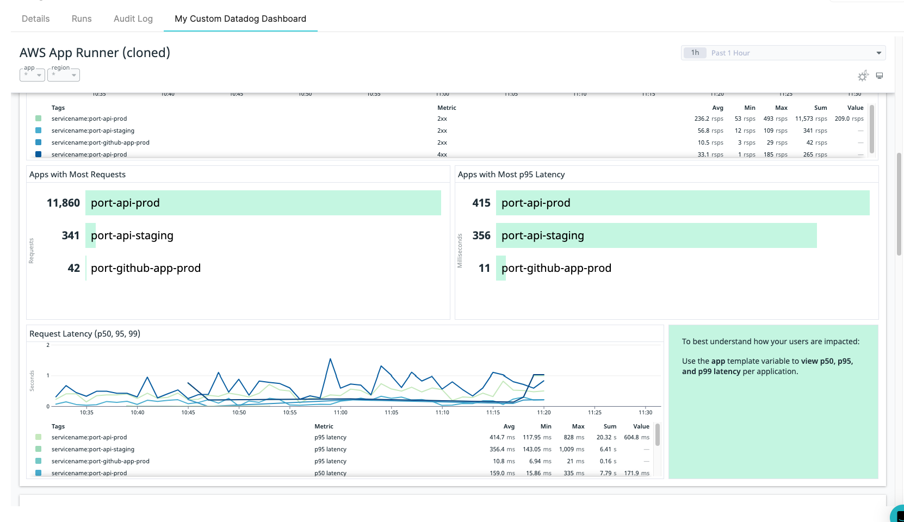

# Datadog

With Port, you can import and display [Datadog](https://docs.datadoghq.com/dashboards/sharing/) dashboards using a URL link.

By using the combination of `"type": "string`, `"format": "url` and `"spec": "embedded-url"` in a [Blueprint property](../port-components/blueprint.md#blueprint-properties), Port will display the Datadog dashboard matching the provided URL in the [Specific Entity Page](../port-components/page.md#entity-page).

## Datadog property definition in Blueprint schema

```json showLineNumbers
{
  "title": "My Custom Datadog Dashboard",
  "type": "string",
  "format": "url",
  "spec": "embedded-url"
}
```

## Example

Here is how the Datadog tab appears in the Specific Entity Page when an `embedded-url` spec with a Datadog dashboard URL is provided:


