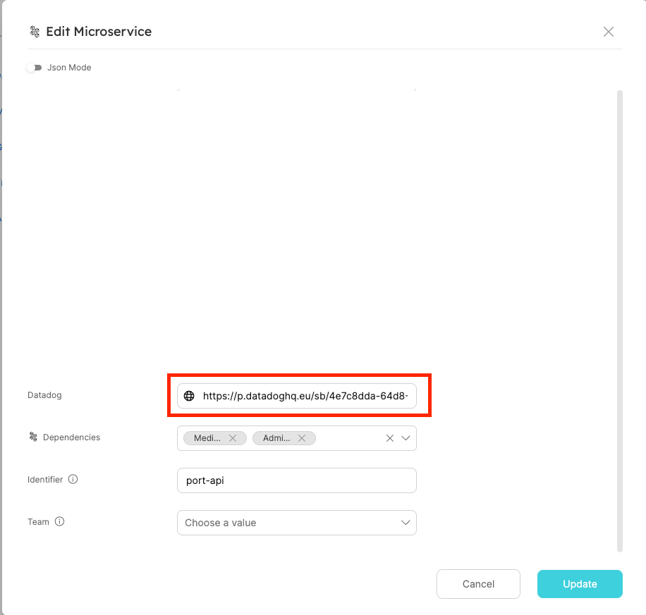
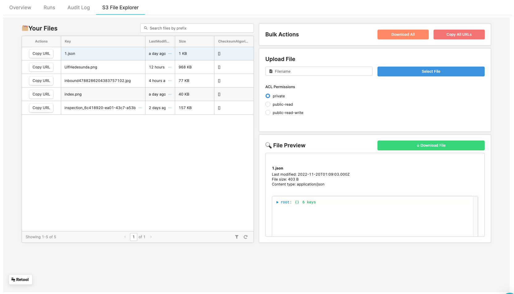

# Embedded Url (iframe)

You can use the embedded-url `spec` property to embed any publicly available webpage you want into an additional tab in the **specific Entity page**.
Simply make sure the URL you're embedding is viewable to the internet.

By using the combination of `"type": "string`, `"format": "url` and `"spec": "embedded-url"` in a [Blueprint property](../port-components/blueprint.md#blueprint-properties), Port will display the url as a new tab matching the provided URL in the blueprint's entity.

# Prerequisite

In order to add an embedded view tab into your **specific Entity page**, you must first get the URL you want to embed.
Copy this URL.

# Create a new property in the blueprint

make sure the property has a `spec` value equals to `embedded-url`.

```json showLineNumbers
{
  "title": "[THE TAB TITLE]",
  "type": "string",
  "format": "url",
  "spec": "embedded-url"
}
```

this will create a new property in the blueprint's entities that can store the url.

# Add your copied url to the entity:

Go to the blueprint's page and edit one of the enitities:
In this example we are embedding a [Datadog](https://docs.datadoghq.com/dashboards/sharing/) dashboard but this can be any webpage that can be shared publicly.



Add your copied url to the property and click Update.

## Go to the new tab in the entity's **specific Entity page**

Here is how the Datadog tab appears in the Specific Entity Page when an `embedded-url` spec with a public [Datadog](https://docs.datadoghq.com/dashboards/sharing/) dashboard URL is provided:


# Example 2: Retool S3 File Explorer


